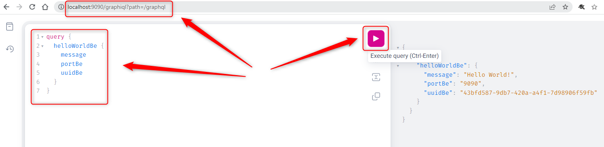
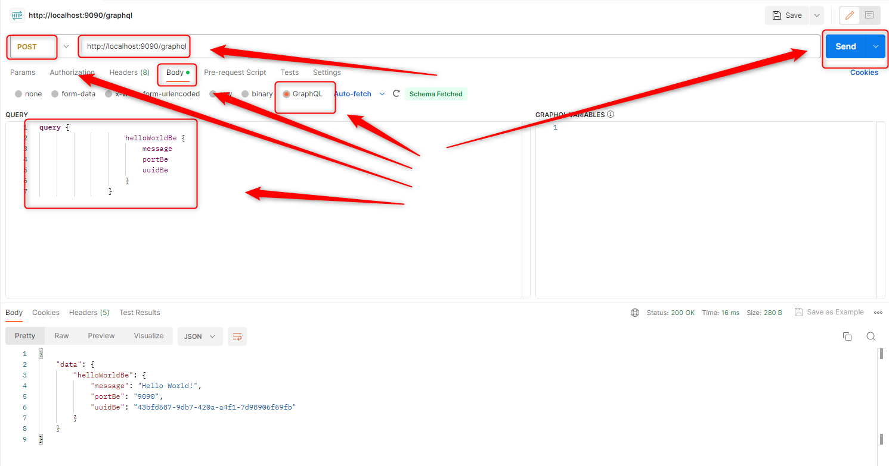
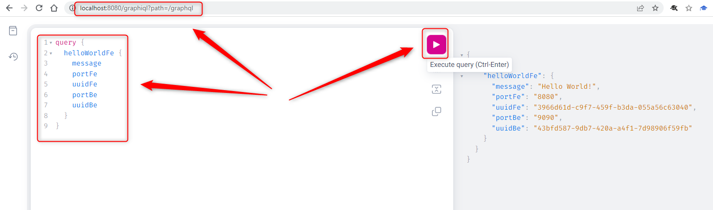

USAGE
-----

Usage steps:
1. In the first Command Line tool start **application BE** with `mvn -f ./springboot-helloworld-rcp-graphql-multiple-be spring-boot:run`
1. (Optional) Display **application BE** result in **GraphQL Console** (for more details check section **Printscreens of BE application**)
     * Use any browser and visit `http://localhost:9090/graphiql`
     * Run following GraphQL query:
         ```
         query {
          helloWorldBe {
            message
            portBe
            uuidBe
          }
        }
       ```
1. (Optional) Display **application BE** result in **Postman** (for more details check section **Printscreens of BE application**)
     * Use Postman with URL type POST `http://localhost:9090/graphql`
     * Choose Body -> GraphQL wit following content:
         ```
         query {
          helloWorldBe {
            message
            portBe
            uuidBe
          }
        }
       ```
1. In the second Command Line tool start **application FE** with `mvn -f ./springboot-helloworld-rcp-graphql-multiple-fe spring-boot:run`
1. Display **application FE** result in **GraphQL Console** (for more details check section **Printscreens of FE application**)
     * Use any browser and visit `http://localhost:8080/graphiql`
     * Run following GraphQL query:
         ```
         query {
          helloWorldFe {
            message
            portBe
            uuidBe
            portFe
            uuidFe
          }
        }
       ```
1. Display **application FE** result in **Postman** (for more details check section **Printscreens of FE application**)
     * Use Postman with URL type POST `http://localhost:8080/graphql`
     * Choose Body -> GraphQL wit following content:
         ```
         query {
          helloWorldFe {
            message
            portBe
            uuidBe
            portFe
            uuidFe
          }
        }
       ```
1. Clean up environment:
    * In the first Command Line with `ctrl + C`
    * In the second Command Line with `ctrl + C`


DESCRIPTION
-----------

##### Goal
The goal of this project is to present how to implement communication between **multiple Java** applications type **GraphQL** with usage **Spring Boot** framework. **Application BE** provides message, port BE and uuid BE. **Application FE** displays message, port FE, uuid FE, port BE and uuid BE.

##### Flow
The following flow takes place in this project:
1. User via tool GraphQL Console sends request to FE application for a content
1. FE application sends request to BE application for a content. Communication type GraphQL is used
1. BE application sends back response with message, BE port and BE UUID to FE application. Communication type GraphQL is used
1. FE application sends back response with message, FE port, FE UUID, BE port and BE UUID to User via GraphQL Console

##### Launch
To launch this application please make sure that the **Preconditions** are met and then follow instructions from **Usage** section.

##### Technologies
This project uses following technologies:
* **Spring Boot** framework: `https://docs.google.com/document/d/1mvrJT5clbkr9yTj-AQ7YOXcqr2eHSEw2J8n9BMZIZKY/edit?usp=sharing`
* **Java**: `https://docs.google.com/document/d/119VYxF8JIZIUSk7JjwEPNX1RVjHBGbXHBKuK_1ytJg4/edit?usp=sharing`
* **Maven**: `https://docs.google.com/document/d/1cfIMcqkWlobUfVfTLQp7ixqEcOtoTR8X6OGo3cU4maw/edit?usp=sharing`
* **Git**: `https://docs.google.com/document/d/1Iyxy5DYfsrEZK5fxZJnYy5a1saARxd5LyMEscJKSHn0/edit?usp=sharing`


PRECONDITIONS
-------------

##### Preconditions - Tools
* Installed **Operating System** (tested on Windows 11)
* Installed **Java** (tested on version 17.0.5)
* Installed **Maven** (tested on version 3.8.5)
* Installed **Git** (tested on version 2.33.0.windows.2)

##### Preconditions - Actions
* **Download** source code using Git 
* Open any **Command Line** (for instance "Windonw PowerShell" on Windows OS) tool on the main **project's folder**.


PRINTSCREENS OF BE APPLICATION
------------------------------






PRINTSCREENS OF FE APPLICATION
------------------------------



