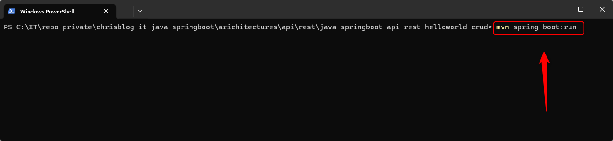
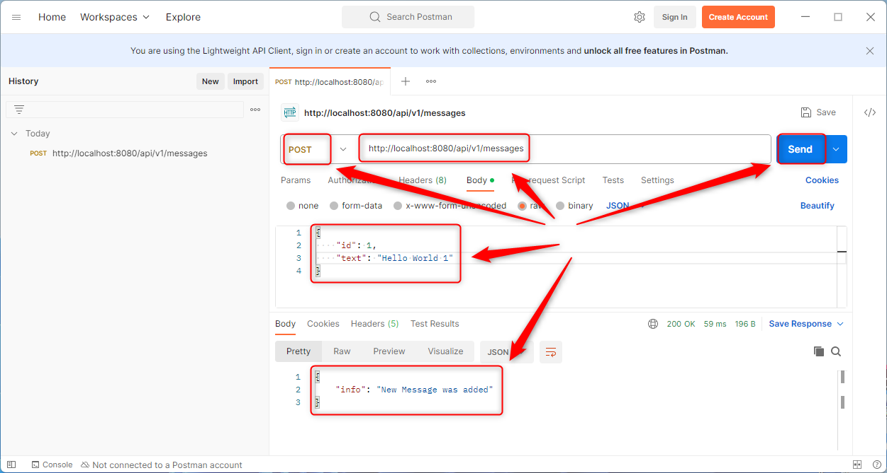
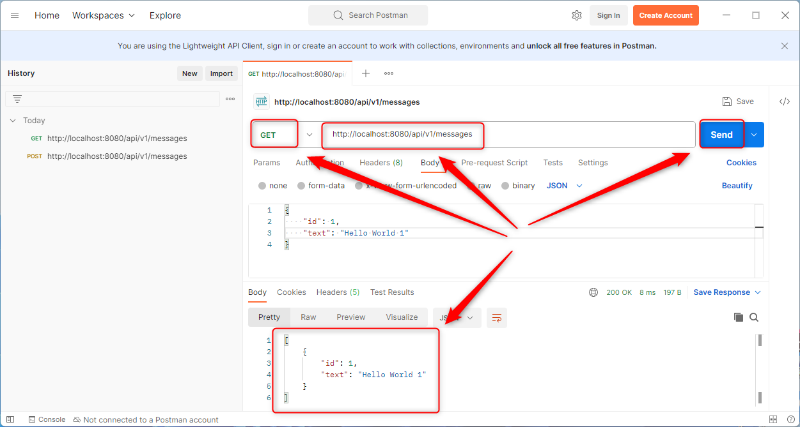
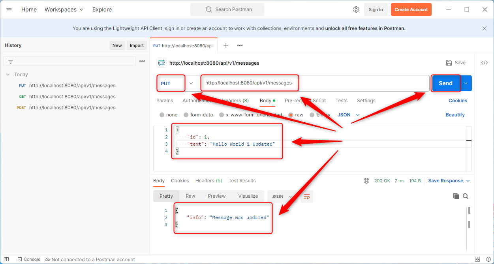
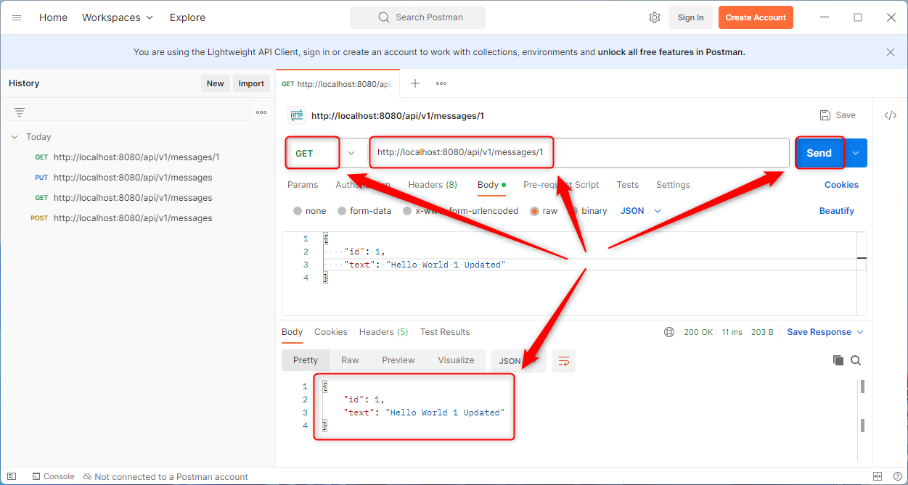
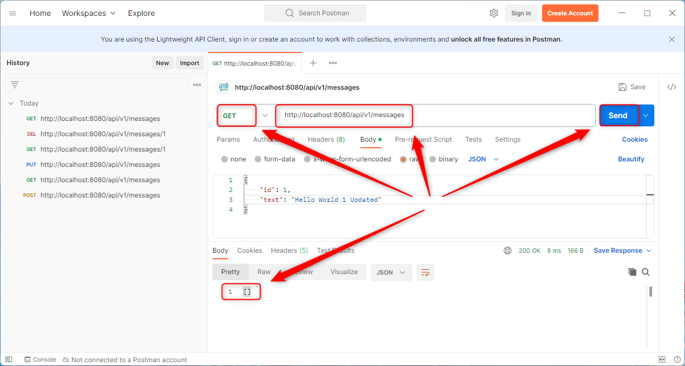

USAGE COMMANDS
--------------

> Please be aware that following tools should be installed in advance on your computer: **Java**, **Maven** and **Git**. 

> Please **clone/download** project, open **project's main folder** in your favorite **command line tool** and then **proceed with steps below**. 

Usage steps:
1. In a command line tool start application with `mvn spring-boot:run`
1. In a http client (e.g. Postman) use **POST** method and visit `http://localhost:8080/api/v1/messages`
   * Choose **Body -> raw -> JSON** and add following JSON:
   ```
   {
    "id": 1,
    "text": "Hello World 1"
   }
   ```
   * Expected message **New Message was added**
1. In a http client (e.g. Postman) use **GET** method and visit `http://localhost:8080/api/v1/messages`
   * Expected following JSON:
   ```
   [
      {
      "id": 1,
      "text": "Hello World 1"
      }
   ]
   ```
1. In a http client (e.g. Postman) use **PUT** method and visit `http://localhost:8080/api/v1/messages`
   * Choose **Body -> raw -> JSON** and add following JSON:
   ```
   {
    "id": 1,
    "text": "Hello World 1 Updated"
   }
   ```
   * Expected message **Message was updated**
1. In a http client (e.g. Postman) use **GET** method and visit `http://localhost:8080/api/v1/messages/1`
   * Expected following JSON:
   ```   
   {
     "id": 1,
     "text": "Hello World 1 Updated"
   }   
   ```
1. In a http client (e.g. Postman) use **DELETE** method and visit `http://localhost:8080/api/v1/messages/1`
   * Expected message **Message was deleted**
1. In a http client (e.g. Postman) use **GET** method and visit `http://localhost:8080/api/v1/messages`
   * Expected **empty list**
1. Clean up environment 
     * In a command line tool stop application with `ctrl + C`


USAGE IMAGES
------------

Start application:



Display result:













DESCRIPTION
-----------

##### Goal
The goal of this project is to present how to implement **CRUD** (Create, Read, Update, Delete) operations in an application type **API REST** in **Java** programming language with usage **Spring Boot** framework. This application enables adding, reading, updating and deleting messages.

##### Terminology
Terminology explanation:
* **Java**: Java is a widely-used programming language for coding web applications.
* **API REST**: an architectural style for an application program interface (API) that uses HTTP requests to access and use data
* **Spring Boot**: Java Spring Framework (Spring Framework) is a popular, open source, enterprise-level framework for creating standalone, production-grade applications that run on the Java Virtual Machine (JVM).

##### Flow
The following flow takes place in this project:
1. User via any http client sends request to application with specific CRUD action: Create, Read, Update or Delete.
1. Application performs specific CRUD action.
1. Application sends back response to user via http client with message. This message is different and depends on specific CRUD action.

##### Launch
To launch this application please make sure that the **Preconditions** are met and then follow instructions from **Usage** section.

##### Technologies
This project uses following technologies:
* **Spring Boot** framework: `https://docs.google.com/document/d/1mvrJT5clbkr9yTj-AQ7YOXcqr2eHSEw2J8n9BMZIZKY/edit?usp=sharing`
* **Java**: `https://docs.google.com/document/d/119VYxF8JIZIUSk7JjwEPNX1RVjHBGbXHBKuK_1ytJg4/edit?usp=sharing`
* **Maven**: `https://docs.google.com/document/d/1cfIMcqkWlobUfVfTLQp7ixqEcOtoTR8X6OGo3cU4maw/edit?usp=sharing`
* **Git**: `https://docs.google.com/document/d/1Iyxy5DYfsrEZK5fxZJnYy5a1saARxd5LyMEscJKSHn0/edit?usp=sharing`


PRECONDITIONS
-------------

##### Preconditions - Tools
* Installed **Operating System** (tested on Windows 11)
* Installed **Java** (tested on version 17.0.5)
* Installed **Maven** (tested on version 3.8.5)
* Installed **Git** (tested on version 2.33.0.windows.2)

##### Preconditions - Actions
* Download **Source Code** (using Git or in any other way) 
* Open any **Command Line** tool (for instance "Windonw PowerShell" on Windows OS) on downloaded **project's main folder**