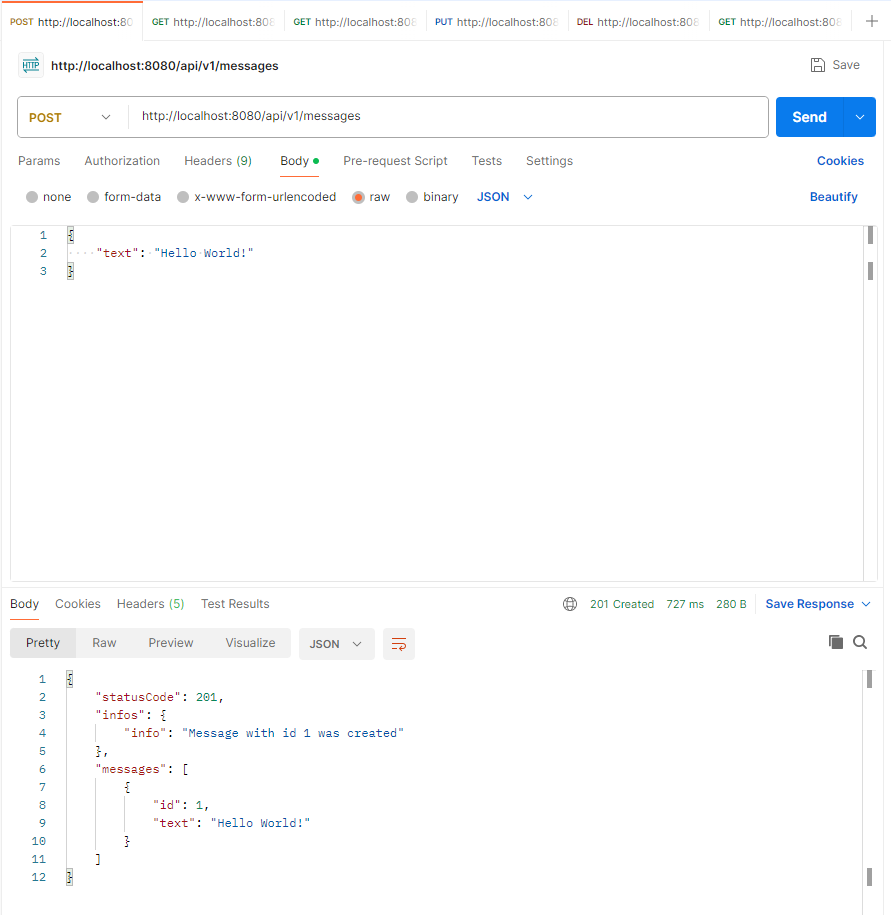
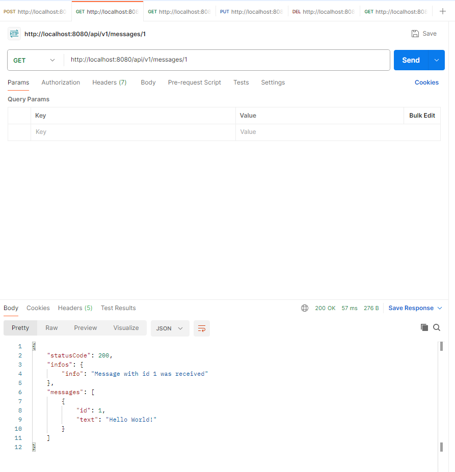
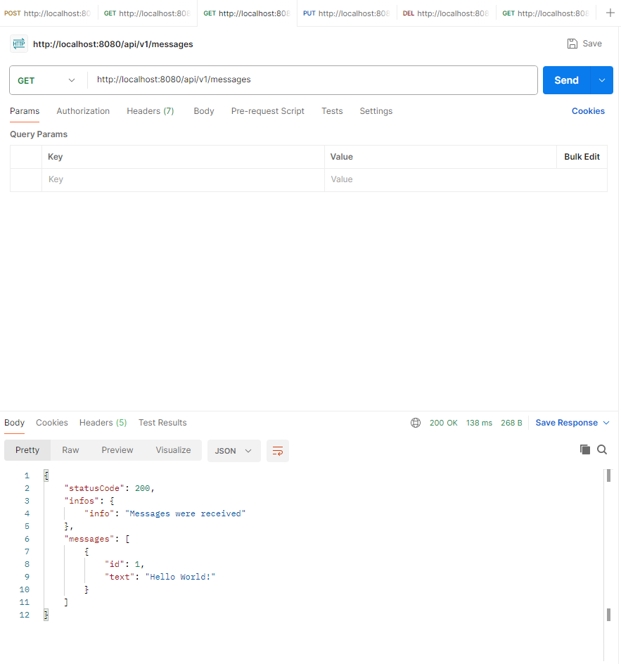
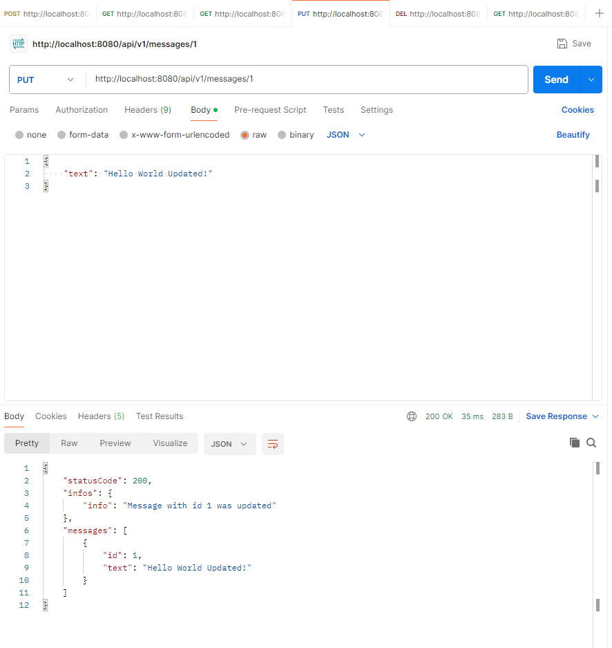
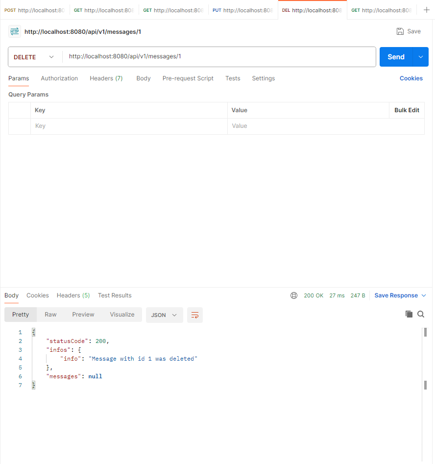
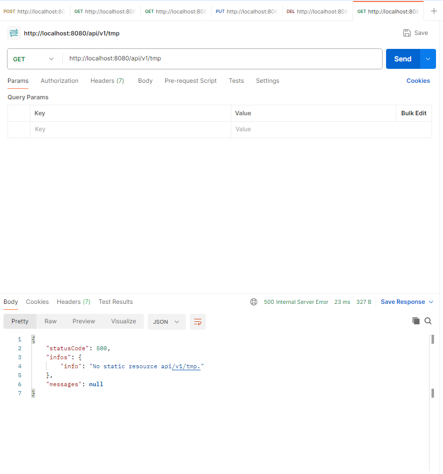

DESCRIPTION
-----------

##### Goal
The goal of this project is to present how create **REST API** application with **CRUD (Create, Read, Update, Delete)** methods with usage **Java** programming language, **Spring Boot** framework and embedded **H2** database. This application enables following REST operations with object Message:
* **Create**: object Message can be created and saved in database
* **Read**: object Message can be read from database
* **Update**: object Message can be mofied and saved in database
* **Delete**: object Message can be removed from database

##### Terminology
Terminology explanation:
* **Git**: tool for distributed version control
* **Maven**: tool for build automation
* **Java**: object-oriented programming language
* **Spring Boot**: framework for Java. It consists of: Spring + Container + Configuration
* **Database**: A database is an organized collection of structured data, typically stored electronically in a computer system. It allows for efficient storage, retrieval, and manipulation of data using a database management system (DBMS). Databases can be relational (tables with rows and columns) or non-relational (NoSQL, key-value pairs, documents, etc.). They are used in various applications to manage and query large amounts of data for business, research, and personal use. Examples include MySQL, PostgreSQL (relational), and MongoDB (non-relational).
* **H2**: H2 is an open-source, lightweight, fast, and embedded relational database management system written in Java. It supports standard SQL and provides features such as in-memory databases, multi-threaded support, and encryption. H2 can be run in embedded or server modes, making it suitable for a wide range of applications, from small embedded systems to larger web-based applications. It is often used for development, testing, or scenarios where a lightweight database is needed.
* **CRUD operations**: CRUD operations are the basic functions of persistent storage, used in databases and applications to manage data. CRUD stands for: Create: Insert new data into the system or database (e.g., adding a new record); Read: Retrieve or view existing data (e.g., fetching data from a database); Update: Modify or edit existing data (e.g., changing an attribute of a record); Delete: Remove or delete data from the system or database (e.g., deleting a record).

##### Implementation
Implementation details:
* Application is created basing on Controllers, Services, Repositories and Entities
* There are Unit Tests for application
* There are Integration Tests for application


EXAMPLE
-------














USAGE MANUAL
------------

> **Usage Manual** means that application is started **manually** from command line using Spring Boot command.

> Please **clone/download** project, open **project's main folder** in your favorite **command line tool** and then **proceed with steps below**. 

> Please be aware that following tools should be installed on your local PC:  
* **Operating System** (tested on Windows 11)
* **Java** (tested on version 17.0.5)
* **Maven** (tested on version 3.8.5)
* **Git** (tested on version 2.33.0.windows.2)

##### Required steps:
1. In a command line tool **start** application with `mvn spring-boot:run`
1. In a Rest Client (for example Postman) **create** new message using **POST** method with `http://localhost:8080/api/v1/messages`
   * Use **Body -> Raw -> JSON**
   ```
   {
        "text": "Hello World!"
    }
   ```
1. In a Rest Client (for example Postman) **read specific** message using **GET** method with `http://localhost:8080/api/v1/messages/1`
1. In a Rest Client (for example Postman) **read all** messages using **GET** method with `http://localhost:8080/api/v1/messages`
1. In a Rest Client (for example Postman) **update** message using **POST** method with `http://localhost:8080/api/v1/messages/1`
   * Use **Body -> Raw -> JSON**
   ```
   {
        "text": "Hello World Updated!"
    }
   ```
1. In a Rest Client (for example Postman) **delete** message using **DELETE** method with `http://localhost:8080/api/v1/messages/1`
1. Clean up environment:
     * In a command line tool **stop** application with `ctrl + C`
     

##### Optional steps:
N/A