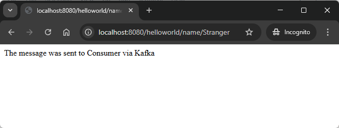

EXAMPLE
-------

DESCRIPTION
-----------

##### Goal
The goal of this project is to present how to use **Kafka** type **KRaft** for implementation of asynchronous communication between two applications created with usage **Java** programming language and **Spring Boot 3** framework. Additionally **Krafka UI** is used to present messages sent between these two applications.

##### Content
This project consists of following applications:
* **Producer**: sends events to Kafka broker
   * **Input**: Http request with path variable **name** from any browser is received
   * **Output**: Http response to any browser with message **The message was sent to Consumer via Kafka** is sent
* **Consumer**: receives events from Kafka broker
   * **Input**: Http request from any browser is received
   * **Output**: Http response to any browser with message **Message from Producer via Kafka is: Hello World {name}** is sent
* **Kafka**: acts as an intermediary between the producer and the consumer
   * **Input**: event from Producer is received
   * **Output**: event to Consumer is sent
* **Kafka UI**: displays events handled by Kafka broker
   * **Input**: Http request from any browser is received
   * **Output**: Http response to any browser with **dashboard of Kafka event`s** details is sent
   

##### Terminology
Terminology explanation:
* **Git**: Git is a distributed version control system used to track changes in code, collaborate with others, and manage source code history efficiently.
* **Java**: Java is a high-level, object-oriented programming language known for its platform independence, achieved through the Java Virtual Machine (JVM). It is widely used for developing web, mobile, desktop, and enterprise applications, emphasizing simplicity, security, and portability. "Write once, run anywhere" is its core principle.
* **Maven**: Maven is a build automation and dependency management tool for Java projects, streamlining project builds, managing libraries, and ensuring consistent project configurations.
* **Spring Boot**: Spring Boot is a framework for building Java-based applications that simplifies development by providing auto-configuration, embedded servers, and production-ready tools, enabling developers to create standalone, production-ready applications with minimal configuration.
* **Kafka KRaft**: Kafka KRaft (Kafka Raft) is a mode of running Apache Kafka without the need for Apache ZooKeeper. It uses the Raft consensus algorithm for managing metadata and leader election, simplifying the architecture by removing ZooKeeper's dependency while maintaining Kafka's distributed, fault-tolerant capabilities. This mode enhances scalability and operational simplicity.
* **Kafka UI**: Kafka UI is a web-based interface for managing and monitoring Apache Kafka clusters. It allows users to visualize topics, partitions, consumer groups, and messages, making it easier to interact with Kafka without using the command line.
* **Asynchronous Communication**: Asynchronous communication is the exchange of information without requiring participants to be present or respond in real time, allowing for flexibility in timing (e.g., emails or messaging apps).
* **Docker**: Docker is a platform that allows you to build, run, and manage applications in lightweight, portable containers. These containers package the application and its dependencies, ensuring consistency across development, testing, and production environments.
* **Docker Compose**: Docker Compose is a tool for defining and running multi-container Docker applications using a simple YAML configuration file (docker-compose.yml). It allows you to specify services, networks, and volumes, enabling easy orchestration and management of containerized applications.
* **Kubernetes**: Kubernetes is an open-source platform for automating the deployment, scaling, and management of containerized applications. It organizes containers into logical units called pods and helps ensure high availability, scalability, and efficient resource utilization.
* **Kind**: Kubernetes Kind (Kubernetes IN Docker) is a tool for running Kubernetes clusters locally using Docker containers. It allows developers to easily create and manage multi-node Kubernetes clusters for testing and development purposes in a lightweight environment.

USAGES
------

This project can be tested in following configurations:
* **Usage Docker Compose**: all services are started as Docker containers definied in a Docker Compose file.
* **Usage Kubernetes (Kind)**: all services are started as Kubernetes pods.

USAGE DOCKER COMPOSE
--------------------

> **Usage Docker Compse** means all services are started as Docker containers definied in Docker Compose file.

> Please **clone/download** project, open **project's main folder** in your favorite **command line tool** and then **proceed with steps below**.

> **Prerequisites**:  
* **Operating System** (tested on Windows 11)
* **Git** (tested on version 2.33.0.windows.2)
* **Docker** (tested on version 4.33.1) 

Usage steps:
1. Start **Docker** tool
1. In a command line tool **start Docker containers** with `docker-compose -f .\docker-compose\docker-compose.yml up -d --build`
1. In a browser check **Consumer** and visit `http://localhost:9090`
   * Expected text **Message from Producer via Kafka is: There is no message from Producer via Kafka yet** in the browser
1. In a browser check **Procuder** and visit `http://localhost:8080/helloworld/name/{name}` (e.g. `http://localhost:8080/helloworld/name/Stranger`)
   * Expected text **The message was sent to Consumer via Kafka** in the browser
1. In a browser check again **Consumer** and visit `http://localhost:9090`
   * Expected text **Message from Producer via Kafka is: Hello World {name}** (e.g. **Message from Producer via Kafka is: Hello World Stranger**) in the browser
1. In a browser check **Kafka UI** and visit `http://localhost:8086`
   * Expected **dashboard** of Kafka UI (check section **EXAMPLE**)
   * Fill **Cluster name** as **localhost**
   * Fill **Host** as **kafka**
   * Fill **Port** as **9092**
1. Clean up environment
    * Remove containers `docker-compose -f .\docker-compose\docker-compose.yml down --rmi all`
    * Stop **Docker** tool

USAGE KUBERNETES (KIND)
-----------------------

> **Usage Kubernetes** means that all services are started as Kubernetes pods. 

> Please **clone/download** project, open **project's main folder** in your favorite **command line tool** and then **proceed with steps below**.

> **Prerequisites**:  
* **Operating System** (tested on Windows 11)
* **Git** (tested on version 2.33.0.windows.2)
* **Kind** (tested on version 0.26.0)

##### Required steps:
1. Start **Docker** tool
1. In the first command line tool create and start cluster **Kind** with `kind create cluster --name helloworld`
1. In the first command line tool **start Kubernetes Pods** with `kubectl apply -f ./k8s --recursive`
1. In the first command line tool **check status of Kubernetes Pods** with `kubectl get pods`
   * Expected mysql, be and fe as **READY 1/1** (it can take few minutes)
1. In the second command line tool **forward port of Producer service** with `kubectl port-forward service/producer 8080:8080`
1. In the third command line tool **forward port of Consumer service** with `kubectl port-forward service/consumer 9090:9090`
1. In the fourth command line tool**forward port of Kafka UI service** with `kubectl port-forward service/kafka-ui 8086:8086`
1. In a browser check **Consumer** and visit `http://localhost:9090`
   * Expected text **Message from Producer via Kafka is: There is no message from Producer via Kafka yet** in the browser
1. In a browser check **Procuder** and visit `http://localhost:8080/helloworld/name/{name}` (e.g. `http://localhost:8080/helloworld/name/Stranger`)
   * Expected text **The message was sent to Consumer via Kafka** in the browser
1. In a browser check again **Consumer** and visit `http://localhost:9090`
   * Expected text **Message from Producer via Kafka is: Hello World {name}** (e.g. **Message from Producer via Kafka is: Hello World Stranger**) in the browser
1. In a browser check **Kafka UI** and visit `http://localhost:8086`
   * Expected **dashboard** of Kafka UI (check section **EXAMPLE**)
   * Fill **Cluster name** as **localhost**
   * Fill **Host** as **kafka**
   * Fill **Port** as **9092**
1. Clean up environment 
     * In the fourth command line tool **stop forwarding port of Kafka UI service** with `ctrl + C`
     * In the third command line tool **stop forwarding port of Consumer service** with `ctrl + C`
     * In the second command line tool **stop forwarding port of Producer service** with `ctrl + C`
     * In the first command line tool **remove Kubernetes Pods** with `kubectl delete -f ./k8s --recursive`
     * In the first command line tool delete cluster **Kind** with `kind delete cluster --name helloworld`
     * Stop **Docker** tool

##### Optional steps:
1. In a command line tool build Docker Producer image with `docker build -f springboot-kafka-bitnami-docker-compose_producer/Dockerfile -t wisniewskikr/springboot-kafka-bitnami-docker-compose_producer:0.0.1 ./springboot-kafka-bitnami-docker-compose_producer`
1. In a command line tool push Docker Procuder image to Docker Repository with `docker push wisniewskikr/springboot-kafka-bitnami-docker-compose_producer:0.0.1` 
1. In a command line tool build Docker Consumer image with `docker build -f springboot-kafka-bitnami-docker-compose_consumer/Dockerfile -t wisniewskikr/springboot-kafka-bitnami-docker-compose_consumer:0.0.1 ./springboot-kafka-bitnami-docker-compose_consumer`
1. In a command line tool push Docker Consumer image to Docker Repository with `docker push wisniewskikr/springboot-kafka-bitnami-docker-compose_consumer:0.0.1` 
1. In the first command line tool with administrator privileges check clusers with `kind get clusters`
1. In a command line tool check Kubernetes Deployments with `kubectl get deployments`
1. In a command line tool check Kubernetes Deployments details with **kubectl describe deployment {deployment-name}**
1. In a command line tool check Kubernetes Services with `kubectl get services`
1. In a command line tool check Kubernetes Services details with **kubectl describe service {service-name}**
1. In a command line tool check Kubernetes Pods with `kubectl get pods`
1. In a command line tool check Kubernetes Pods details with **kubectl describe pod {pod-name}**
1. In a command line tool check Kubernetes Pods logs with **kubectl logs {pod-name}**