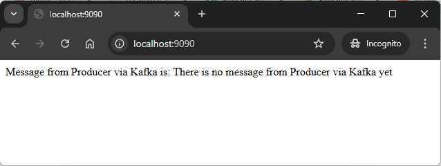

EXAMPLE
-------

USAGE
-----

> Please be aware that following tools should be installed on your local machine: **Java**, **Maven**, **Git** and **Docker**. Docker tool has to be **up and running**. 

> Please **clone/download** project, open **project's main folder** in your favorite **command line tool** and then **proceed with steps below**. 

Usage steps:
1. Start **Docker** tool
1. Start elements using Docker Compose with `docker-compose up --build`
1. Send message with **http://localhost:8080/helloworld/name/{name}**. For instance: `http://localhost:8080/helloworld/name/Stranger`
   * Expected text **Done** in the browser
1. Read message by checking logs in Command Line tool. The application **Consumer** should display following message there: **Hello World {name}**. 
   * Expected text **Hello World Stranger** in the console
1. Clean up environment
    * Stop containers with `ctrl + C`
    * Remove containers `docker-compose down --rmi all`
    * Stop **Docker** tool

DESCRIPTION
-----------

##### Goal
The goal of this project is to show how to **send messages** from one **Java** application with **Spring Boot** framework (called **Producer**) to other (called **Consumer**) using **Apache Kafka** broker (type **Bitnami**) in **KRaft** mode. KRaft mode means that Apache Kafka doesn't user Zookeeper (Discovery Service) any more. All applications are on different Docker containers managed by **Docker Compose** tool.

##### Details
This project consists of:
* **Apache Kafka server**: messages broker - tool which enable sending and receiving messages. This server is in KRaft mode what means that doesn't user Zookeeper (Discovery Service) any more
* **Spring Boot Producer application**: application which sends messages to Apache Kafka. User's **name** is sent as parameter
* **Spring Boot Consumer application**: application which receives messages from Apacke Kafka and displays it on Console. Following message is displayed: **Hello World + {name}**

##### Launch
To launch this application please make sure that the **Preconditions** are met and then follow instructions from **Usage** section.

##### Technologies
This application uses:
* **Java**: `https://docs.google.com/document/d/119VYxF8JIZIUSk7JjwEPNX1RVjHBGbXHBKuK_1ytJg4/edit?usp=sharing`
* **Maven**: `https://docs.google.com/document/d/1cfIMcqkWlobUfVfTLQp7ixqEcOtoTR8X6OGo3cU4maw/edit?usp=sharing`
* **Git**: `https://docs.google.com/document/d/1Iyxy5DYfsrEZK5fxZJnYy5a1saARxd5LyMEscJKSHn0/edit?usp=sharing`
* **Docker**: `https://docs.google.com/document/d/1tKdfZIrNhTNWjlWcqUkg4lteI91EhBvaj6VDrhpnCnk/edit?usp=sharing`
* **Spring Boot** framework: `https://docs.google.com/document/d/1mvrJT5clbkr9yTj-AQ7YOXcqr2eHSEw2J8n9BMZIZKY/edit?usp=sharing`
* **Docker Compose** tool: `https://docs.google.com/document/d/1SPrCS5OS_G0je_wmcLGrX8cFv7ZkQbb5uztNc9kElS4/edit?usp=sharing`
* **Apache Kafka** tool: `https://docs.google.com/document/d/1pDBnFbpvo0mNaIgxLCV--3qUn-wf0vHZiTYRQL05Wes/edit?usp=sharing`

PRECONDITIONS
-------------

##### Preconditions - Tools
* Installed **Operating System** (tested on Windows 10)
* Installed **Java** (tested on version 1.8.0_291)
* Installed **Maven** (tested on version 3.8.5) 
* Installed **Git** (tested on version 2.33.0.windows.2) 
* Installed **Docker** (tested on version version 20.10.12) 

##### Preconditions - Actions
* Download **Source Code** (using Git or in any other way) 
* Open any **Command Line** tool (for instance "Windonw PowerShell" on Windows OS) on downloaded **project's main folder**