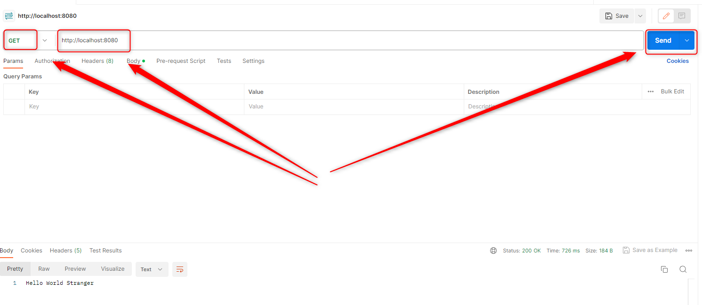
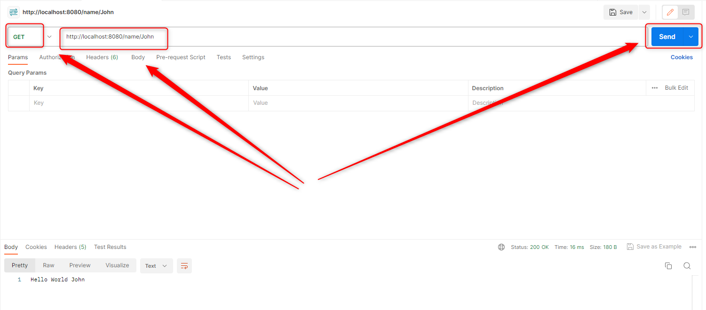

USAGE
-----

Usage steps:
1. In the first Command Line tool start **application BE** with `mvn -f ./springboot-helloworld-api-grcp-multiple-be spring-boot:run`
1. In the second Command Line tool start **application FE** with `mvn -f ./springboot-helloworld-api-grcp-multiple-fe spring-boot:run`
1. In Postman tool with GET method diplay REST API result of GRPC API call with `http:\\localhost:8080`
1. (Optional) In Postman tool with GET method diplay REST API result of GRPC API call with flexible parameter with `http:\\localhost:8080\name\John`
1. Clean up environment:
    * In the first Command Line with `ctrl + C`
    * In the second Command Line with `ctrl + C`

USAGE IMAGES
------------

DESCRIPTION
-----------

##### Goal
The goal of this project is to present how to implement **GRPC API** communication between **multiple Java** applications with usage **Spring Boot** framework. FE and BE applications communicate using GRPC API. User and FE communicate using REST API.

##### Flow
The following flow takes place in this project:
1. User via tool Postman sends request to FE application for a content. Communication type REST API is used here
1. FE application sends request to BE application for a content. Communication type GRPC API is used here
1. BE application sends back response to FE application. Communication type GRPC API is used here
1. FE application sends back response to User via Postman. Communication type REST API is used here

##### Launch
To launch this application please make sure that the **Preconditions** are met and then follow instructions from **Usage** section.

##### Technologies
This project uses following technologies:
* **Spring Boot** framework: `https://docs.google.com/document/d/1mvrJT5clbkr9yTj-AQ7YOXcqr2eHSEw2J8n9BMZIZKY/edit?usp=sharing`
* **Java**: `https://docs.google.com/document/d/119VYxF8JIZIUSk7JjwEPNX1RVjHBGbXHBKuK_1ytJg4/edit?usp=sharing`
* **Maven**: `https://docs.google.com/document/d/1cfIMcqkWlobUfVfTLQp7ixqEcOtoTR8X6OGo3cU4maw/edit?usp=sharing`
* **Git**: `https://docs.google.com/document/d/1Iyxy5DYfsrEZK5fxZJnYy5a1saARxd5LyMEscJKSHn0/edit?usp=sharing`

PRECONDITIONS
-------------

##### Preconditions - Tools
* Installed **Operating System** (tested on Windows 11)
* Installed **Java** (tested on version 17.0.5)
* Installed **Maven** (tested on version 3.8.5)
* Installed **Git** (tested on version 2.33.0.windows.2)

##### Preconditions - Actions
* **Download** source code using Git 
* Open any **Command Line** (for instance "Windonw PowerShell" on Windows OS) tool on the main **project's folder**.