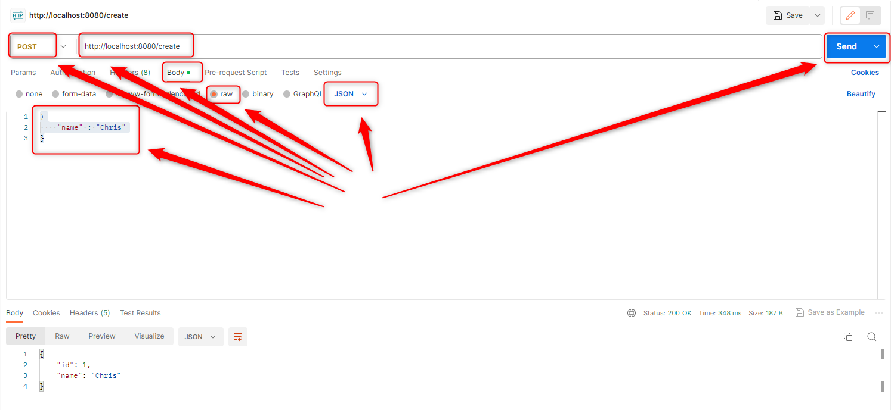
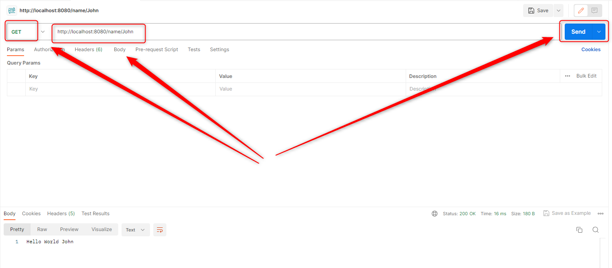
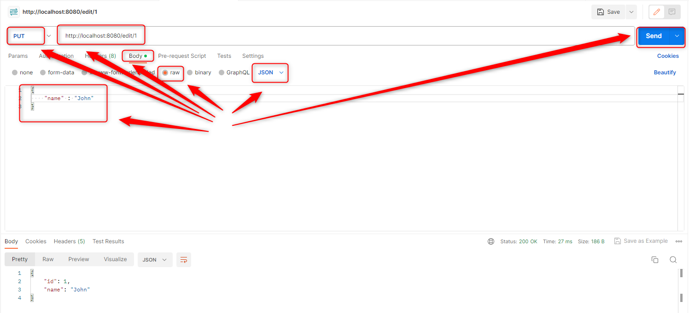
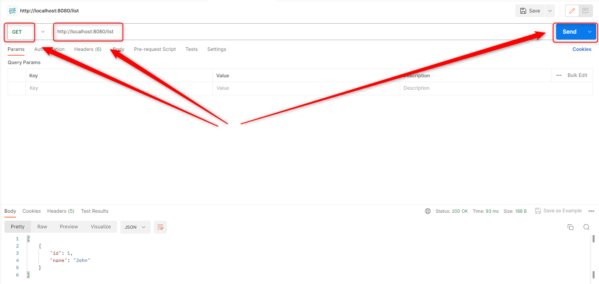
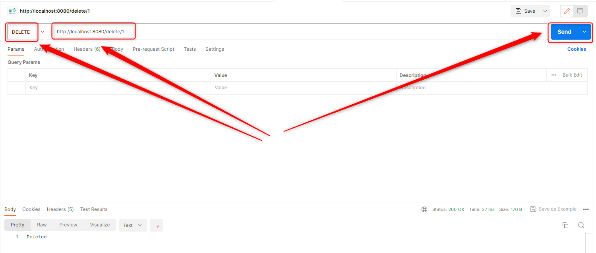

USAGE
-----

Usage steps:
1. In the first Command Line tool build **GRPC API classes** with `mvn clean install`
1. In the first Command Line tool start **application BE** with `mvn -f ./springboot-helloworld-api-grpc-multiple-crud-be spring-boot:run`
1. In the second Command Line tool start **application FE** with `mvn -f ./springboot-helloworld-api-grpc-multiple-crud-fe spring-boot:run`
1. In Postman tool **create user** using POST method with `http://localhost:8080/create`
     * Body -> raw - JSON
     ```
     {
          "name" : "Chris"
     }
     ```
1. In Postman tool **view user** using GET method with `http://localhost:8080/view/1`
1. In Postman tool **update user** using PUT method with `http://localhost:8080/edit/1`
     * Body -> raw - JSON
     ```
     {
          "name" : "John"
     }
     ```
1. In Postman tool **view list of users** using GET method with `http://localhost:8080/list`
1. In Postman tool **delete user** using DELETE method with `http://localhost:8080/delete/1`
1. (Optional) In any browser open H2 Console (credentials admin / admin123) with `http://localhos:8080/h2-console`     
1. In Command Line tool clean up environment with `ctrl + C`


USAGE PRINTSCREENS
------------------












DESCRIPTION
-----------

##### Goal
The goal of this project is to present how to implement **GRPC API** communication with operations type **CRUD (Create, Read, Update, Delete)** between **multiple Java** applications with usage **Spring Boot** framework. FE and BE applications communicate using GRPC API. User and FE communicate using REST API. All CRPC API classes are created in **common** module based on **HelloWorld.proto** file. This module is added as dependency in BE and FE modules.

##### Flow
The following flow takes place in this project:
1. User via tool Postman sends request to FE application for a content. Request is type CRUD: Create, Read, Update, Delete. Communication type REST API is used here
1. FE application sends request to BE application for a content. Request is type CRUD: Create, Read, Update, Delete. Communication type GRPC API is used here
1. BE application sends back response to FE application. Communication type GRPC API is used here
1. FE application sends back response to User via Postman. Communication type REST API is used here

##### Launch
To launch this application please make sure that the **Preconditions** are met and then follow instructions from **Usage** section.

##### Technologies
This project uses following technologies:
* **Spring Boot** framework: `https://docs.google.com/document/d/1mvrJT5clbkr9yTj-AQ7YOXcqr2eHSEw2J8n9BMZIZKY/edit?usp=sharing`
* **Java**: `https://docs.google.com/document/d/119VYxF8JIZIUSk7JjwEPNX1RVjHBGbXHBKuK_1ytJg4/edit?usp=sharing`
* **Maven**: `https://docs.google.com/document/d/1cfIMcqkWlobUfVfTLQp7ixqEcOtoTR8X6OGo3cU4maw/edit?usp=sharing`
* **Git**: `https://docs.google.com/document/d/1Iyxy5DYfsrEZK5fxZJnYy5a1saARxd5LyMEscJKSHn0/edit?usp=sharing`


PRECONDITIONS
-------------

##### Preconditions - Tools
* Installed **Operating System** (tested on Windows 11)
* Installed **Java** (tested on version 17.0.5)
* Installed **Maven** (tested on version 3.8.5)
* Installed **Git** (tested on version 2.33.0.windows.2)

##### Preconditions - Actions
* **Download** source code using Git 
* Open any **Command Line** (for instance "Windonw PowerShell" on Windows OS) tool on the main **project's folder**.