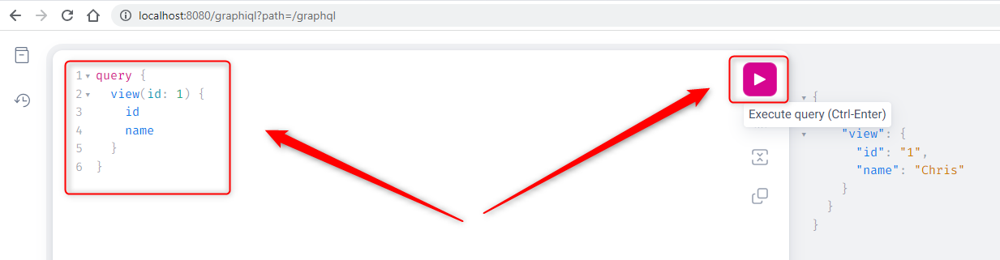
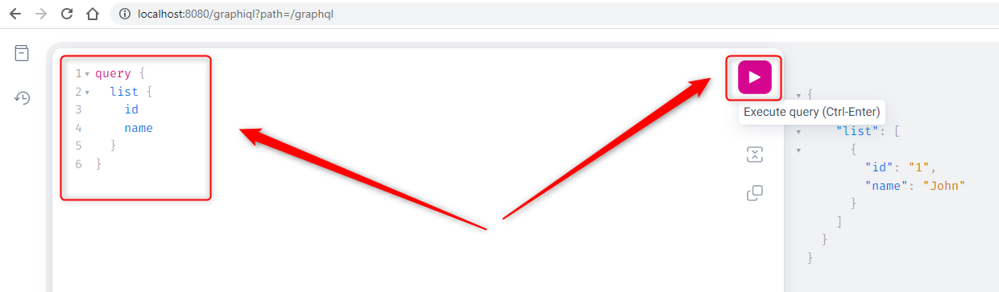

USAGE
-----

Usage steps:
1. In any Command Line tool start application with `mvn spring-boot:run`
1. In Postman tool create user using POST method with `http://localhost:8080/create`
     * Body -> raw - JSON
     ```
     {
          "name" : "Chris"
     }
     ```
1. In Postman tool view user using GET method with `http://localhost:8080/view/1`
1. In Postman tool update user using PUT method with `http://localhost:8080/edit/1`
     * Body -> raw - JSON
     ```
     {
          "name" : "John"
     }
     ```
1. In Postman tool view list of users using GET method with `http://localhost:8080/list`
1. In Postman tool delete user using DELETE method with `http://localhost:8080/delete/1`
1. (Optional) In any browser open H2 Console (credentials admin / admin123) with `http://localhos:8080/h2-console`     
1. In Command Line tool clean up environment with `ctrl + C`


USAGE PRINTSCREENS
------------------








DESCRIPTION
-----------

##### Goal
The goal of this project is to present how to implement **CRUD (Create, Read, Update, Delete)** operations on **embedded database H2** in **Java** application type **API REST** with usage **Spring Boot** framework.

##### Flow
The following flow takes place in this project:
1. User via Postman sends request to application for a content. Request can be type CRUD: Create, Read, Update, Delete
1. Application sends back response to User via Postman

##### Launch
To launch this application please make sure that the **Preconditions** are met and then follow instructions from **Usage** section.

##### Technologies
This project uses following technologies:
* **Spring Boot** framework: `https://docs.google.com/document/d/1mvrJT5clbkr9yTj-AQ7YOXcqr2eHSEw2J8n9BMZIZKY/edit?usp=sharing`
* **Java**: `https://docs.google.com/document/d/119VYxF8JIZIUSk7JjwEPNX1RVjHBGbXHBKuK_1ytJg4/edit?usp=sharing`
* **Maven**: `https://docs.google.com/document/d/1cfIMcqkWlobUfVfTLQp7ixqEcOtoTR8X6OGo3cU4maw/edit?usp=sharing`
* **Git**: `https://docs.google.com/document/d/1Iyxy5DYfsrEZK5fxZJnYy5a1saARxd5LyMEscJKSHn0/edit?usp=sharing`


PRECONDITIONS
-------------

##### Preconditions - Tools
* Installed **Operating System** (tested on Windows 11)
* Installed **Java** (tested on version 17.0.5)
* Installed **Maven** (tested on version 3.8.5)
* Installed **Git** (tested on version 2.33.0.windows.2)


##### Preconditions - Actions
* **Download** source code using Git 
* Open any **Command Line** (for instance "Windonw PowerShell" on Windows OS) tool on the main **project's folder**.