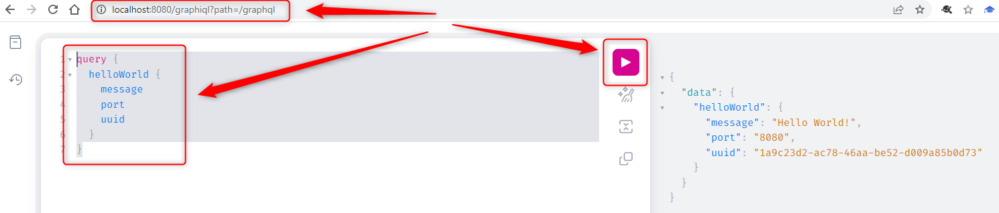
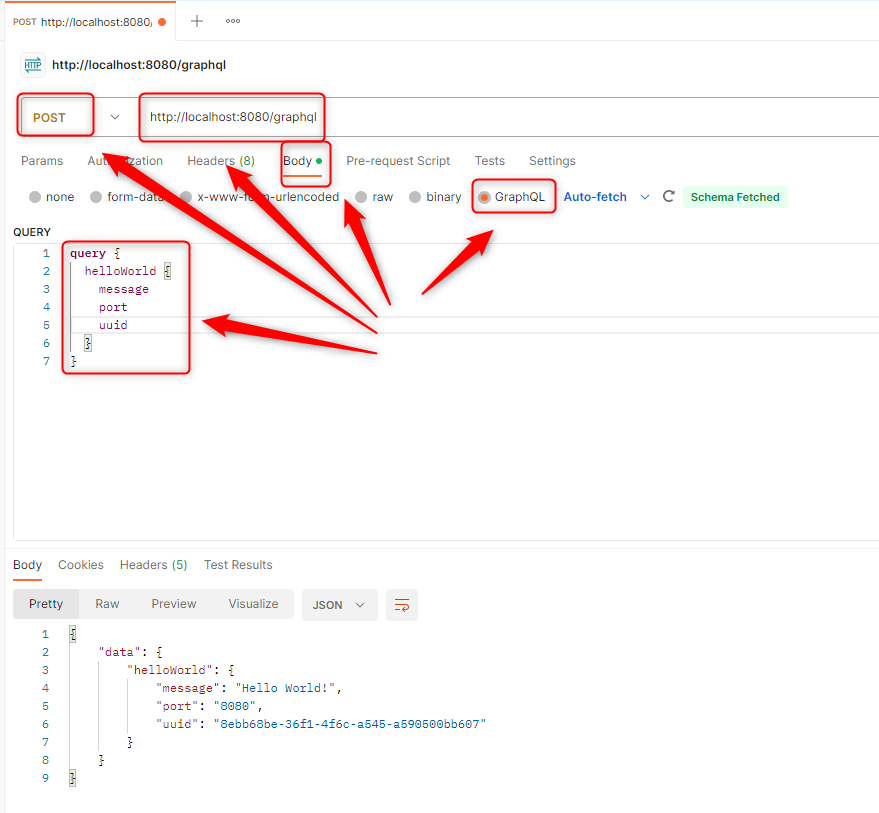

USAGE
-----

Usage steps:
1. Start application with `mvn spring-boot:run`
1. Display result in **GraphQL Console**:
     * Use any browser and visit `http://localhost:8080/graphiql`
     * Run following GraphQL query:
         ```
         query {
          helloWorld {
            message
            port
            uuid
          }
        }
       ```
1. Display result in **Postman**:
     * Use Postman with URL type POST `http://localhost:8080/graphql`
     * Choose Body -> GraphQL wit following content:
         ```
         query {
          helloWorld {
            message
            port
            uuid
          }
        }
       ```
1. Clean up environment with `ctrl + C`






DESCRIPTION
-----------

##### Goal
The goal of this project is to present how to implement **Java** application type **GraphQL** with usage **Spring Boot** framework.

##### Flow
The following flow takes place in this project:
1. User via tool GraphiQL sends request to application for a content.
1. Application HelloWorld returns response with GraphQL containing message, port and UUID. This response is presented to User via GraphiQL.

##### Launch
To launch this application please make sure that the **Preconditions** are met and then follow instructions from **Usage** section.

##### Technologies
This project uses following technologies:
* **Spring Boot** framework: `https://docs.google.com/document/d/1mvrJT5clbkr9yTj-AQ7YOXcqr2eHSEw2J8n9BMZIZKY/edit?usp=sharing`
* **Java**: `https://docs.google.com/document/d/119VYxF8JIZIUSk7JjwEPNX1RVjHBGbXHBKuK_1ytJg4/edit?usp=sharing`
* **Maven**: `https://docs.google.com/document/d/1cfIMcqkWlobUfVfTLQp7ixqEcOtoTR8X6OGo3cU4maw/edit?usp=sharing`
* **Git**: `https://docs.google.com/document/d/1Iyxy5DYfsrEZK5fxZJnYy5a1saARxd5LyMEscJKSHn0/edit?usp=sharing`


PRECONDITIONS
-------------

##### Preconditions - Tools
* Installed **Operating System** (tested on Windows 11)
* Installed **Java** (tested on version 17.0.5)
* Installed **Maven** (tested on version 3.8.5)
* Installed **Git** (tested on version 2.33.0.windows.2)


##### Preconditions - Actions
* **Download** source code using Git 
* Open any **Command Line** (for instance "Windonw PowerShell" on Windows OS) tool on the main **project's folder**.