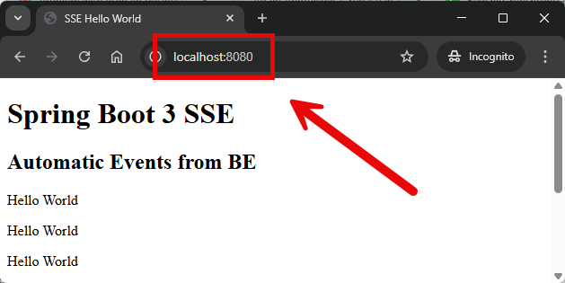

EXAMPLE
-------

DESCRIPTION
-----------

##### Goal
The goal of this project is to present how to handle **Server-Sent Events** triggered automatically from **BE** side 
with usage **Java** programming language and **Spring Boot 3** framework.

Sse triggered automatically from BE means that scheduler sends events to HTML page. 
So communication is asynchronous - there is no request-response communication.

##### Services
This project consists of following applications:
* **App**: application created in Spring Boot 3 contains both - FE and BE - parts. Actions:
  * **Action 1**: 
    * **Input**: sse event is created by Scheduler
    * **Output**: event text is displayed on HTML page

##### Terminology
Terminology explanation:
* **Git**: tool for distributed version control
* **Maven**: tool for build automation
* **Java**: object-oriented programming language
* **Spring Boot**: framework for Java. It consists of: Spring + Container + Configuration
* **Server-Sent Events**: Server-Sent Events (SSE) is a unidirectional communication method where a server can push 
real-time updates to the client (browser) over HTTP.

USAGES
------

This project can be tested in following configurations:
* **Usage Manual**: infrastructure services are started as Docker containers. Application services are started manually in command line
* **Usage Docker Compose**: N/A
* **Usage Kubernetes (Kind)**: N/A

USAGE MANUAL
------------

> **Usage Manual** means that infrastructure services are started as Docker containers. Application services are started manually in command line.

> Please **clone/download** project, open **project's main folder** in your favorite **command line tool** and then **proceed with steps below**.

> **Prerequisites**:
* **Operating System** (tested on Windows 11)
* **Git** (tested on version 2.33.0.windows.2)
* **Java** (tested on version 23.0.1)
* **Maven** (tested on version 3.9.6)

##### Required steps:
1. In a first command line tool **start application** with `./mvnw spring-boot:run`
1. In any Internet Browser (e.g. Chrome) visit `http://localhost:8080`
   * Expected: texts **Hello World**
1. Clean up environment
   * In the first command line tool **stop application** with `ctrl + C`

USAGE DOCKER COMPOSE
--------------------

N/A

USAGE KUBERNETES (KIND)
---------------------------

N/A
