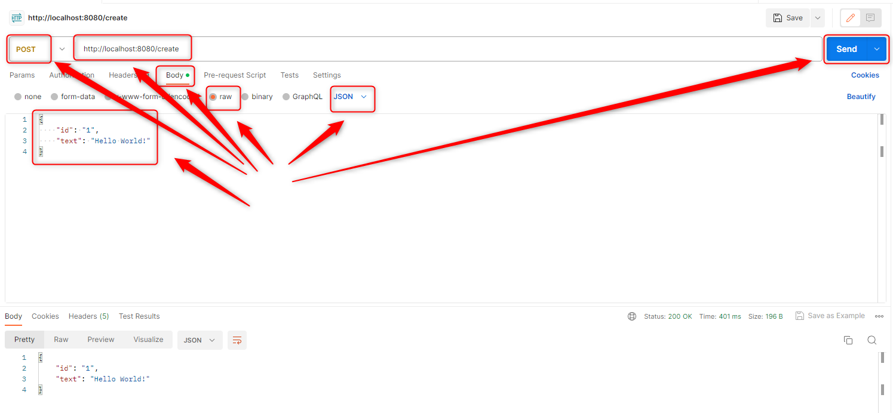
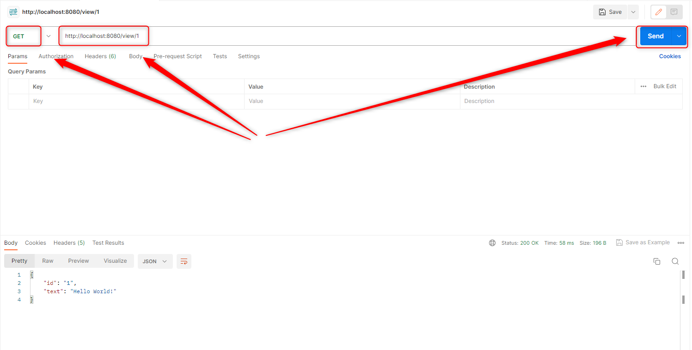
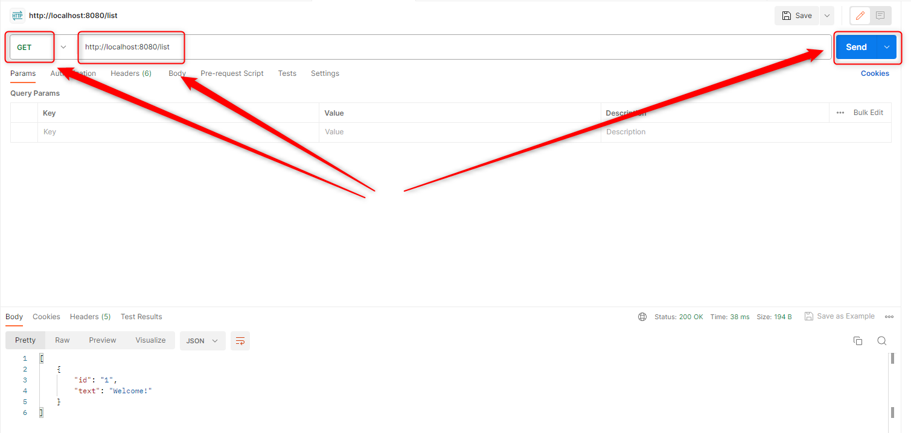
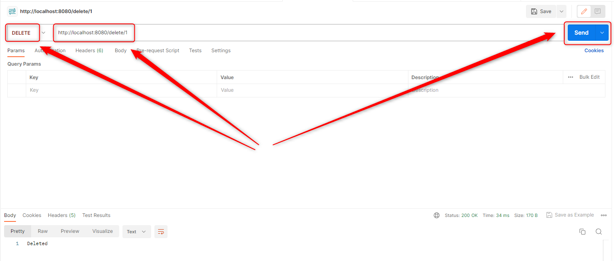

USAGE
-----

> This usage assumes that you have installed on your local machine following tools: **Java**, **Maven**, **Git**, **Docker** and **Docker Compose**.

Usage steps:
1. In any Command Line tool start Cassandra database with `docker-compose up -d`
1. **Wait about one minute** until Cassandra database is fully up and running
1. In any Command Line tool start application with `mvn spring-boot:run`
1. In Postman tool **create text** using POST method with `http://localhost:8080/create`
     * Body -> raw - JSON
     ```
     {
          "id" : "1"
          "text" : "Hello World!"
     }
     ```
1. In Postman tool **view text** using GET method with `http://localhost:8080/view/1`
1. In Postman tool **update text** using PUT method with `http://localhost:8080/edit/1`
     * Body -> raw - JSON
     ```
     {
          "text" : "Welcome"
     }
     ```
1. In Postman tool **view list of texts** using GET method with `http://localhost:8080/list`
1. In Postman tool **delete text** using DELETE method with `http://localhost:8080/delete/1`
1. Clean up environment 
     * Stop application with `ctrl + C`
     * Stop docker compose applications with `docker-compose down`


USAGE PRINTSCREENS
------------------











DESCRIPTION
-----------

##### Goal
The goal of this project is to present how to implement **CRUD (Create, Read, Update, Delete)** operations on **Cassandra** noSql database in **Java** application type **API REST** with usage **Spring Boot** framework.

Cassandra database is started by **Docker Compose** tool.

##### Terminology
Terminology explanation:
* **Java Spring Boot application**: application created in Java programming language and basing on Spring Boot framework. This application returns text "Hello World" in JSON format.
* **NoSql database**: database that enables storing and management of data in other way than relational databases
* **Cassandra database**: noSql database type Column-Oriented. It means that there are tables, rows and dynamic columns
* **Docker**: platform for deploying application in closed units called Docker Containers
* **Docker Compose**: tool for working with many Docker Containers

##### Flow
The following flow takes place in this project:
1. User via Postman sends request to application for a content. Request can be type CRUD: Create, Read, Update, Delete
1. Application sends back response to User via Postman

##### Launch
To launch this application please make sure that the **Preconditions** are met and then follow instructions from **Usage** section.

##### Technologies
This project uses following technologies:
* **Spring Boot** framework: `https://docs.google.com/document/d/1mvrJT5clbkr9yTj-AQ7YOXcqr2eHSEw2J8n9BMZIZKY/edit?usp=sharing`
* **Java**: `https://docs.google.com/document/d/119VYxF8JIZIUSk7JjwEPNX1RVjHBGbXHBKuK_1ytJg4/edit?usp=sharing`
* **Maven**: `https://docs.google.com/document/d/1cfIMcqkWlobUfVfTLQp7ixqEcOtoTR8X6OGo3cU4maw/edit?usp=sharing`
* **Git**: `https://docs.google.com/document/d/1Iyxy5DYfsrEZK5fxZJnYy5a1saARxd5LyMEscJKSHn0/edit?usp=sharing`


PRECONDITIONS
-------------

##### Preconditions - Tools
* Installed **Operating System** (tested on Windows 11)
* Installed **Java** (tested on version 17.0.5)
* Installed **Maven** (tested on version 3.8.5)
* Installed **Git** (tested on version 2.33.0.windows.2)
* Installed **Docker** (tested on version 4.17.0)
* Installed **Docker Compose** (tested on version 2.15.1)


##### Preconditions - Actions
* **Download** source code using Git 
* Open any **Command Line** (for instance "Windonw PowerShell" on Windows OS) tool on the main **project's folder**.