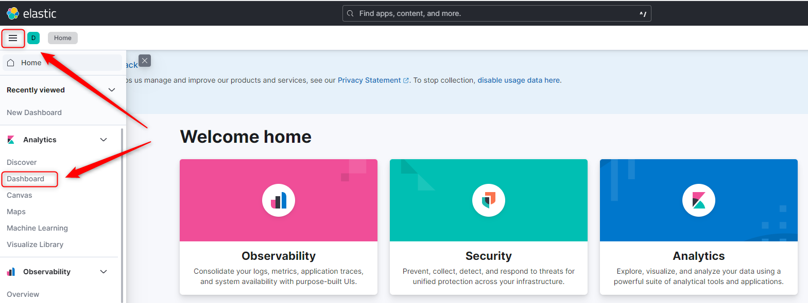
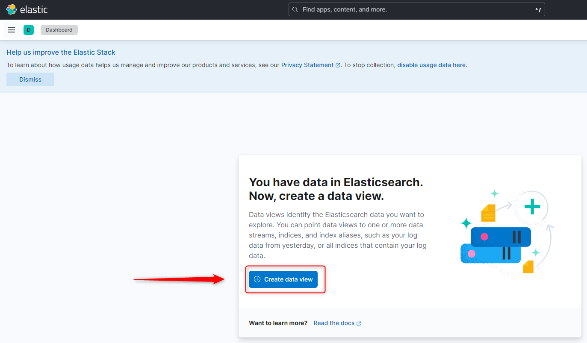
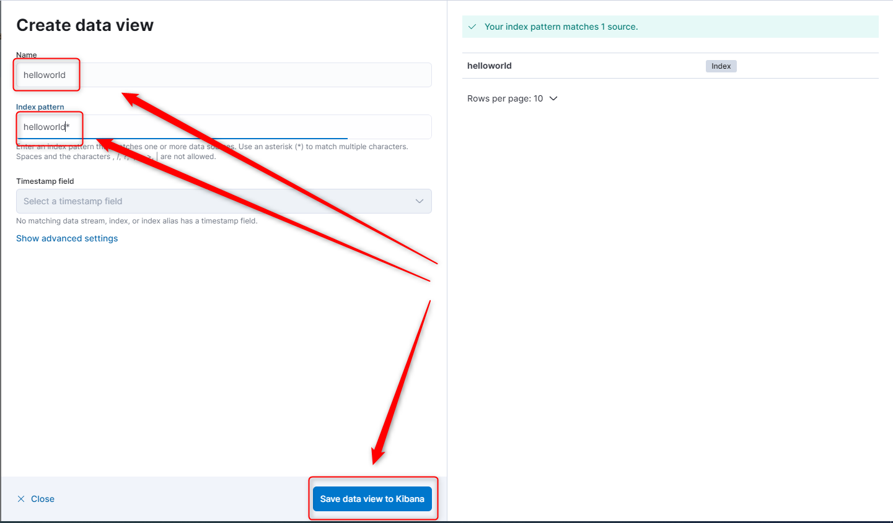
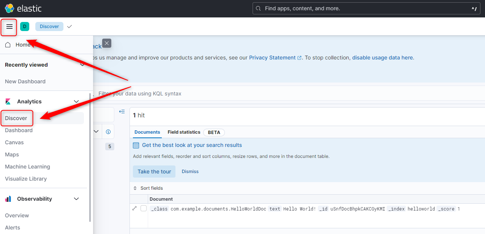

USAGE
-----

> This usage assumes that you have installed on your local PC following tools: **Java**, **Maven**, **Git**, **Docker** and **Docker Compose**. It also assumes that tool **Docker** is up and running.

Usage steps:
1. Start Elasticsearch and Kibana with `docker-compose up -d`
     * (Optional) Verify Elasticsearch with `http://localhost:9200`
1. Start application with `mvn spring-boot:run`
1. In browser visit `http://localhost:8080`
1. Display stored data in Kibana
     * In browser visit `http://localhost:5601`
     * Configure Kibana. Please check section **KIBANA CONFIGURATION** 
1. Clean up environment 
     * Stop application with `ctrl + C`
     * Stop Elasticsearch and Kibana with `docker-compose down`

DESCRIPTION
-----------

##### Goal
The goal of this project is to present how to connect **Elasticsearch** and **Kibana** with **Java Spring Boot** application.

Tools Elasticsearch and Kibana are deployed as **Docker Containers** by **Docker Compose** tool.

##### Terminology
Terminology explanation:
* **Java Spring Boot application**: application created in Java programming language and basing on Spring Boot framework. This application returns text "Hello World" in JSON format.
* **NoSql database**: database that enables storing and management of data in other way than relational databases
* **Elasticsearch**: it's noSql database and search engine based on Lucene. Because it creates indexes then search if very fast here
* **Kibana**: it's tool for visualization datas 
* **Docker**: platform for deploying application in closed units called Docker Containers
* **Docker Compose**: tool for working with many Docker Containers

##### Flow
The following flow takes place in this project:
1. User via any browser sends request to application HelloWorld for content
1. Application HelloWorld saves text "Hello World" to database and then read it
1. Application HelloWorld returns response with message. This response is presented to User via browser

##### Launch
To launch this application please make sure that the **Preconditions** are met and then follow instructions from **Usage** section.

##### Technologies
This project uses following technologies:
* **Spring Boot** framework: `https://docs.google.com/document/d/1mvrJT5clbkr9yTj-AQ7YOXcqr2eHSEw2J8n9BMZIZKY/edit?usp=sharing`
* **Elasticsearch**: `https://docs.google.com/document/d/1zev8rQh6i5Pp66F1rhpt4sBO2ao5Tsn3NlcSRtrTbFg/edit?usp=sharing`

PRECONDITIONS
-------------
##### Preconditions - Tools
* Installed **Operating System** (tested on Windows 10)
* Installed **Java** (tested on version 1.8.0_291). Tool details: `https://docs.google.com/document/d/119VYxF8JIZIUSk7JjwEPNX1RVjHBGbXHBKuK_1ytJg4/edit?usp=sharing`
* Installed **Maven** (tested on version 3.8.5). Tool details: `https://docs.google.com/document/d/1cfIMcqkWlobUfVfTLQp7ixqEcOtoTR8X6OGo3cU4maw/edit?usp=sharing`
* Installed **Git** (tested on version 2.33.0.windows.2). Tool details: `https://docs.google.com/document/d/1Iyxy5DYfsrEZK5fxZJnYy5a1saARxd5LyMEscJKSHn0/edit?usp=sharing`
* Installed **Docker** (tested on version 4.17.0)
* Installed **Docker Compose** (tested on version 2.15.1)

##### Preconditions - Actions
* **Download** source code using Git 
* Open any **Command Line** (for instance "Windonw PowerShell" on Windows OS) tool on **project's folder**

KIBANA CONFIGURATON
-------------------

Link:
* http://localhost:5601

