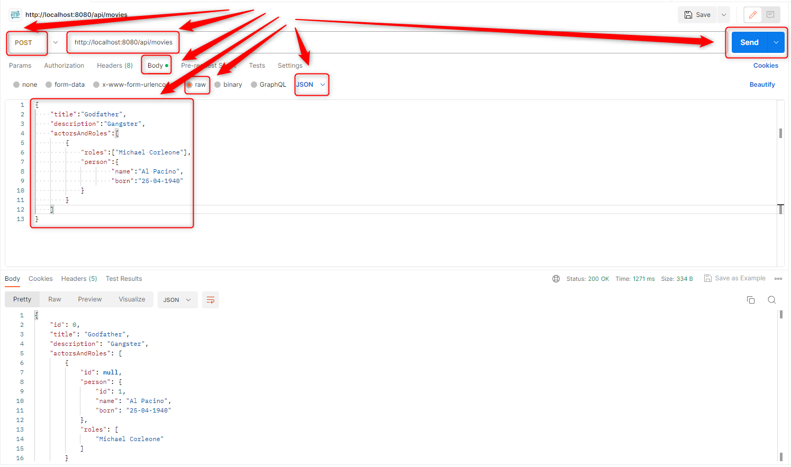
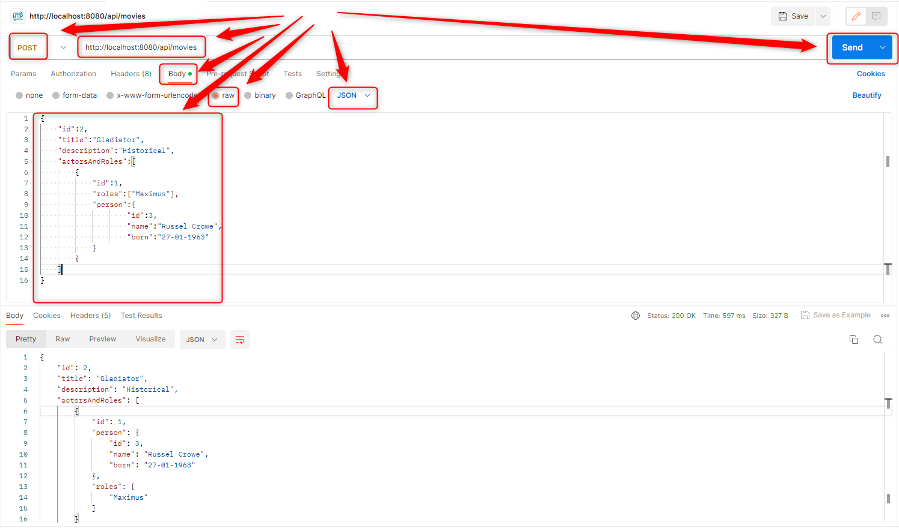
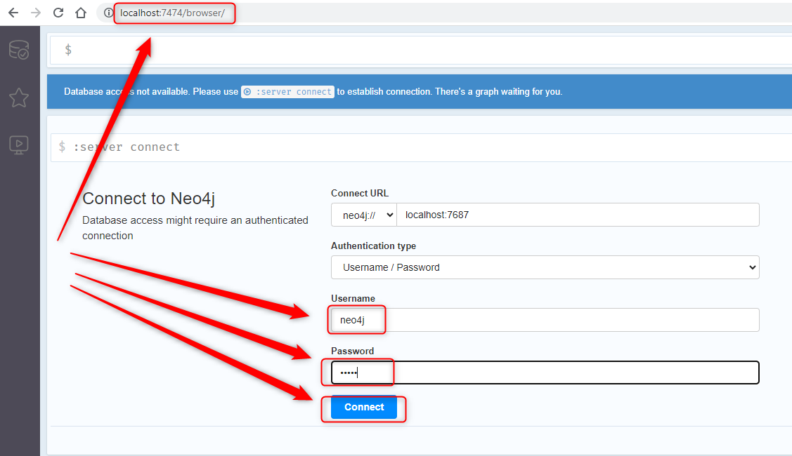
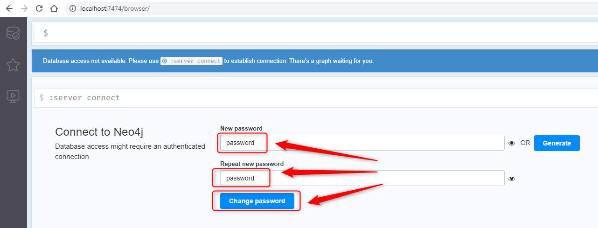
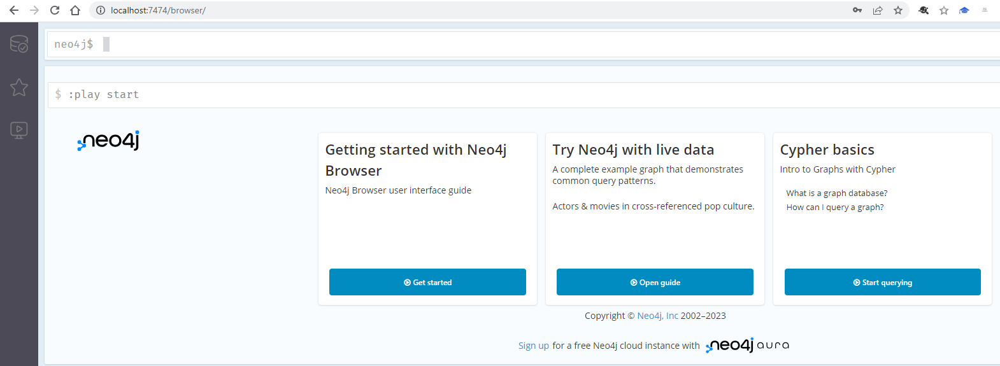
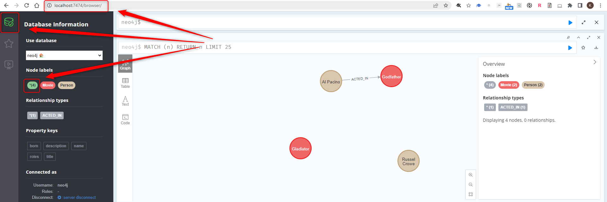

USAGE
-----

> This usage assumes that you have installed on your local machine following tools: **Java**, **Maven**, **Git**, **Docker** and **Docker Compose**.

Usage steps:
1. In Command Line tool start Neo4J database with `docker-compose up -d`
1. In Browser configure Neo4J database (check section **NEO4J CONFIGURATION** for details)
     * Log in to Neo4j ("Authentication Type": "Username / Password", credentials **neo4j/neo4j**) with `http://localhost:7474`
     * Set new password as **password**
1. In Command Line tool start application with `mvn spring-boot:run`
1. In Postman tool **create nodes with relationship** using POST method with `http://localhost:8080/api/movies`
     * Body -> raw -> JSON
     ```
     {
          "title":"Godfather",
          "description":"Gangster",
          "actorsAndRoles":[
               {
                    "roles":["Michael Corleone"],
                    "person":{
                         "name":"Al Pacino",
                         "born":"25-04-1940"
                    }
               }
          ]
     }
     ```
1. In Postman tool **create nodes without relationship** using POST method with `http://localhost:8080/api/movies`
     * Body -> raw -> JSON
     ```
     {
          "id":2,
          "title":"Gladiator",
          "description":"Historical",
          "actorsAndRoles":[
               {
                    "id":1,
                    "roles":["Maximus"],
                    "person":{
                         "id":3,
                         "name":"Russel Crowe",
                         "born":"27-01-1963"
                    }
               }
          ]
     }
     ```
1. In Browser check result in Neo4J database (check section **NEO4J CONSOLE** for details)
1. Clean up environment 
     * In Command Line tool stop application with `ctrl + C`
     * In Command Line tool stop docker compose applications with `docker-compose down`


USAGE PRINTSCREENS
------------------






DESCRIPTION
-----------

##### Goal
The goal of this project is to present how to implement **CRUD (Create, Read, Update, Delete)** operations with **nodes and relationships** on **Neo4J** noSql database in **Java** application type **API REST** with usage **Spring Boot** framework.

Neo4J database is started by **Docker Compose** tool.

This project is based on following GIT project: `https://github.com/RosarioB/spring-boot-rest-api-crud-neo4j/tree/main`

##### Terminology
Terminology explanation:
* **Java Spring Boot application**: application created in Java programming language and basing on Spring Boot framework. This application returns text "Hello World" in JSON format.
* **NoSql database**: database that enables storing and management of data in other way than relational databases
* **Neo4J database**: noSql database type Graph. It means that data are stored in nodes and edges. Nodes typically store information about people, places, and things, while edges store information about the relationships between the nodes
* **Docker**: platform for deploying application in closed units called Docker Containers
* **Docker Compose**: tool for working with many Docker Containers

##### Flow
The following flow takes place in this project:
1. User via Postman sends request to application for a content. Request can be type CRUD: Create, Read, Update, Delete
1. Application sends back response to User via Postman

##### Launch
To launch this application please make sure that the **Preconditions** are met and then follow instructions from **Usage** section.

##### Technologies
This project uses following technologies:
* **Spring Boot** framework: `https://docs.google.com/document/d/1mvrJT5clbkr9yTj-AQ7YOXcqr2eHSEw2J8n9BMZIZKY/edit?usp=sharing`
* **Java**: `https://docs.google.com/document/d/119VYxF8JIZIUSk7JjwEPNX1RVjHBGbXHBKuK_1ytJg4/edit?usp=sharing`
* **Maven**: `https://docs.google.com/document/d/1cfIMcqkWlobUfVfTLQp7ixqEcOtoTR8X6OGo3cU4maw/edit?usp=sharing`
* **Git**: `https://docs.google.com/document/d/1Iyxy5DYfsrEZK5fxZJnYy5a1saARxd5LyMEscJKSHn0/edit?usp=sharing`


PRECONDITIONS
-------------

##### Preconditions - Tools
* Installed **Operating System** (tested on Windows 11)
* Installed **Java** (tested on version 17.0.5)
* Installed **Maven** (tested on version 3.8.5)
* Installed **Git** (tested on version 2.33.0.windows.2)
* Installed **Docker** (tested on version 4.17.0)
* Installed **Docker Compose** (tested on version 2.15.1)


##### Preconditions - Actions
* **Download** source code using Git 
* Open any **Command Line** (for instance "Windonw PowerShell" on Windows OS) tool on the main **project's folder**.


NEO4J CONFIGURATION
-------------------

Details:
* URL: `http://localhost:7474`
* Default Credentials: neo4j / neo4J
* New password: password








NEO4J CONSOLE
-------------

