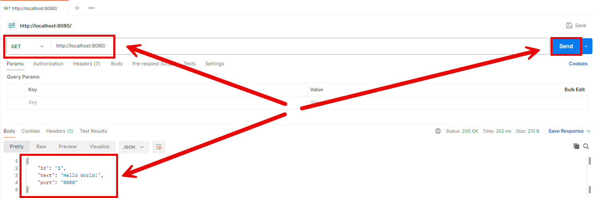
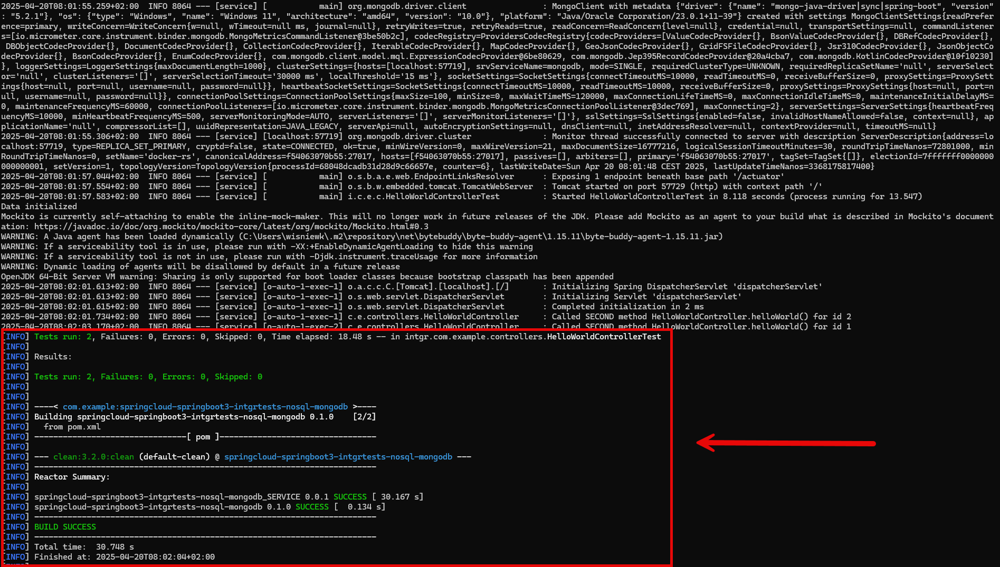

EXAMPLE
-------

DESCRIPTION
-----------

##### Goal
The goal of this project is to present how to create **Integration Tests** for microservices with **no sql** database type **MongoDb** with usage **Java** programming language and **Spring Cloud** and **Spring Boot 3** frameworks.

##### Services
This project consists of following applications:
* **Database**: SQL database - in this case type **MySql**
* **Service**: an application created in **Java** programming language with usage **Spring Boot** framework. It has connection with MySql database

##### Inputs
This project requires following inputs:
* **Service**: http requests from any Rest Client. It handles GET method for path "/message/{id}"

##### Outputs
This project provides following outputs:
* **Service**: http responses with JSONs with data

##### Terminology
Terminology explanation:
* **Git**: tool for distributed version control
* **Maven**: tool for build automation
* **Java**: object-oriented programming language
* **Spring Boot**: framework for Java. It consists of: Spring + Container + Configuration
* **Spring Cloud**: Spring Cloud is a framework within the Spring ecosystem that provides tools for building distributed systems and microservices. It simplifies tasks like service discovery, configuration management, load balancing, circuit breakers, and distributed tracing, allowing developers to build scalable and resilient cloud-native applications.
* **Database**: A database is an organized collection of data that is stored and managed electronically, allowing for efficient retrieval, manipulation, and updating of information. It is typically managed by a database management system (DBMS).
* **MongoDb**: MongoDB is a NoSQL, document-oriented database that stores data in JSON-like BSON (Binary JSON) format. It's designed for scalability, flexibility, and high performance, making it ideal for handling large volumes of unstructured or semi-structured data. Instead of tables and rows (like in relational databases), MongoDB uses collections and documents, allowing for dynamic schemas and easier data modeling for modern applications.
* **Unit Tests**: Unit tests are short, automated tests written to verify that individual units of code (like functions or methods) work as expected. They're typically fast, isolated, and help catch bugs early in development.

USAGES
------

This project can be tested in following configurations:
* **Usage Manual**: infrastructure services are started as Docker containers. Application is started manually in a command line.
* **Usage Docker Compose**: all services are started as Docker containers defined in docker compose file.
* **Usage Kubernetes (Kind)**: all services are started as Kubernetes pods.

USAGE MANUAL
------------

> **Usage Manual** means that infrastructure services are started as Docker containers. Application is started manually in a command line.

> Please **clone/download** project, open **project's main folder** in your favorite **command line tool** and then **proceed with steps below**.

> **Prerequisites**:
* **Operating System** (tested on Windows 11)
* **Git** (tested on version 2.33.0.windows.2)
* **Docker** (tested on version 4.33.1)

##### Required steps:
1. Start **Docker** tool
1. In a first command line tool **start Docker containers** with `docker-compose -f .\docker-compose\infrastructure\docker-compose.yaml up -d --build`
1. In a second command line tool **start application** with `mvn spring-boot:run`
1. In any Rest Client (e.g. Postman) using GET method visit `http://localhost:8080`
   * Expected following **JSON**: {"id": 1, "text": "Hello World!", "port": "8080"}
1. Clean up environment
   * In the second command line tool **stop application** with `ctrl + C`
   * In the first command line tool **remove Docker containers** with `docker-compose -f .\docker-compose\infrastructure\docker-compose.yaml down --rmi all`
   * Stop **Docker** tool

USAGE DOCKER COMPOSE
--------------------

> **Usage Docker Compose** means all services are started as Docker containers defined in docker compose file.

> Please **clone/download** project, open **project's main folder** in your favorite **command line tool** and then **proceed with steps below**.

> **Prerequisites**:
* **Operating System** (tested on Windows 11)
* **Git** (tested on version 2.33.0.windows.2)
* **Docker** (tested on version 4.33.1)

##### Required steps:
1. Start **Docker** tool
1. In any command line tool **start Docker containers** with `docker-compose -f .\docker-compose\full\docker-compose.yaml up -d --build`
1. In any Rest Client (e.g. Postman) using GET method visit `http://localhost:8080`
   * Expected following **JSON**: {"id": 1, "text": "Hello World!", "port": "8080"}
1. Clean up environment
   * In a command line tool **remove Docker containers** with `docker-compose -f .\docker-compose\full\docker-compose.yaml down --rmi all`
   * Stop **Docker** tool

##### Optional steps:
1. In a command line tool validate Docker Compose with `docker-compose config`
1. In a command line tool check list of Docker images with `docker images`
1. In a command line tool check list of all Docker containers with `docker ps -a`
1. In a command line tool check list of active Docker containers with `docker ps`
1. In a command line tool check list of Docker nerworks with `docker network ls`
1. In a command line tool check APP container logs with `docker logs app-container`

USAGE KUBERNETES (KIND)
---------------------------

> **Usage Kubernetes** means that all services are started as Kubernetes pods.

> Please **clone/download** project, open **project's main folder** in your favorite **command line tool** and then **proceed with steps below**.

> **Prerequisites**:
* **Operating System** (tested on Windows 11)
* **Git** (tested on version 2.33.0.windows.2)
* **Kind** (tested on version 0.26.0)

##### Required steps:
1. Start **Docker** tool
1. In the first command line tool create and start cluster **Kind** with `kind create cluster --name helloworld`
1. In the first command line tool **start Kubernetes Pods** with `kubectl apply -f ./k8s --recursive`
1. In the first command line tool **check status of Kubernetes Pods** with `kubectl get pods`
   * Expected mysql, second and first as **READY 1/1** (it can take few minutes)
1. In the second command line tool **forward port of App** with `kubectl port-forward service/app 8080:8080`
1. In any Rest Client (e.g. Postman) using GET method visit `http://localhost:8080`
   * Expected following **JSON**: {"id": 1, "text": "Hello World!", "port": "8080"}
1. Clean up environment
   * In the second command line tool **stop forwarding port of App** with `ctrl + C`
   * In the first command line tool **remove Kubernetes Pods** with `kubectl delete -f ./k8s --recursive`
   * In the first command line tool delete cluster **Kind** with `kind delete cluster --name helloworld`
   * Stop **Docker** tool

##### Optional steps:
1. In a command line tool build Docker App image with `docker build -f docker/Dockerfile -t wisniewskikr/java-springboot3-helloworld-db-nosql-mongodb:0.0.1 .`
1. In a command line tool push Docker App image to Docker Repository with `docker push wisniewskikr/java-springboot3-helloworld-db-nosql-mongodb:0.0.1`
1. In the first command line tool with administrator privileges check clusers with `kind get clusters`
1. In a command line tool check Kubernetes Deployments with `kubectl get deployments`
1. In a command line tool check Kubernetes Deployments details with **kubectl describe deployment {deployment-name}**
1. In a command line tool check Kubernetes Services with `kubectl get services`
1. In a command line tool check Kubernetes Services details with **kubectl describe service {service-name}**
1. In a command line tool check Kubernetes Pods with `kubectl get pods`
1. In a command line tool check Kubernetes Pods details with **kubectl describe pod {pod-name}**
1. In a command line tool check Kubernetes Pods logs with **kubectl logs {pod-name}**
