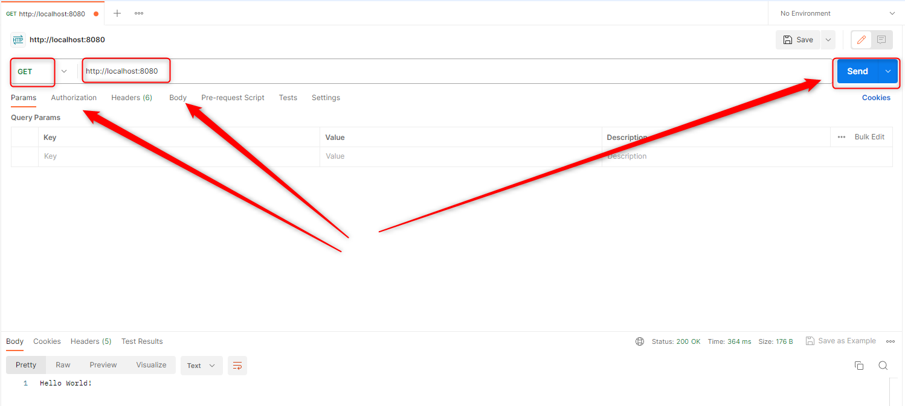

USAGE
-----

Usage steps:
1. Start Docker tool
1. In a command line tool start MySql Docker container with `docker-compose -f .\docker-compose\docker-compose.yaml up -d --build`
1. In command line tool start application with `mvn spring-boot:run`
1. In Postman tool using GET method visit `http://localhost:8080`
1. Clean up environment 
    * Stop application with `ctrl + C`
    * In a command line tool remove MySql Docker container with `docker-compose -f .\docker-compose\docker-compose.yaml down --rmi all`
    * Stop Docker tool

USAGE PRINTSCREENS
------------------

DESCRIPTION
-----------

##### Goal
The goal of this project is to present how to use database migration tool **Flyway** in **Java** application with usage **Spring Boot** framework and database type **MySql**.

##### Terminology
Terminology explanation:
* **Java Spring Boot application**: application created in Java programming language with usage Spring Boot framework
* **Flyway**: this tool enables automated database migration. This tool is used for versioning database changes. All database migration scrips are loaded before application is started
* **MySql**: relational database

##### Flow
The following flow takes place in this project:
1. User via any browser sends request to application HelloWorld for content
1. Application HelloWorld saves text "Hello World" to database and then read it
1. Application HelloWorld returns response with message. This response is presented to User via browser

##### Launch
To launch this application please make sure that the **Preconditions** are met and then follow instructions from **Usage** section.

##### Technologies
This project uses following technologies:
* **Spring Boot** framework: `https://docs.google.com/document/d/1mvrJT5clbkr9yTj-AQ7YOXcqr2eHSEw2J8n9BMZIZKY/edit?usp=sharing`
* **Java**: `https://docs.google.com/document/d/119VYxF8JIZIUSk7JjwEPNX1RVjHBGbXHBKuK_1ytJg4/edit?usp=sharing`
* **Maven**: `https://docs.google.com/document/d/1cfIMcqkWlobUfVfTLQp7ixqEcOtoTR8X6OGo3cU4maw/edit?usp=sharing`
* **Git**: `https://docs.google.com/document/d/1Iyxy5DYfsrEZK5fxZJnYy5a1saARxd5LyMEscJKSHn0/edit?usp=sharing`

PRECONDITIONS
-------------
##### Preconditions - Tools
* Installed **Operating System** (tested on Windows 11)
* Installed **Java** (tested on version 17.0.5)
* Installed **Maven** (tested on version 3.8.5)
* Installed **Git** (tested on version 2.33.0.windows.2)

##### Preconditions - Actions
* **Download** source code using Git 
* Open any **Command Line** (for instance "Windonw PowerShell" on Windows OS) tool on the main **project's folder**.