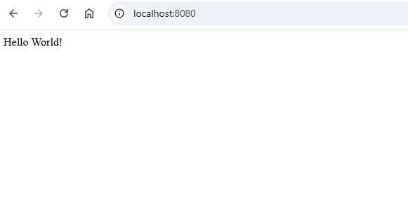
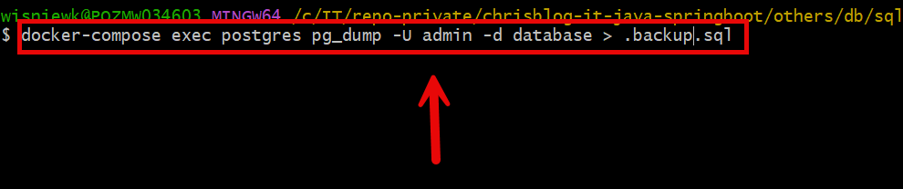

EXAMPLE
-------

DESCRIPTION
-----------

##### Goal
The goal of this project is to present how to perform **backup** of **Postgres** dababase basing on application in **Java** programming language with usage **Spring Boot** framework.

##### Elements
This project consists of following elements:
* **MVC**: this application consists of:
     * Single page which displays "Hello World" message from Postgres database

##### Terminology
Terminology explanation:
* **Git**: tool for distributed version control
* **Maven**: tool for build automation
* **Java**: object-oriented programming language
* **Spring Boot**: framework for Java. It consists of: Spring + Container + Configuration
* **MVC**: MVC is a design pattern that separates an application into three components: 1. Model: Manages data and business logic. 2. View: Handles UI and presentation (Thymeleaf templates in Spring Boot). 3. Controller: Processes user requests, interacts with the model, and updates the view.
* **Postgres**: PostgreSQL (or Postgres) is a powerful, open-source relational database management system (RDBMS) known for its extensibility, reliability, and SQL compliance. It supports advanced features like ACID transactions, JSONB storage, full-text search, and custom functions, making it ideal for modern applications.

USAGE
-----

> Please **clone/download** project, open **project's main folder** in your favorite **command line tool** and then **proceed with steps below**.

> **Prerequisites**:  
* **Operating System** (tested on Windows 11)
* **Git** (tested on version 2.33.0.windows.2)
* **Docker** (tested on version 4.33.1)

##### Required steps:
1. Start **Docker** tool
1. Start database with `docker-compose up -d`
1. Start application with `mvn spring-boot:run`
1. Visit `http://localhost:8080`
1. Clean up local environment 
     * Stop application `ctrl + C`
     * Stop database and console with `docker-compose down`
     * Stop Docker tool

##### Optional steps:
1. Create Posgres backup file with `docker-compose exec db pg_dump -U myuser -d mydatabase > .backup.sql`
1. Load Postgres backup file with `docker-compose exec -T db psql -U myuser -d mydatabase < .backup.sql`