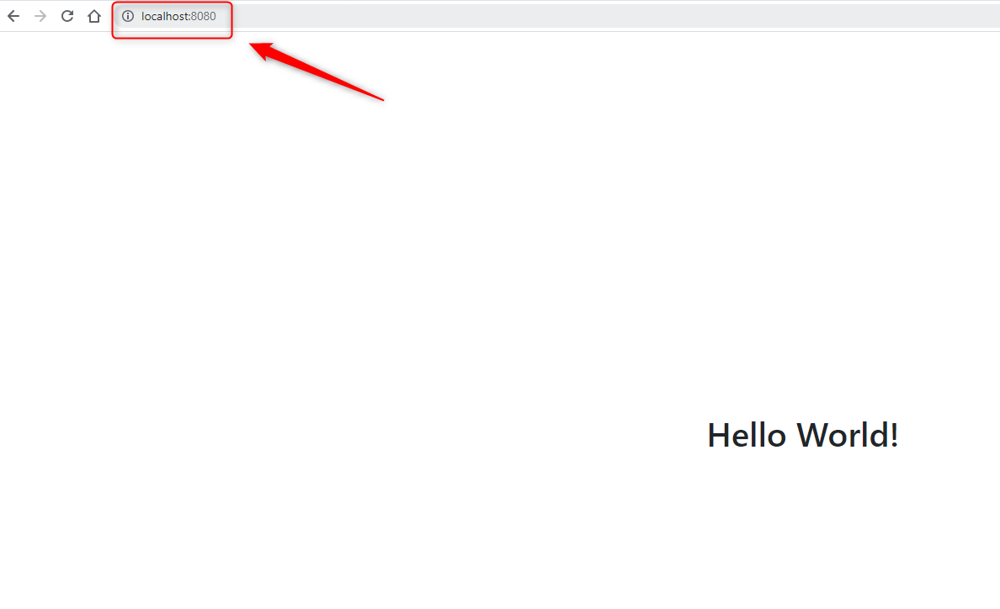

USAGE
-----

Usage steps:
1. In any Command Line tool start application with `mvn spring-boot:run`
1. In any Browser open application with `http://localhost:8080`
1. (Optional) In any browser open H2 Console (credentials admin / admin123) with `http://localhos:8080/h2-console`     
1. In Command Line tool clean up environment with `ctrl + C`

USAGE PRINTSCREENS
------------------

DESCRIPTION
-----------

##### Goal
The goal of this project is to present how to implement **embedded database H2** in **Java** application type **HTML** with usage **Spring Boot** and **Thymeleaf** frameworks.

##### Flow
The following flow takes place in this project:
1. User via any Browser sends request to application for a content.
1. Application sends back response to User via Browser

##### Launch
To launch this application please make sure that the **Preconditions** are met and then follow instructions from **Usage** section.

##### Technologies
This project uses following technologies:
* **Spring Boot** framework: `https://docs.google.com/document/d/1mvrJT5clbkr9yTj-AQ7YOXcqr2eHSEw2J8n9BMZIZKY/edit?usp=sharing`
* **Java**: `https://docs.google.com/document/d/119VYxF8JIZIUSk7JjwEPNX1RVjHBGbXHBKuK_1ytJg4/edit?usp=sharing`
* **Maven**: `https://docs.google.com/document/d/1cfIMcqkWlobUfVfTLQp7ixqEcOtoTR8X6OGo3cU4maw/edit?usp=sharing`
* **Git**: `https://docs.google.com/document/d/1Iyxy5DYfsrEZK5fxZJnYy5a1saARxd5LyMEscJKSHn0/edit?usp=sharing`
* **Thymeleaf**: `https://docs.google.com/document/d/1FTMKfQ5-f6PZ4cW7LSsm5_NeiBgkTe4gzSue2BCX0Lg/edit?usp=sharing`

PRECONDITIONS
-------------

##### Preconditions - Tools
* Installed **Operating System** (tested on Windows 11)
* Installed **Java** (tested on version 17.0.5)
* Installed **Maven** (tested on version 3.8.5)
* Installed **Git** (tested on version 2.33.0.windows.2)

##### Preconditions - Actions
* **Download** source code using Git 
* Open any **Command Line** (for instance "Windonw PowerShell" on Windows OS) tool on the main **project's folder**.