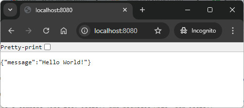

USAGE
-----

> Please be aware that following tools should be installed on your local PC: **Java**, **Maven** **Git** and **Docker**. Docker has to be **up and running**. 

> Please **clone/download** project, open **project's main folder** in your favorite **command line tool** and then **proceed with steps below**. 

Required steps:
1. In a command line tool start MySql database with `docker run -d --name mysql-container -e MYSQL_ROOT_PASSWORD=my_secret_password -e MYSQL_DATABASE=database -e MYSQL_USER=admin -e MYSQL_PASSWORD=admin123 -p 3306:3306 mysql:5.7`
1. In a command line tool start application with `mvn spring-boot:run`
1. In a browser visit `http://localhost:8080`
   * Expected JSON **{"message":"Hello World!"}**
1. Clean up environment 
     * In a command line tool stop application with `ctrl + C`
     * In a command line tool stop and remove Docker container with `docker rm -f mysql-container`
     * In a command line tool remove Docker image with `docker rmi mysql:5.7`

Optional steps:
1. In a command line tool check list of Docker images with `docker images`
1. In a command line tool check list of all Docker containers with `docker ps -a`
1. In a command line tool check list of active Docker containers with `docker ps`

USAGE IMAGES
------------

DESCRIPTION
-----------

##### Goal
The goal of this project is to present how to connect a **MySql** database with an application created in **Java** programming language with usage **Spring Boot 2** framework. Additionally database is initially filled with data provided by file **data.sql**.

##### Terminology
Terminology explanation:
* **Java**: object-oriented programming language
* **Spring Boot**: framework for Java. It consists of: Spring + Container + Configuration
* **Maven**: tool for build automation
* **Git**: tool for distributed version control
* **MySql**: database type SQL
* **data.sql**: it's a default SQL file in Spring Boot with data which should be loaded to database. 

##### Launch
To launch this application please make sure that the **Preconditions** are met and then follow instructions from **Usage** section.

PRECONDITIONS
-------------

##### Preconditions - Tools
* Installed **Operating System** (tested on Windows 11)
* Installed **Java** (tested on version 17.0.5)
* Installed **Maven** (tested on version 3.8.5)
* Installed **Git** (tested on version 2.33.0.windows.2)
* Installed **Docker** (texted on version 4.33.1)

##### Preconditions - Actions
* Start **Docker**
* Download **Source Code** (using Git or in any other way) 
* Open any **Command Line** tool (for instance "Windonw PowerShell" on Windows OS) on downloaded **project's main folder**