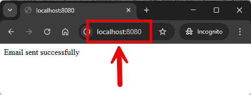
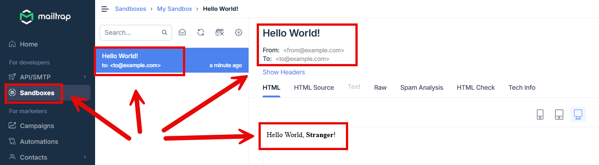
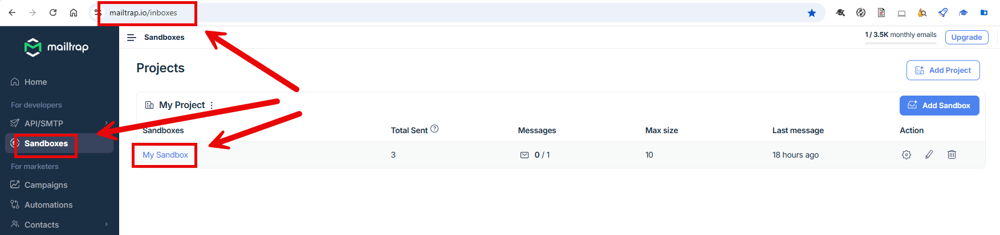
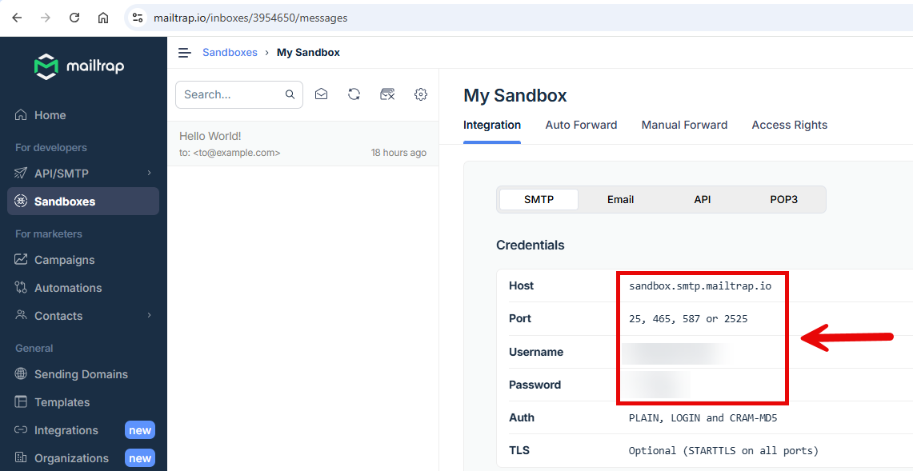

EXAMPLE
-------

DESCRIPTION
-----------

##### Goal
The goal of this project is to present how to send **emails** type **text** with usage **Java** programming language and
**Spring Boot 3** framework. 

Emails are sent and received by tool called **Mailtrap**.

##### Content
This project consists of following applications:
* **App**: application type REST API which sends predefined "Hello World" emails

##### Terminology
Terminology explanation:
* **Git**: Git is a distributed version control system used to track changes in code, collaborate with others, and manage source code history efficiently.
* **Java**: Java is a high-level, object-oriented programming language known for its platform independence, achieved through the Java Virtual Machine (JVM). It is widely used for developing web, mobile, desktop, and enterprise applications, emphasizing simplicity, security, and portability. "Write once, run anywhere" is its core principle.
* **Maven**: Maven is a build automation and dependency management tool for Java projects, streamlining project builds, managing libraries, and ensuring consistent project configurations.
* **Spring Boot**: Spring Boot is a framework for building Java-based applications that simplifies development by providing auto-configuration, embedded servers, and production-ready tools, enabling developers to create standalone, production-ready applications with minimal configuration.
* **Mailtrap**: Mailtrap is an email testing tool that simulates an SMTP server, letting developers safely capture, inspect, and debug outgoing emails from their applications without actually sending them to real recipients.

USAGES
------

This project can be tested in following configurations:
* **Usage Manual**: infrastructure services are started as Docker containers. Application services are started manually in command line
* **Usage Docker Compose**: all services are started as Docker containers defined in a Docker Compose file.

USAGE MANUAL
------------

> **Usage Manual** means that infrastructure services are started as Docker containers. Application services are started manually in command line.

> Please **clone/download** project, open **project's main folder** in your favorite **command line tool** and then **proceed with steps below**.

> **Prerequisites**:
* **Operating System** (tested on Windows 11)
* **Git** (tested on version 2.33.0.windows.2)
* **Java** (tested on version 23.0.1)
* **Maven** (tested on version 3.9.6)

##### Required steps:
1. Configure **Mailtrap** (check section **MAILTRAP CONFIGURATION**)
1. Update file **src/main/resources/application.properties**
    * Update property **spring.mail.username** with value from Mailtrap
    * Update property **spring.mail.password** with value from Mailtrap
1. In a command line tool **start application** with `mvn spring-boot:run`
1. In a browser send message with `http://localhost:8080`
    * Expected text **Email sent successfully** in the browser
1. In a browser check **Mailtrap sandbox** (check section **EXAMPLE**) 
    * Expected from **from@example.com**
    * Expected to **to@example.com**
    * Expected subject **Hello World!**
    * Expected text **Hello World, Stranger!**
1. Clean up environment
    * In a command line tool **stop application** with `ctrl + C`

USAGE DOCKER COMPOSE
--------------------

> **Usage Docker Compose** means all services are started as Docker containers defined in Docker Compose file.

> Please **clone/download** project, open **project's main folder** in your favorite **command line tool** and then **proceed with steps below**.

> **Prerequisites**:
* **Operating System** (tested on Windows 11)
* **Git** (tested on version 2.33.0.windows.2)
* **Java** (tested on version 23.0.1)
* **Maven** (tested on version 3.9.6)
* **Docker** (tested on version 4.33.1)

Usage steps:
1. Configure **Mailtrap** (check section **MAILTRAP CONFIGURATION**)
1. Update file **docker-compose.yaml**
   * Update property **spring.mail.username** with value from Mailtrap
   * Update property **spring.mail.password** with value from Mailtrap
1. Start **Docker** tool
1. In a command line tool **start Docker containers** with `docker-compose up -d --build`
1. In a browser send message with `http://localhost:8080`
   * Expected text **Email sent successfully** in the browser
1. In a browser check **Mailtrap sandbox** (check section **EXAMPLE**)
   * Expected from **from@example.com**
   * Expected to **to@example.com**
   * Expected subject **Hello World!**
   * Expected text **Hello World, Stranger!**
1. Clean up environment
    * Remove containers `docker-compose down --rmi all`
    * Stop **Docker** tool

MAILTRAP CONFIGURATION
---------------------

