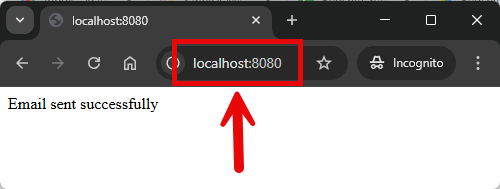
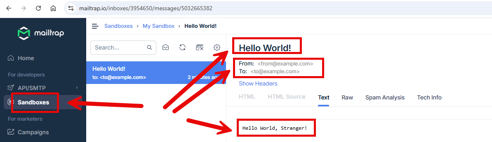
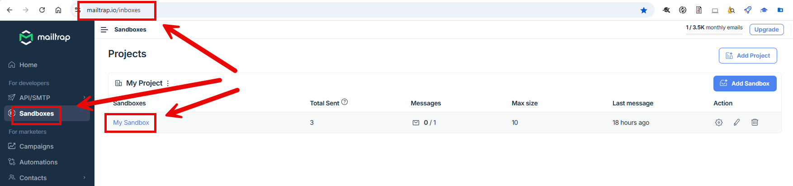
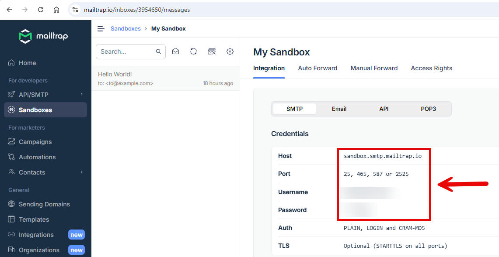

EXAMPLE
-------

DESCRIPTION
-----------

##### Goal
The goal of this project is to present how to send **emails** type **text** with usage **Java** programming language and
**Spring Boot 3** framework. 

Emails are sent and received by tool called **Mailtrap**.

##### Content
This project consists of following applications:
* **App**: application type REST API which sends predefined "Hello World" emails

##### Terminology
Terminology explanation:
* **Git**: Git is a distributed version control system used to track changes in code, collaborate with others, and manage source code history efficiently.
* **Java**: Java is a high-level, object-oriented programming language known for its platform independence, achieved through the Java Virtual Machine (JVM). It is widely used for developing web, mobile, desktop, and enterprise applications, emphasizing simplicity, security, and portability. "Write once, run anywhere" is its core principle.
* **Maven**: Maven is a build automation and dependency management tool for Java projects, streamlining project builds, managing libraries, and ensuring consistent project configurations.
* **Spring Boot**: Spring Boot is a framework for building Java-based applications that simplifies development by providing auto-configuration, embedded servers, and production-ready tools, enabling developers to create standalone, production-ready applications with minimal configuration.
* **Mailtrap**: Mailtrap is an email testing tool that simulates an SMTP server, letting developers safely capture, inspect, and debug outgoing emails from their applications without actually sending them to real recipients.

USAGES
------

This project can be tested in following configurations:
* **Usage Manual**: infrastructure services are started as Docker containers. Application services are started manually in command line
* **Usage Docker Compose**: all services are started as Docker containers defined in a Docker Compose file.

USAGE MANUAL
------------

> **Usage Manual** means that infrastructure services are started as Docker containers. Application services are started manually in command line.

> Please **clone/download** project, open **project's main folder** in your favorite **command line tool** and then **proceed with steps below**.

> **Prerequisites**:
* **Operating System** (tested on Windows 11)
* **Git** (tested on version 2.33.0.windows.2)
* **Docker** (tested on version 4.33.1)

##### Required steps:
1. Start **Docker** tool
1. In a first command line tool **start Docker containers** with `docker-compose -f .\docker-compose\infrastructure\docker-compose.yaml up -d --build`
1. In a second command line tool **start PRODUCER application** with `mvn -f ./springboot3-kafka-obsidiandynamics-json_producer spring-boot:run`
1. In a third command line tool **start CONSUMER application** with `mvn -f ./springboot3-kafka-obsidiandynamics-json_consumer spring-boot:run`
1. In a browser send message via **PRODUCER** and visit `http://localhost:8080/api/producer?name={name}` (e.g. `http://localhost:8080/api/producer?name=Stranger)
    * Expected text **The message was sent to Consumer via Kafka** in the browser
1. In a browser check **CONSUMER** and visit `http://localhost:9090/api/consumer`
    * Expected text **Message from Producer via Kafka is: Hello World {name}** (e.g. **Message from Producer via Kafka is: Hello World Stranger**) in the browser
1. Clean up environment
    * In the third command line tool **stop CONSUMER application** with `ctrl + C`
    * In the second command line tool **stop PRODUCER application** with `ctrl + C`
    * In the first command line tool **remove Docker containers** with `docker-compose -f .\docker-compose\infrastructure\docker-compose.yaml down --rmi all`
    * Stop **Docker** tool

USAGE DOCKER COMPOSE
--------------------

> **Usage Docker Compose** means all services are started as Docker containers definied in Docker Compose file.

> Please **clone/download** project, open **project's main folder** in your favorite **command line tool** and then **proceed with steps below**.

> **Prerequisites**:
* **Operating System** (tested on Windows 11)
* **Git** (tested on version 2.33.0.windows.2)
* **Docker** (tested on version 4.33.1)

Usage steps:
1. Start **Docker** tool
1. In a command line tool **start Docker containers** with `docker-compose -f .\docker-compose\full\docker-compose.yml up -d --build`
1. In a browser send message via **PRODUCER** and visit `http://localhost:8080/api/producer?name={name}` (e.g. `http://localhost:8080/api/producer?name=Stranger)
    * Expected text **The message was sent to Consumer via Kafka** in the browser
1. In a browser check **CONSUMER** and visit `http://localhost:9090/api/consumer`
    * Expected text **Message from Producer via Kafka is: Hello World {name}** (e.g. **Message from Producer via Kafka is: Hello World Stranger**) in the browser
1. Clean up environment
    * Remove containers `docker-compose -f .\docker-compose\full\docker-compose.yml down --rmi all`
    * Stop **Docker** tool

##### Optional steps:
1. In a browser check messages via **Kafdrop** with `http://localhost:9090`
    * For more details please check section **KAFDROP CONFIGURATION**

MAILTRAP CONFIGURATION
---------------------

