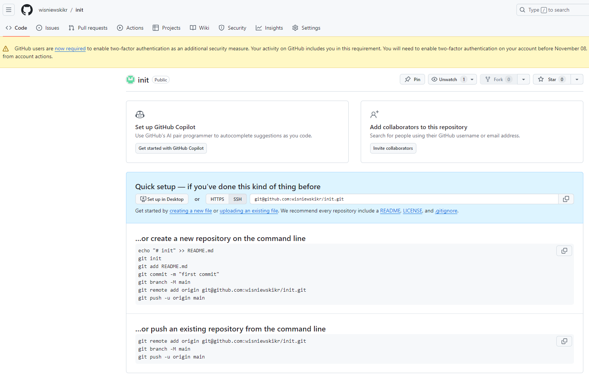
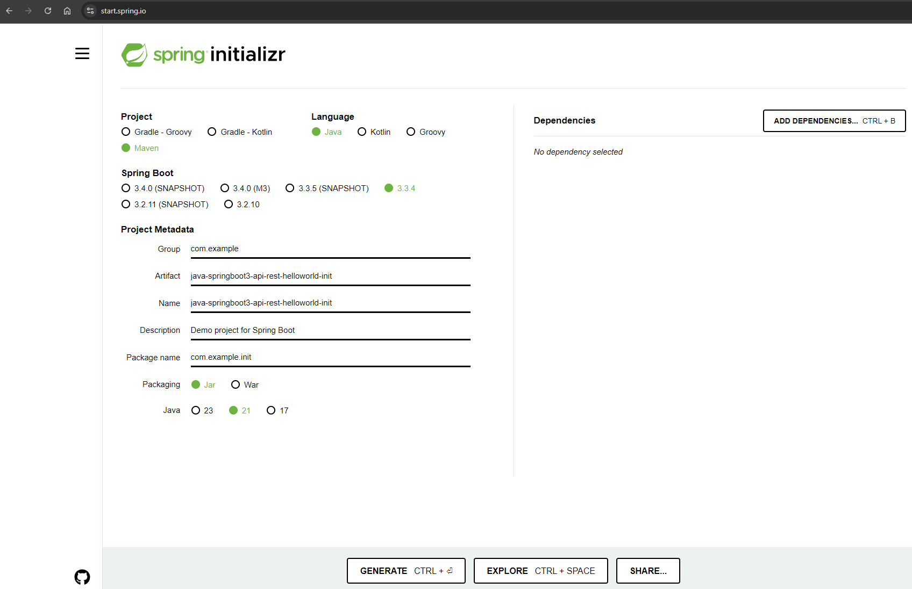

DESCRIPTION
-----------

##### Goal
The goal of this project is to present - step by step - how to init application based on **Java** programming language and **Spring Boot** framework. This application is created by **Spring Initializr**, then opened in **Visual Studio Code** IDE and at the end added to **GitHub** repository. 

##### Terminology
Terminology explanation:
* **Git**: tool for distributed version control
* **Maven**: tool for build automation
* **Java**: object-oriented programming language
* **Spring Boot**: framework for Java. It consists of: Spring + Container + Configuration
* **Spring Initializr**: it is an online tool provided by the Spring framework that helps developers quickly generate the foundational setup for new Spring Boot projects. It allows users to select project settings, such as build tool (Maven or Gradle), Spring Boot version, dependencies, and Java version, then generates a ready-to-use project structure with a ZIP file download. This accelerates the process of starting a Spring Boot application by automating the setup of key configurations and dependencies.
**Visual Studio Code (VS Code)**: it is a lightweight, open-source code editor developed by Microsoft. It supports multiple programming languages, offers built-in Git integration, and features an extensive marketplace for extensions. Key features include syntax highlighting, code completion (with IntelliSense), debugging tools, and a customizable user interface. It is cross-platform, running on Windows, macOS, and Linux.

EXAMPLE
-------

PREPARE VISUAL STUDIO CODE
--------------------------

Steps for preparation Visual Studio Code IDE:
* Download Visual Studio Code
* Install extension **Extension Pack for Java**
* Install extension **GitLens**
* Install extension **SonarLint**
* Install extension **Conventional Commits**
* Install extension **Docker**
* Install extension **Kubernetes**

PREPARE APPLICATION
-------------------

Steps for preparation application:
* Create Git project in **GitHub**. For intance project 'init'
* Create Spring Boot in **Spring Initializr**. For instance 'java-springboot3-api-rest-helloworld-init'
* Download and unzip project from **Spring Initializr**
* Open project in **Visual Studio Code**
* Open terminal in **Visual Studio Code**
* Init project as Git project with `git init`
* Add all files to Git project with `git add .`
* Check files status in Git project with `git status`
* Commit files to Git project with `git commit -m "Init project"`
* Create branch **main** with `git branch -M main`
* Connect Git local repository with remote repository with `git remote add origin git@github.com:wisniewskikr/init.git`
* Push changes to remote repository with `git push -u origin main`

USAGE MANUAL
------------

> **Usage Manual** means that **Java, Maven, Spring Boot application** and started **manually** from command line.

> Please **clone/download** project, open **project's main folder** in your favorite **command line tool** and then **proceed with steps below**. 

> Please be aware that following tools should be installed on your local PC:  
* **Operating System** (tested on Windows 11)
* **Java** (tested on version 17.0.5)
* **Maven** (tested on version 3.8.5)
* **Git** (tested on version 2.33.0.windows.2)

##### Required steps:
1. In a command line tool **start application** with `mvn spring-boot:run`
1. In a http browser visit http://localhost:8080
   * Expected HTML page with message **Hello World!**
1. Clean up environment:
     * In acommand line tool **stop application** with `ctrl + C`
     

##### Optional steps:
1. In a browser check application healthcheck with `http://localhost:8080/actuator/health`