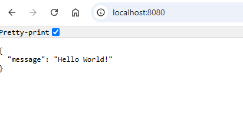

EXAMPLE
-------

DESCRIPTION
-----------

##### Goal
The goal of this project is to present how to implement **communication** between two **REST API** applications with usage **Java** programming language and **Spring Boot 3** framework. Class **RestClient** is used for this communication.

##### Elements
This project consists of following elements:
* **First**: Rest API application
   * Input: endpoint "api/vi/message"
   * Content: RestClient communication with second application
   * Output: JSON with message
* **Second**: Rest API application
   * Input: endpoint "api/vi/message"
   * Content: N/A
   * Output: JSON with message

##### Terminology
Terminology explanation:
* **Git**: Git is a distributed version control system (VCS) that tracks changes in code, allowing multiple developers to collaborate efficiently. It helps manage different versions of a project, enabling branching, merging, and rollback to previous states.
* **Maven**: Maven is a build automation and project management tool for Java-based projects, used primarily for dependency management and project configuration.
* **Java**: Java is a high-level, object-oriented programming language known for its platform independence, achieved through the Java Virtual Machine (JVM). It is widely used for web, mobile, and enterprise applications. Java follows the "write once, run anywhere" (WORA) principle, making it a popular choice for cross-platform development.
* **Spring Boot**: Spring Boot is a Java-based framework that simplifies the development of stand-alone, production-ready Spring applications by providing auto-configuration, embedded servers, and a convention-over-configuration approach.
* **REST API**: A REST API (Representational State Transfer API) is a web service that allows systems to communicate over HTTP using standard methods like GET, POST, PUT, and DELETE. It follows REST principles, ensuring scalability, statelessness, and resource-based interactions, typically using JSON or XML for data exchange.
* **RestClient**: A RestClient is a tool, library, or object used to send HTTP requests and receive responses from RESTful web services. It simplifies communication with APIs by handling methods like GET, POST, PUT, and DELETE, often providing features like authentication, headers, and data serialization. 

USAGES
------

This project can be tested in following configurations:
* **Usage Manual**: all services are started manually in a command line

USAGE MANUAL
------------

> Please be aware that following tools should be installed on your local PC: **Java**, **Maven** and **Git**. 

> Please **clone/download** project, open **project's main folder** in your favorite **command line tool** and then **proceed with steps below**. 

Usage steps:
1. In any command line tool start application with `mvn spring-boot:run`
1. In any browser visit `http://localhost:8080`
   * Expected JSON **{"message":"Hello World!"}**
1. Clean up environment 
     * In any command line tool stop application with `ctrl + C`