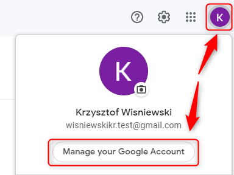
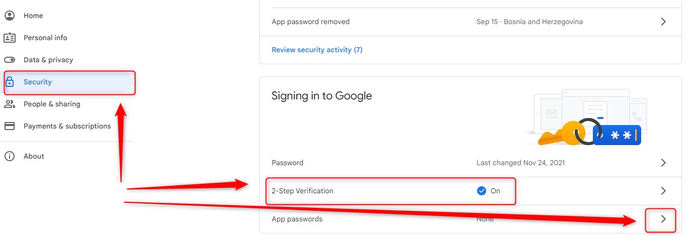
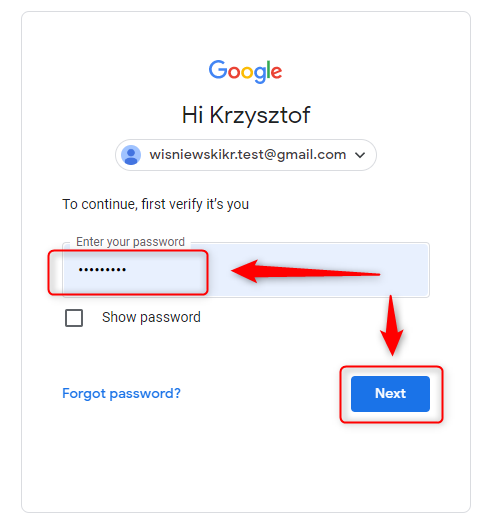
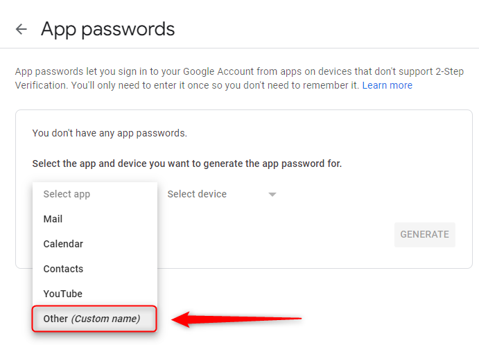
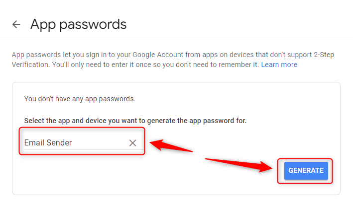
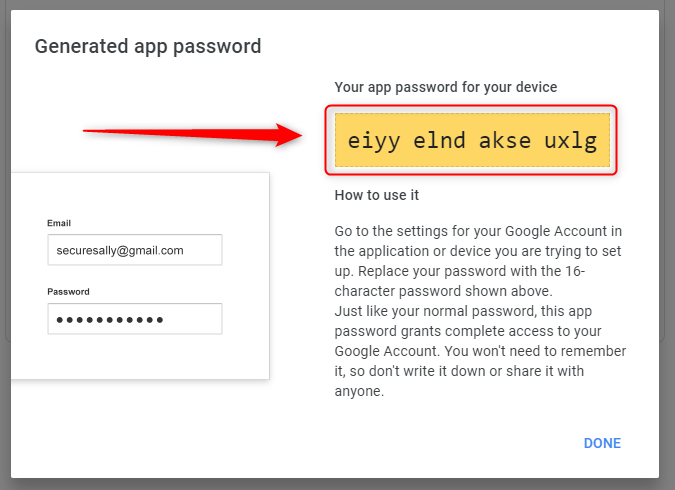

DESCRIPTION
-----------

##### Goal
The goal of this project is to present how to implement **sending e-mails** using **Java** application with **Spring Boot** framework.

##### Details
This application works in following way:
* **Input**: URL typed in a browser
* **Action**: Application sends two example "Hello World" emails  - one as plain text and one as HTML - to configured email address
* **Output**: Emails received in configured email box 

##### Launch
To launch this application please make sure that the **Preconditions** are met and then follow instructions from **Usage** section.

##### Technologies
This application uses:
* **Spring Boot** framework: `https://docs.google.com/document/d/1mvrJT5clbkr9yTj-AQ7YOXcqr2eHSEw2J8n9BMZIZKY/edit?usp=sharing`

PRECONDITIONS
-------------

##### Preconditions - Tools
* Installed **Operating System** (tested on Windows 10)
* Installed **Java** (tested on version 1.8.0_291). Tool details: `https://docs.google.com/document/d/119VYxF8JIZIUSk7JjwEPNX1RVjHBGbXHBKuK_1ytJg4/edit?usp=sharing`
* Installed **Maven** (tested on version 3.8.5). Tool details: `https://docs.google.com/document/d/1cfIMcqkWlobUfVfTLQp7ixqEcOtoTR8X6OGo3cU4maw/edit?usp=sharing`
* Installed **Git** (tested on version 2.33.0.windows.2). Tool details: `https://docs.google.com/document/d/1Iyxy5DYfsrEZK5fxZJnYy5a1saARxd5LyMEscJKSHn0/edit?usp=sharing`

##### Preconditions - Actions
* **Download** source code and open any **Command Line** tool on **project's folder**. You can do it in following way:
    * Open any Command Line tool (for instance "Windonw PowerShell" on Windows OS) and go to folder where you want to download source code 
    * Clone Github repository with `git clone https://github.com/wisniewskikr/chrisblog-it.git`
    * Go to source code folder with `cd chrisblog-it\java-others\springboot-email-sender`
* **Configure** an email account for sending e-mails by external applications. For Gmail you can do it in following way:

USAGE
-----

Usage steps:
1. Start application with `mvn spring-boot:run`
1. Visit `http://localhost:8080`
1. Clean up environment with `ctrl + C`