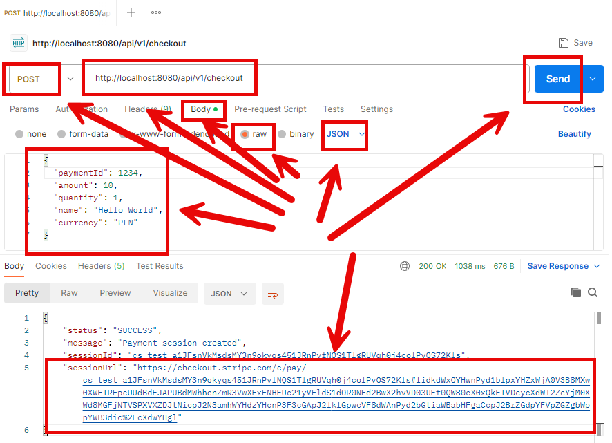
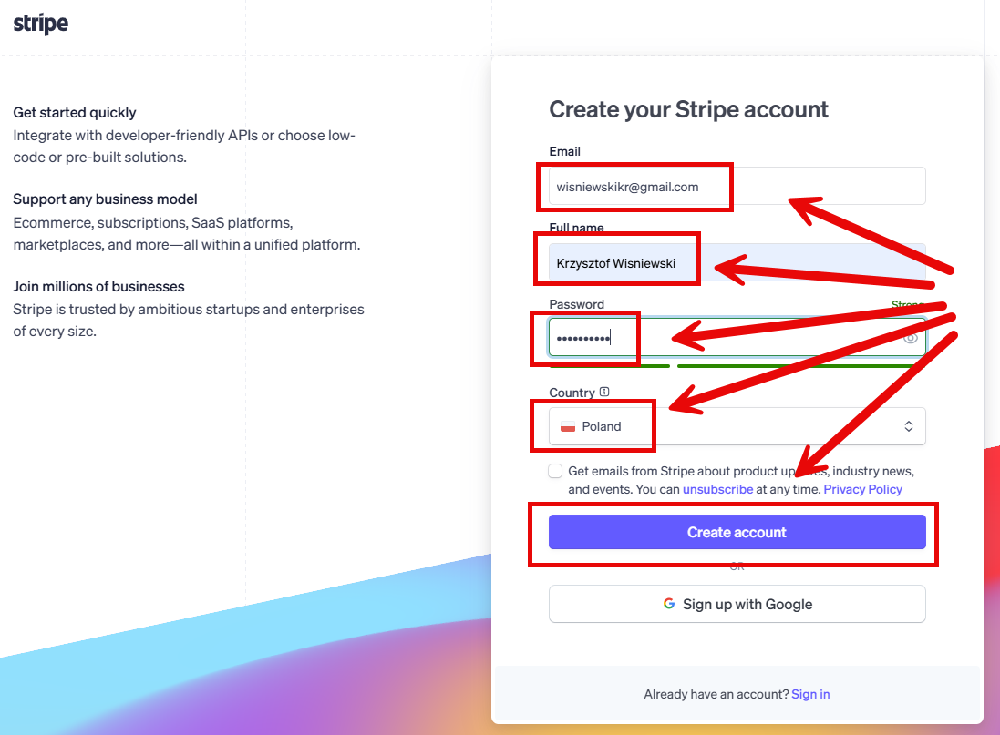
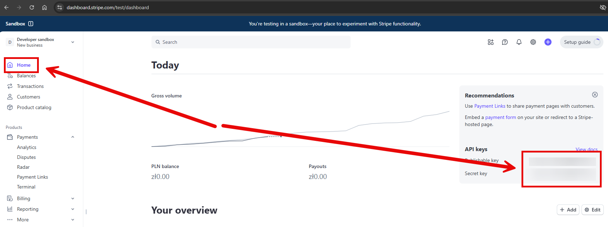

EXAMPLE
-------

DESCRIPTION
-----------

##### Goal
The goal of this project is to present how to make **payment** using **Stripe** tool with usage **Java** 
programming language and **Spring Boot 3** framework.

This payment is done by **REST API** application.

##### Content
This project consists of following applications:
* **App**: application type REST API which connects with Stripe payment tool

##### Terminology
Terminology explanation:
* **Git**: Git is a distributed version control system used to track changes in code, collaborate with others, and manage source code history efficiently.
* **Java**: Java is a high-level, object-oriented programming language known for its platform independence, achieved through the Java Virtual Machine (JVM). It is widely used for developing web, mobile, desktop, and enterprise applications, emphasizing simplicity, security, and portability. "Write once, run anywhere" is its core principle.
* **Maven**: Maven is a build automation and dependency management tool for Java projects, streamlining project builds, managing libraries, and ensuring consistent project configurations.
* **Spring Boot**: Spring Boot is a framework for building Java-based applications that simplifies development by providing auto-configuration, embedded servers, and production-ready tools, enabling developers to create standalone, production-ready applications with minimal configuration.
* **Stripe**: The Stripe payment tool is an online platform that lets businesses securely accept and process payments over the internet, including credit cards, digital wallets, and bank transfers.

USAGES
------

This project can be tested in following configurations:
* **Usage Manual**: infrastructure services are started as Docker containers. Application services are started manually in command line
* **Usage Docker Compose**: all services are started as Docker containers defined in a Docker Compose file.

USAGE MANUAL
------------

> **Usage Manual** means that infrastructure services are started as Docker containers. Application services are started manually in command line.

> Please **clone/download** project, open **project's main folder** in your favorite **command line tool** and then **proceed with steps below**.

> **Prerequisites**:
* **Operating System** (tested on Windows 11)
* **Git** (tested on version 2.33.0.windows.2)
* **Java** (tested on version 23.0.1)
* **Maven** (tested on version 3.9.6)

##### Required steps:
1. Configure **Stripe** (check section **STRIPE CONFIGURATION**)
1. Update file **src/main/resources/application.yaml**
    * Update property **stripe.secretKey** with value from Stripe
1. In a command line tool **start application** with `mvn spring-boot:run`
1. In a Rest Client (e.g. Postman) order payment using **POST** method with `http://localhost:8080/api/v1/checkout`
    * Body -> JSON
      {
      "paymentId": 1234,
      "amount": 10,
      "quantity": 1,
      "name": "Hello World",
      "currency": "PLN"
      }
    * Expected response with **sessionUrl** 
1. In a browser make **Stripe payment** with `{sessionUrl}`
    * Fill **Email**
    * Fill **Card information** (e.g. 4242 4242 4242 4242; 12/34; 567)
    * Fill **Cardholder name**
    * Click **Pay**
    * Expected message **Payment successful**
1. Clean up environment
    * In a command line tool **stop application** with `ctrl + C`

USAGE DOCKER COMPOSE
--------------------

> **Usage Docker Compose** means all services are started as Docker containers defined in Docker Compose file.

> Please **clone/download** project, open **project's main folder** in your favorite **command line tool** and then **proceed with steps below**.

> **Prerequisites**:
* **Operating System** (tested on Windows 11)
* **Git** (tested on version 2.33.0.windows.2)
* **Java** (tested on version 23.0.1)
* **Maven** (tested on version 3.9.6)
* **Docker** (tested on version 4.33.1)

Usage steps:
1. Configure **Stripe** (check section **STRIPE CONFIGURATION**)
1. Update file **docker-compose.yaml**
    * Update property **stripe.secretKey** with value from Stripe
1. Start **Docker** tool
1. In a command line tool **start Docker containers** with `docker-compose up -d --build`
1. In a Rest Client (e.g. Postman) order payment using **POST** method with `http://localhost:8080/api/v1/checkout`
    * Body -> JSON
      {
      "paymentId": 1234,
      "amount": 10,
      "quantity": 1,
      "name": "Hello World",
      "currency": "PLN"
      }
    * Expected response with **sessionUrl**
1. In a browser make **Stripe payment** with `{sessionUrl}`
    * Fill **Email**
    * Fill **Card information** (e.g. 4242 4242 4242 4242; 12/34; 567)
    * Fill **Cardholder name**
    * Click **Pay**
    * Expected message **Payment successful**
1. Clean up environment
    * Remove containers `docker-compose down --rmi all`
    * Stop **Docker** tool

STRIPE CONFIGURATION
--------------------

