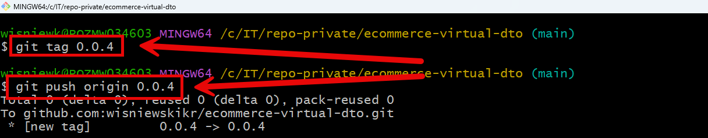
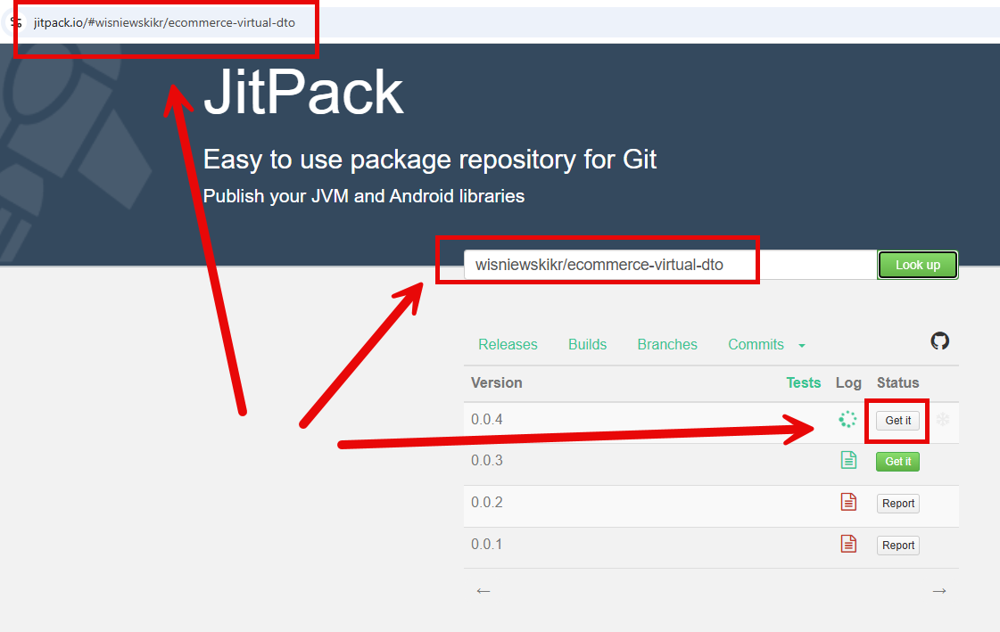
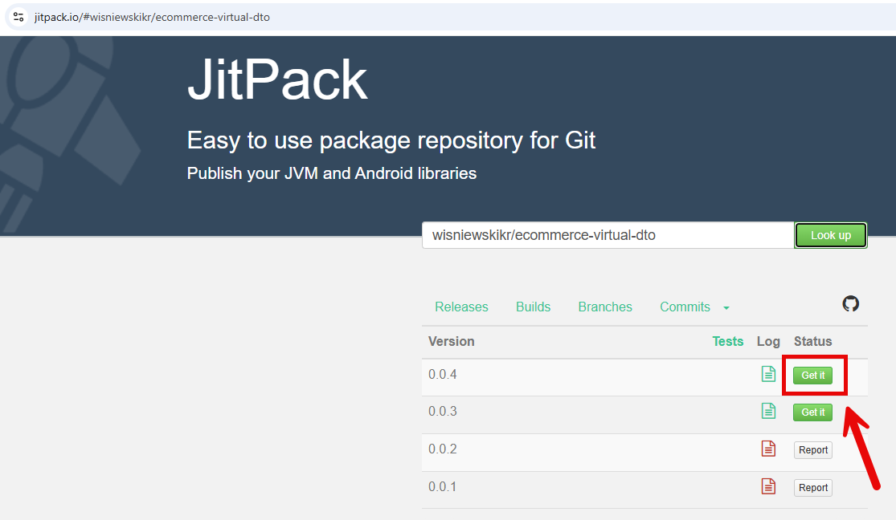

DESCRIPTION
-----------

Dependency is created basing on Gihub project. If project is public then dependency is public too. If project is private then dependency is private too.

You can handle configuration by file "jitpack.yml".

REMOTE MAVEN REPOSITORY CONFIGURATION
-------------------------------------

