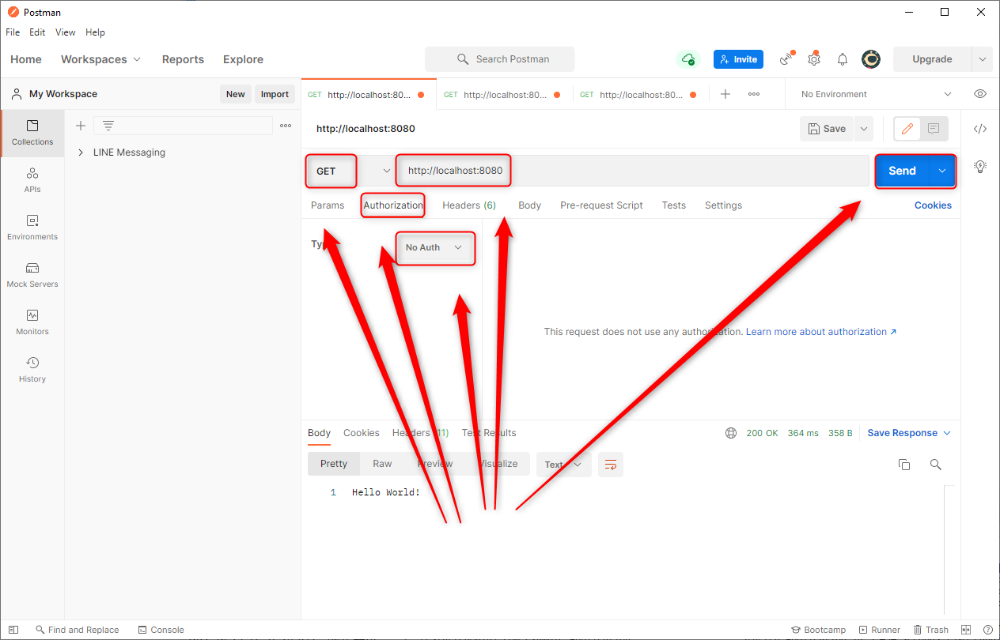
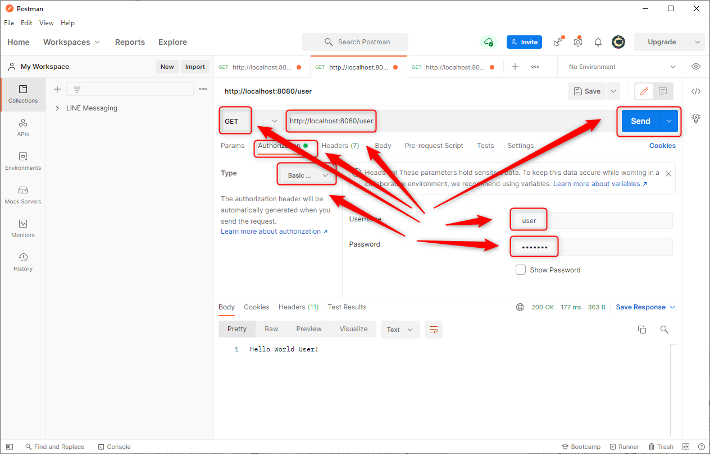
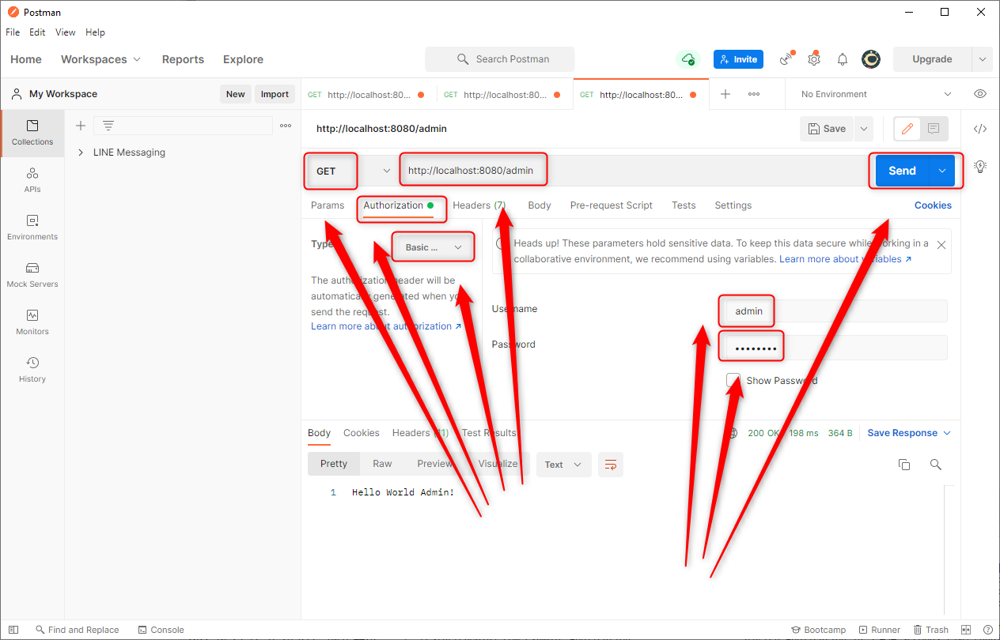

USAGE
-----

Usage steps:
1. Start application with `mvn spring-boot:run`
1. Send GET request with Postman to URL `http://localhost:8080`
1. Send GET request with Postman (**Basic Authentication** with credentials **user / user123** or **admin / admin123**) to URL `http://localhost:8080/user`
1. Send GET request with Postman (**Basic Authentication** with credentials **admin / admin123**) to URL `http://localhost:8080/admin`
1. Clean up environment:
    * Stop application with `ctrl + C`

DESCRIPTION
-----------

##### Goal
The goal of this project is to present how to implement **Basic authentication and authorization** in **Java** application type **API** with usage **Spring Boot** framework. This application uses **Spring Security** dependencies. 

##### Flow
The following flow takes place in this project:
1. User uses any Client API (for instance Postman) for sending GET request to Server for not secured content. 
1. Server sends back not secured content to Client API
1. Client API displays not secured content to the User 
1. User uses any Client API for sending GET request to Server for secured content for role USER. Credentials type Basic authentication are sent together with this request
1. Server checks if credentials are valid. If everything is ok secured content for role USER is sent back to Client API
1. Client API displays secured content for role USER to the User
1. User uses any Client API for sending GET request to Server for secured content for role ADMIN. Credentials type Basic authentication are sent together with this request
1. Server checks if credentials are valid. If everything is ok secured content for role ADMIN is sent back to Client API
1. Client API displays secured content for role ADMIN to the User  

##### Launch
To launch this application please make sure that the **Preconditions** are met and then follow instructions from **Usage** section.

##### Technologies
This project uses following technologies:
* **Spring Boot** framework: `https://docs.google.com/document/d/1mvrJT5clbkr9yTj-AQ7YOXcqr2eHSEw2J8n9BMZIZKY/edit?usp=sharing`
* **Security**: `https://docs.google.com/document/d/1nhPRbfD10KJOYsgI1HUwUz95ReiJPbXK85_zMyAptoY/edit?usp=sharing`

PRECONDITIONS
-------------

##### Preconditions - Tools
* Installed **Operating System** (tested on Windows 10)
* Installed **Java** (tested on version 17.0.5). Tool details: `https://docs.google.com/document/d/119VYxF8JIZIUSk7JjwEPNX1RVjHBGbXHBKuK_1ytJg4/edit?usp=sharing`
* Installed **Maven** (tested on version 3.8.5). Tool details: `https://docs.google.com/document/d/1cfIMcqkWlobUfVfTLQp7ixqEcOtoTR8X6OGo3cU4maw/edit?usp=sharing`
* Installed **Git** (tested on version 2.33.0.windows.2). Tool details: `https://docs.google.com/document/d/1Iyxy5DYfsrEZK5fxZJnYy5a1saARxd5LyMEscJKSHn0/edit?usp=sharing`
* Installed **Postman** (tested on version 8.11.1)

##### Preconditions - Actions
* **Download** source code using Git 
* * Open any **Command Line** (for instance "Windonw PowerShell" on Windows OS) tool on **project's folder**. Type commands from section **USAGE** there.