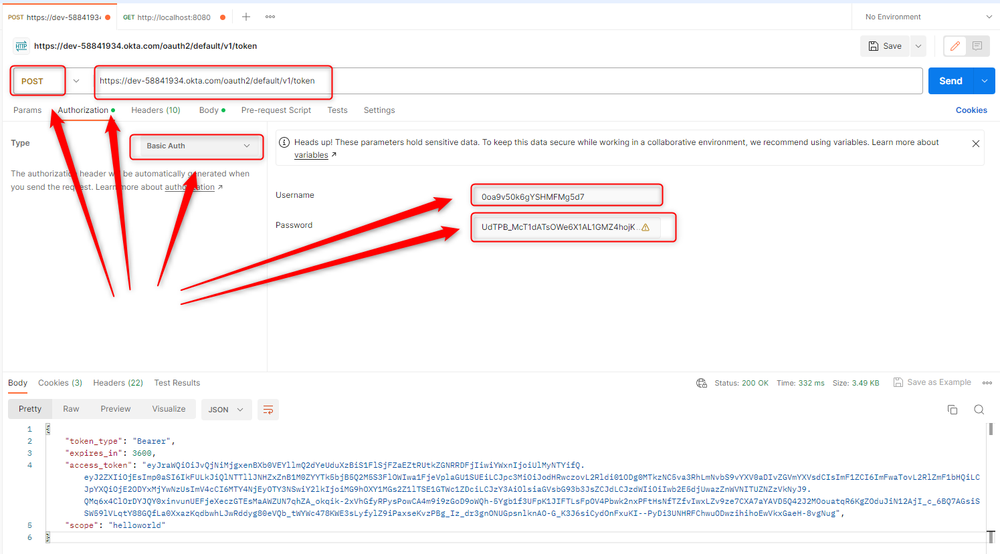
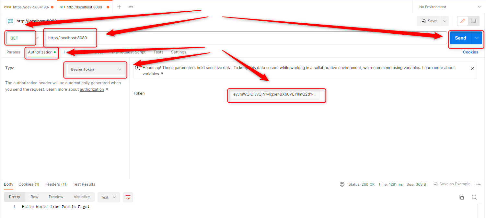
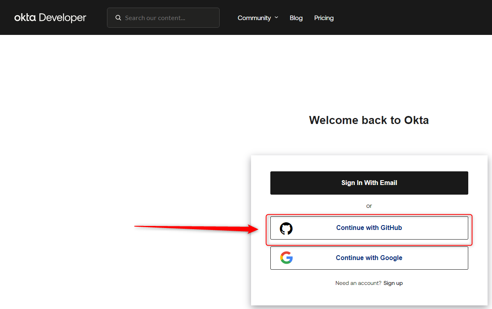
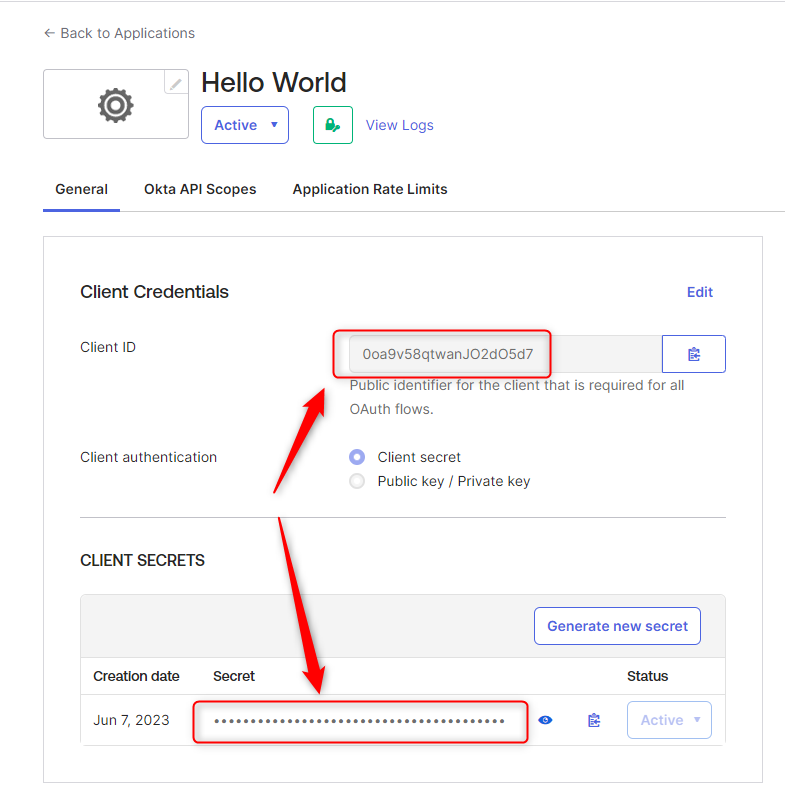
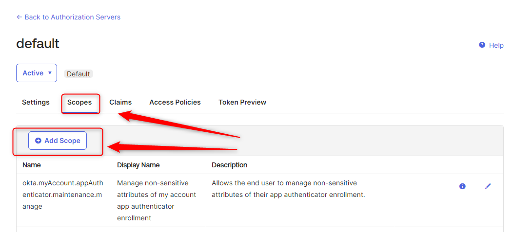
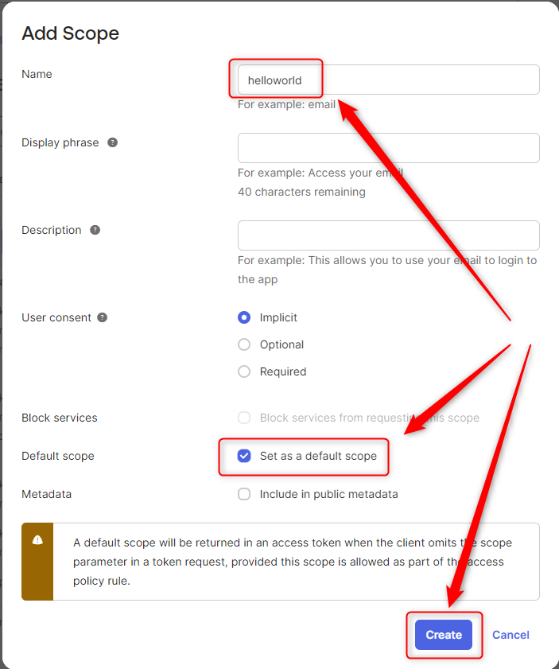

USAGE
-----

Usage steps:
1. Configure Okta. For more details please check section **Okta Configuration**
1. Start application with `mvn spring-boot:run`
1. Get Token from Okta with POST request in Postman (**Authorisation** type **Basic Auth** with credentials **Client Id/Client Secrets** and **Body x-www-form-urlencoded** with parameters **grant_type=client_credentials** and **scope=helloworld**) with **https://{issuer-uri}/oauth2/default/v1/token**. For instance `https://dev-58841934.okta.com/oauth2/default/v1/token`
1. Send GET request with Postman (**Authorization** type **Token Bearer** and value **Token from Okta**) to URL `http://localhost:8080/`
1. Clean up environment:
    * Stop application with `ctrl + C`

DESCRIPTION
-----------

##### Goal
The goal of this project is to present how to implement **authentication and authorization** in **Java** application type **API** with usage **Spring Boot** framework and **Spring Security** dependencies. Secured resources are displayed after **two requests**. 

**In first request** credentials are sent as **Header Basic Auth**. **Authentication** is done by **Okta** vendor. As a result **Access Token** type **JWT (JSON Web Token)** is sent.

**In second request** the Access Token from previous request is sent as **Header Bearer Token**. Because it's **OAuth2** so there is **NO Authentication** here. **Authorization** is done automatically by **Okta dependencies**.

##### Flow
The following flow takes place in this project:
1. User uses any Client API (for instance Postman) for sending GET request to Server for Token. Username and Password are sent as Authorization Basic;
1. Server sends back response with Token if credentials are valid; 
1. User uses any Client API (for instance Postman) for sending GET request to Server for secured resource. JWT Token is sent as Authorization Token Bearer;
1. Server sends back response with secured resource if JWT Token is valid.

##### Launch
To launch this application please make sure that the **Preconditions** are met and then follow instructions from **Usage** section.

##### Technologies
This project uses following technologies:
* **Spring Boot** framework: `https://docs.google.com/document/d/1mvrJT5clbkr9yTj-AQ7YOXcqr2eHSEw2J8n9BMZIZKY/edit?usp=sharing`
* **Security**: `https://docs.google.com/document/d/1nhPRbfD10KJOYsgI1HUwUz95ReiJPbXK85_zMyAptoY/edit?usp=sharing`
* **Java**: `https://docs.google.com/document/d/119VYxF8JIZIUSk7JjwEPNX1RVjHBGbXHBKuK_1ytJg4/edit?usp=sharing`
* **Maven**: `https://docs.google.com/document/d/1cfIMcqkWlobUfVfTLQp7ixqEcOtoTR8X6OGo3cU4maw/edit?usp=sharing`
* **Git**: `https://docs.google.com/document/d/1Iyxy5DYfsrEZK5fxZJnYy5a1saARxd5LyMEscJKSHn0/edit?usp=sharing`

PRECONDITIONS
-------------

##### Preconditions - Tools
* Installed **Operating System** (tested on Windows 10)
* Installed **Java** (tested on version 17.0.5)
* Installed **Maven** (tested on version 3.8.5)
* Installed **Git** (tested on version 2.33.0.windows.2)
* Installed **Postman** (tested on version 8.11.1)

##### Preconditions - Actions
* **Download** source code using Git 
* * Open any **Command Line** (for instance "Windonw PowerShell" on Windows OS) tool on **project's folder**. Type commands from section **USAGE** there.

OKTA CONFIGURATION
------------------

Actions:
- Link to Okta: https://developer.okta.com/

