DESCRIPTION
-----------

##### Goal
The goal of this project is to present how to implement **Form Authentication and Authorization** using **Java** application with **Spring Boot** framework. Form Authentication and Authorization is a **custom** form which has to be implemented by developer.

##### Basic Flow
The following flow takes place in this project:
1. User via Browser sends request to Server for secured content
1. Server sends back Spring Security Custom Login page to User via Browser
1. User via Browser fills credentials and sends request to Server
1. Server checks credentials. If credentials are valid then secured content is sent back to User via Browser

##### Launch
To launch this application please make sure that the **Preconditions** are met and then follow instructions from **Usage** section.

##### Technologies
This project uses following technologies:
* **Spring Boot** framework: `https://docs.google.com/document/d/1mvrJT5clbkr9yTj-AQ7YOXcqr2eHSEw2J8n9BMZIZKY/edit?usp=sharing`
* **Security**: `https://docs.google.com/document/d/1nhPRbfD10KJOYsgI1HUwUz95ReiJPbXK85_zMyAptoY/edit?usp=sharing`

PRECONDITIONS
-------------

##### Preconditions - Tools
* Installed **Operating System** (tested on Windows 10)
* Installed **Java** (tested on version 1.8.0_291). Tool details: `https://docs.google.com/document/d/119VYxF8JIZIUSk7JjwEPNX1RVjHBGbXHBKuK_1ytJg4/edit?usp=sharing`
* Installed **Maven** (tested on version 3.8.5). Tool details: `https://docs.google.com/document/d/1cfIMcqkWlobUfVfTLQp7ixqEcOtoTR8X6OGo3cU4maw/edit?usp=sharing`
* Installed **Git** (tested on version 2.33.0.windows.2). Tool details: `https://docs.google.com/document/d/1Iyxy5DYfsrEZK5fxZJnYy5a1saARxd5LyMEscJKSHn0/edit?usp=sharing`
* Installed **Postman** (tested on version 8.11.1)

##### Preconditions - Actions
* **Download** source code using Git 
* * Open any **Command Line** (for instance "Windonw PowerShell" on Windows OS) tool on **project's folder** (exact localization of project you can check in GIT repositories on page `https://github.com/`)

USAGE
-----

Usage steps:
1. Start application with `mvn spring-boot:run`
1. Send request with `http://localhost:8080`
1. On page "Hello World" click link `Secured Hello World User` and fill credentials (**user / user123**)
1. On page "Hello World User" click link `Back`
1. On page "Hello World" click link `Secured Hello World Admin`
1. On page "Access Denied" click link `Back`
1. On page "Hello World" click link `Logout`
1. On page "Hello World" click link `Secured Hello World User` and fill credentials (**admin / admin123**)
1. On page "Hello World User" click link `Back`
1. On page "Hello World" click link `Secured Hello World Admin`
1. Clean up environment with `ctrl + C`

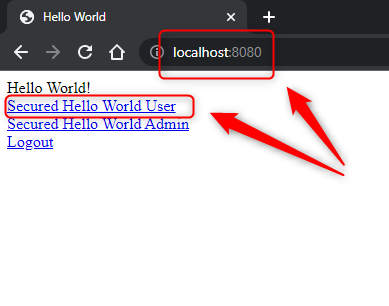

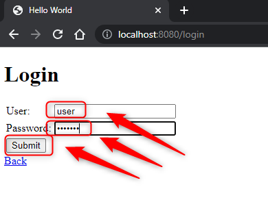

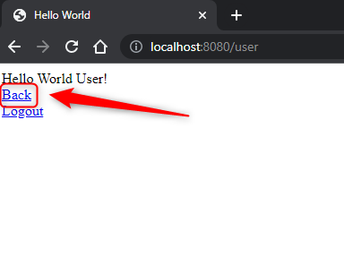

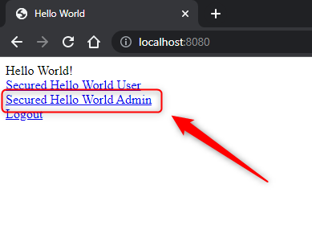

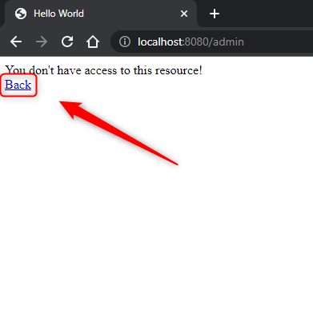

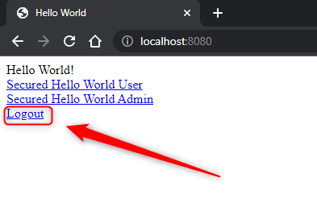

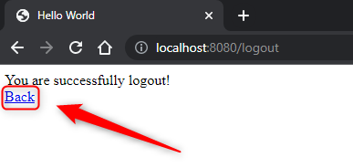

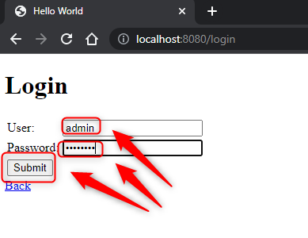

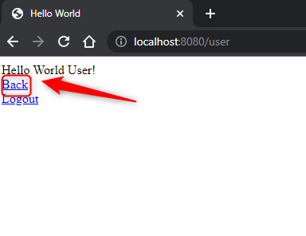

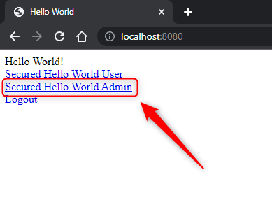

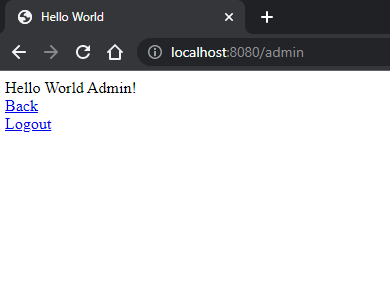