USAGE
-----

Usage steps:
1. Start Keycloak with `docker-compose up --build -d`
     * (Optional) Check Keycloak logs with `docker logs keycloak`
1. Configure Keycloak (for more details please check section **Keycloak Configuration**)
     * Log in to Keycloak
     * Configure Keycloak Realm
     * Configure Keycloak Client
     * Configure Keycloak Realm Roles
     * Configure Keycloak Users
1. Start application with `mvn spring-boot:run`
1. In any browser display not secured Public Page with `http://localhost:8080`
1. In any browser display secured User Page (credentials **user / user123** or **admin / admin123**) with `http://localhost:8080/user`
1. In any browser display secured Admin Page (credentials **admin / admin123**) with `http://localhost:8080/admin`
1. Clean up environment:
    * Stop application with `ctrl + C`
    * Stop Keycloak with `docker-compose down`

DESCRIPTION
-----------

##### Goal
The goal of this project is to present how to implement **authentication and authorization** in **Java** application type **HTML** with usage **Spring Boot** and **Thymeleaf** frameworks and **Spring Security** dependencies. **Authentication** is handled by **SSO** type **OIDC** provided by vendor **Keycloak**. It means that after connecting application and Keycloak you can handle users and groups in Keycloak. **Authorization** is handled by Spring Security configured in **SecurityConfig** class.

##### Flow
The following flow takes place in this project:
1. Using any browser the User sends request to Server for not secured content.
1. Server sends back response to User via browser with not secured content.
1. Using any browser the user sends request to Server for secured content.
1. Servier redirects request to Keycloak.
1. Keycloak sends back to User via browser response with Login form.
1. User via browser sends request to Keycloak with credentials from Login form. 
1. Keycloak authenticates User and then redirects request to Server.
1. Server authorizes User. If everything is ok then Server sends back response to User via browser with secured content.

##### Launch
To launch this application please make sure that the **Preconditions** are met and then follow instructions from **Usage** section.

##### Technologies
This project uses following technologies:
* **Spring Boot** framework: `https://docs.google.com/document/d/1mvrJT5clbkr9yTj-AQ7YOXcqr2eHSEw2J8n9BMZIZKY/edit?usp=sharing`
* **Thymeleaf** framework: `https://docs.google.com/document/d/1FTMKfQ5-f6PZ4cW7LSsm5_NeiBgkTe4gzSue2BCX0Lg/edit?usp=sharing`
* **Security**: `https://docs.google.com/document/d/1nhPRbfD10KJOYsgI1HUwUz95ReiJPbXK85_zMyAptoY/edit?usp=sharing`
* **Java**: `https://docs.google.com/document/d/119VYxF8JIZIUSk7JjwEPNX1RVjHBGbXHBKuK_1ytJg4/edit?usp=sharing`
* **Maven**: `https://docs.google.com/document/d/1cfIMcqkWlobUfVfTLQp7ixqEcOtoTR8X6OGo3cU4maw/edit?usp=sharing`
* **Git**: `https://docs.google.com/document/d/1Iyxy5DYfsrEZK5fxZJnYy5a1saARxd5LyMEscJKSHn0/edit?usp=sharing`
* **Docker**: `https://docs.google.com/document/d/1tKdfZIrNhTNWjlWcqUkg4lteI91EhBvaj6VDrhpnCnk/edit?usp=sharing`

PRECONDITIONS
-------------

##### Preconditions - Tools
* Installed **Operating System** (tested on Windows 10)
* Installed **Java** (tested on version 17.0.5)
* Installed **Maven** (tested on version 3.8.5)
* Installed **Git** (tested on version 2.33.0.windows.2)
* Installed **Docker** (tested on verison 20.10.21)

##### Preconditions - Actions
* **Launch** Docker tool on your local machine
* **Download** source code using Git 
* * Open any **Command Line** (for instance "Windonw PowerShell" on Windows OS) tool on **project's folder**. Type commands from section **USAGE** there.

KEYCLOAK CONFIGURATION
------------------

#### Log in to Keycloak

Details:
* **Keycloak link**: https://localhost:8081
* **Credentials**: admin / admin

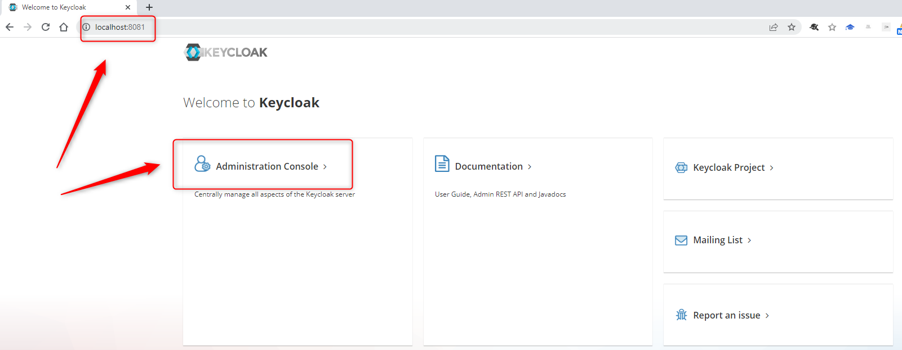

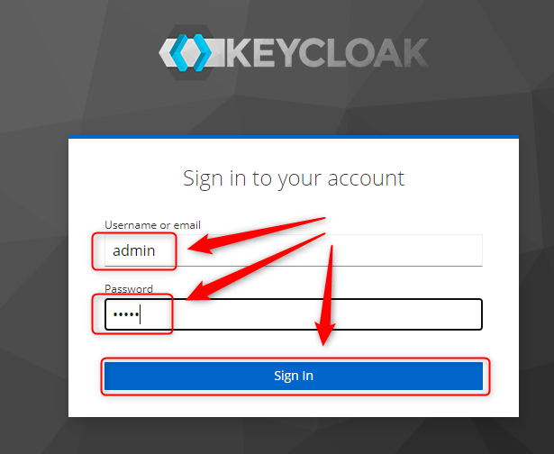

#### Configure Keycloak Realm

Details:
* **Realm Name**: HelloWorldRealm

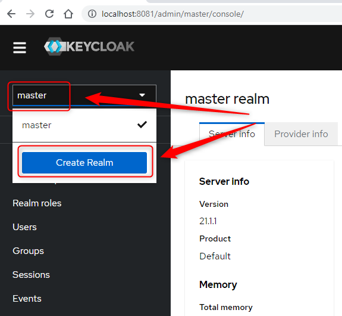

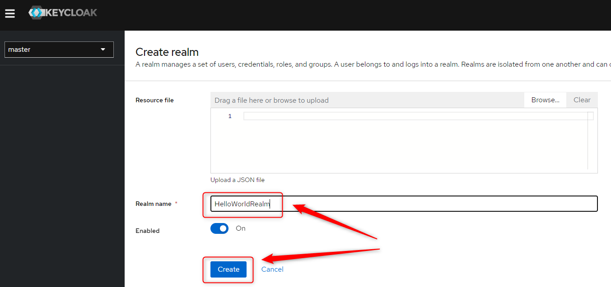

#### Configure Keycloak Client

Details:
* **Client Name**: HelloWorldClient
* **Valid redirect URIs**: http://localhost:8080/*
* **Mappers**: realm roles

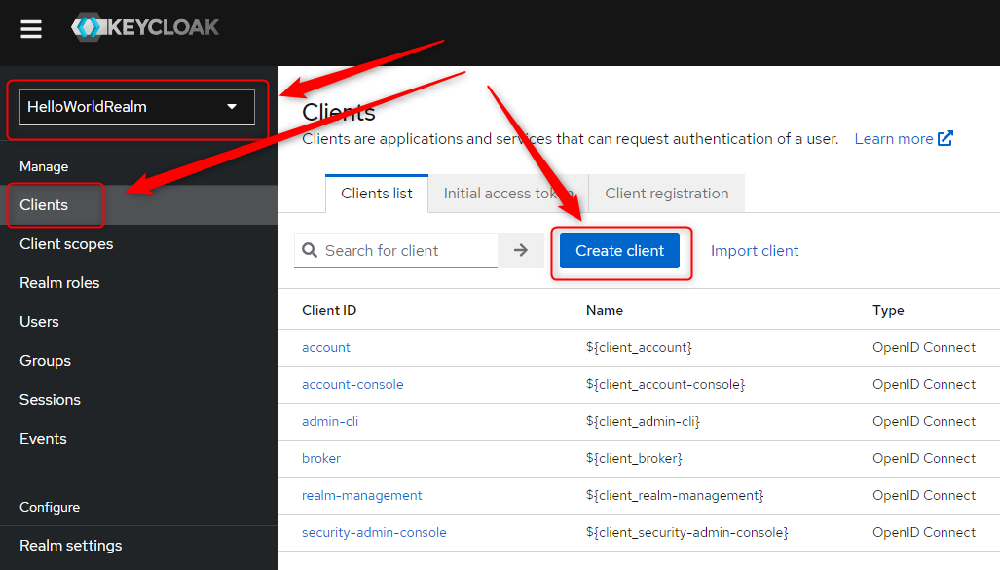

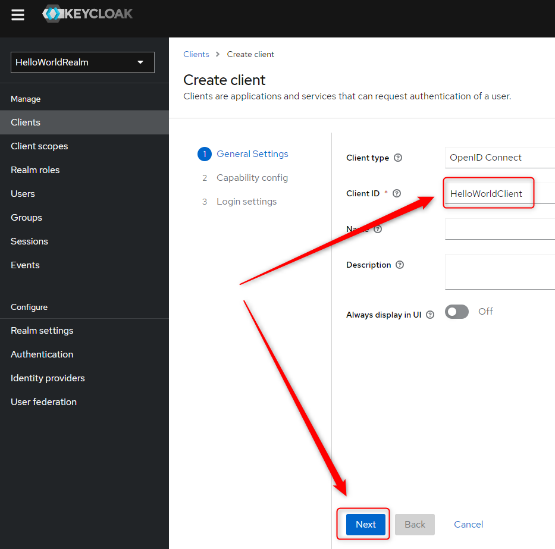

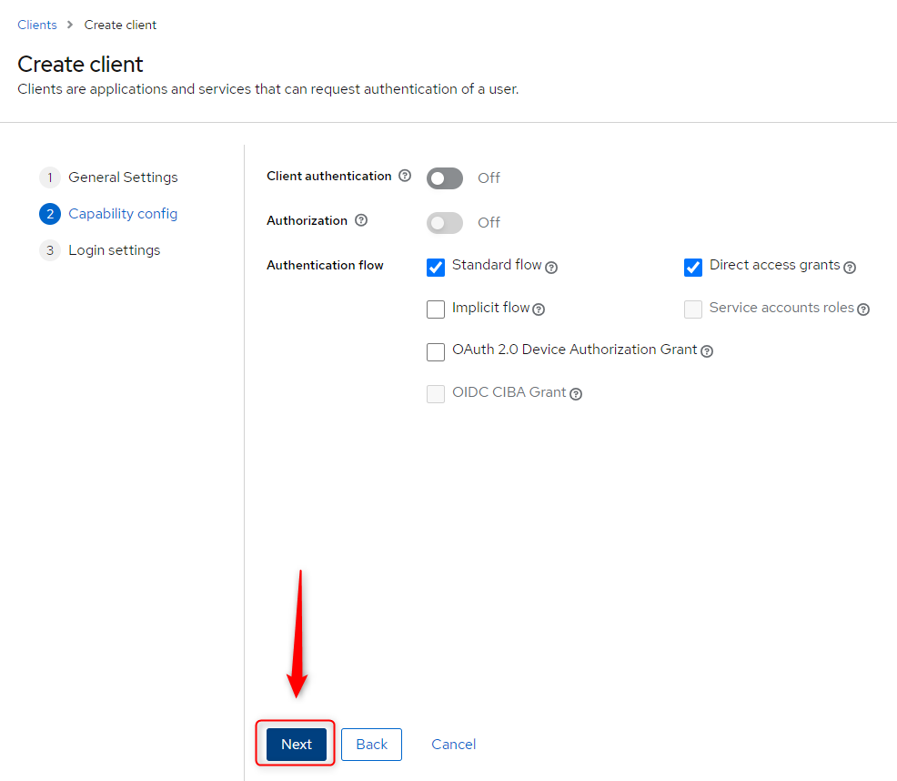

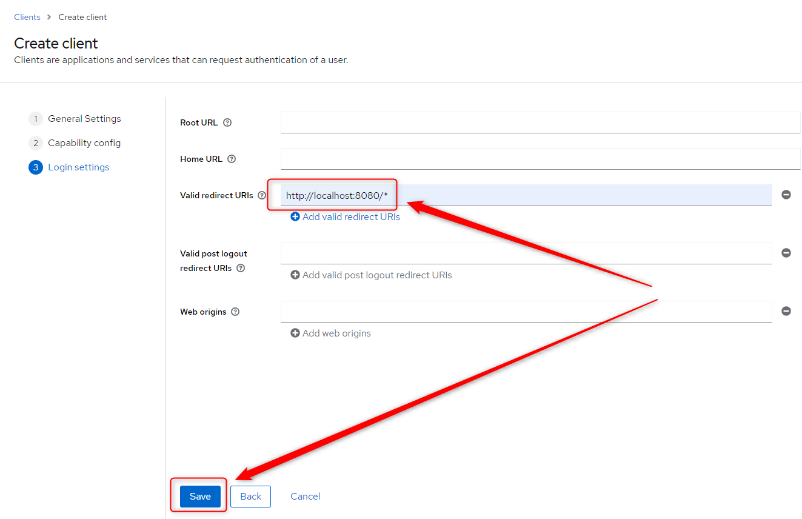

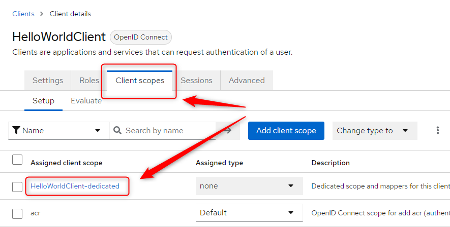

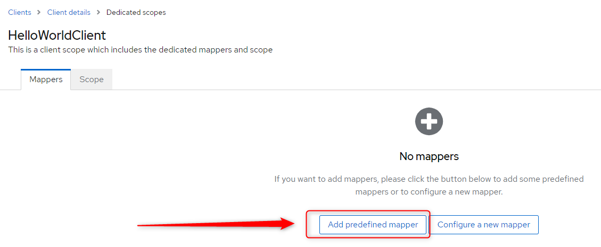

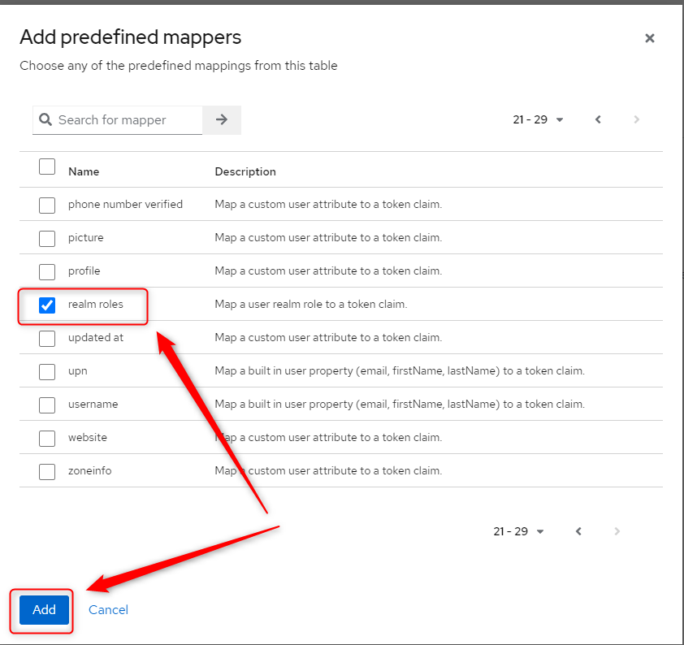

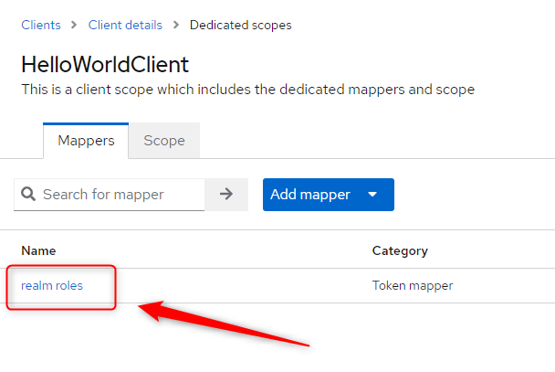

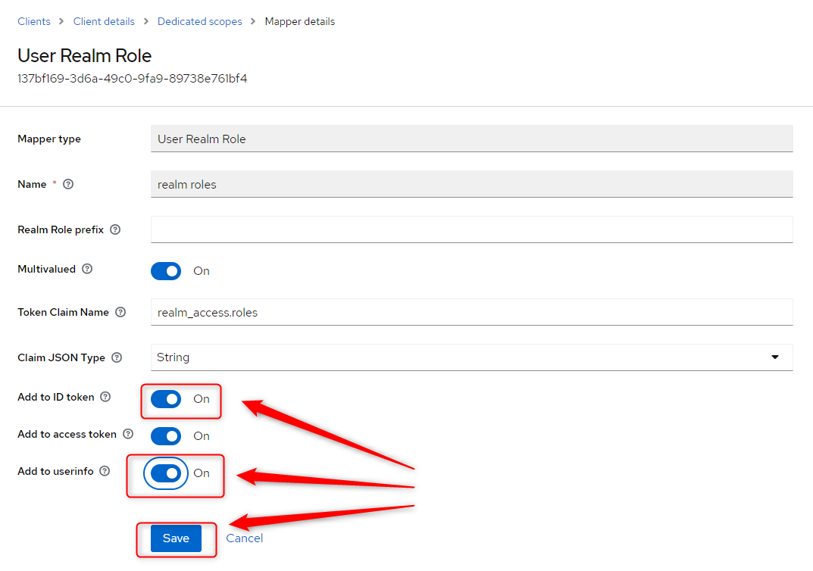

#### Configure Keycloak Realm Roles

Details:
* **Realm Roles Names**: USER, ADMIN

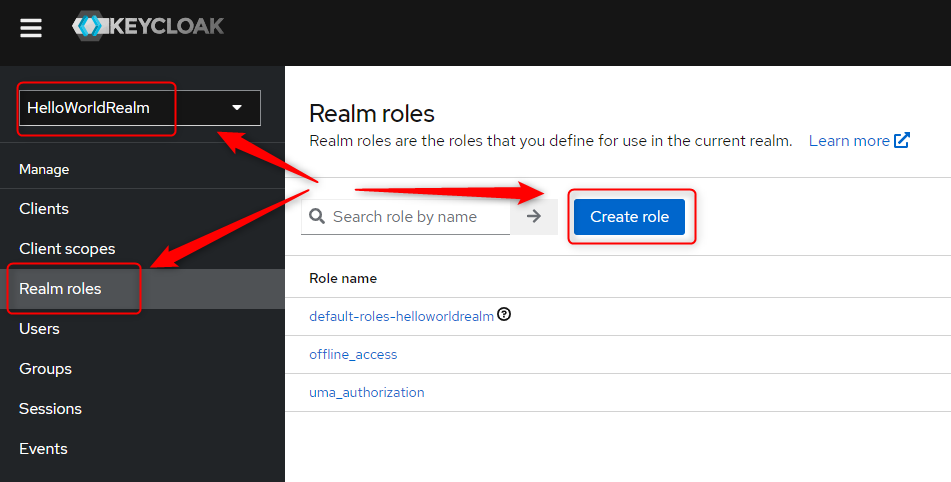

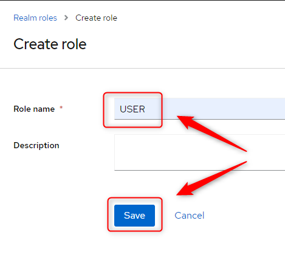

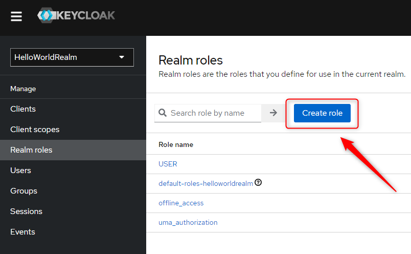

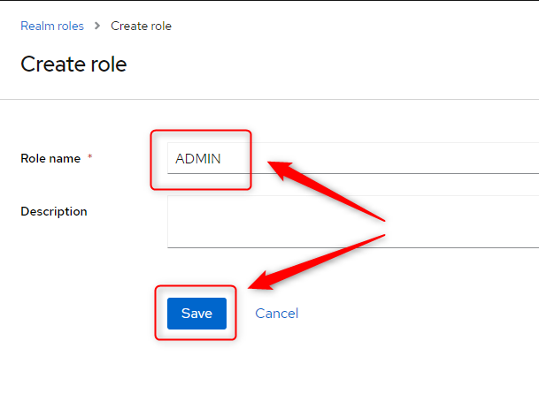