DESCRIPTION
-----------

##### Goal
The goal of this project is to present how to implement SSO security by **Keycloak** using **Java** application with **Spring Boot** framework. Keycloak is the tool which handles authentication (**OIDC**) and authorization (**OAuth2**). Java application uses **Spring Security** and **Keycloak** dependencies.

##### Basic Flow
The following flow takes place in this project:
1. User via Browser sends request to Server for secured content
1. Server redirects User via Browser to Keycloak Login page
1. User via Browser fills credentials and sends request to Keycloak
1. Keycloak checks credentials and redirects request to Server with OAuth token 
1. Server checks if user is properly authenticated and has access to secured content. If everything is ok then secured content is sent back to User via Browser

##### Launch
To launch this application please make sure that the **Preconditions** are met and then follow instructions from **Usage** section.

##### Technologies
This project uses following technologies:
* **Spring Boot** framework: `https://docs.google.com/document/d/1mvrJT5clbkr9yTj-AQ7YOXcqr2eHSEw2J8n9BMZIZKY/edit?usp=sharing`
* **Security**: `https://docs.google.com/document/d/1nhPRbfD10KJOYsgI1HUwUz95ReiJPbXK85_zMyAptoY/edit?usp=sharing`

PRECONDITIONS
-------------

##### Preconditions - Tools
* Installed **Operating System** (tested on Windows 10)
* Installed **Java** (tested on version 1.8.0_291). Tool details: `https://docs.google.com/document/d/119VYxF8JIZIUSk7JjwEPNX1RVjHBGbXHBKuK_1ytJg4/edit?usp=sharing`
* Installed **Maven** (tested on version 3.8.5). Tool details: `https://docs.google.com/document/d/1cfIMcqkWlobUfVfTLQp7ixqEcOtoTR8X6OGo3cU4maw/edit?usp=sharing`
* Installed **Git** (tested on version 2.33.0.windows.2). Tool details: `https://docs.google.com/document/d/1Iyxy5DYfsrEZK5fxZJnYy5a1saARxd5LyMEscJKSHn0/edit?usp=sharing`
* Installed **Docker** (tested on version 20.10.17). Tool details: `https://docs.google.com/document/d/1tKdfZIrNhTNWjlWcqUkg4lteI91EhBvaj6VDrhpnCnk/edit?usp=sharing`

##### Preconditions - Actions
* **Launch** Docker tool on your local machine
* **Configure Keycloak** performing steps from section "Keycloak Configuration"
* **Download** source code using Git
* Update **keycloak.credentials.secret** in file **application.properties** of project 
* Open any **Command Line** (for instance "Windonw PowerShell" on Windows OS) tool on **project's folder** (exact localization of project you can check in GIT repositories on page `https://github.com/`)

KEYCLOAK CONFIGURATION
----------------------

Configuration steps:
1. Login to Keycloak Console (credentials admin/admin) with `http://localhost:8080`
1. Create Realm **HelloWorldRealm**
1. Create Client **HelloWorldClient** with **Client authentication** set as **ON** and **Valid redirect URIs** as **http://localhost:8081/* **
1. Create Role **USER**
1. Create Role **ADMIN**
1. Create User **user** with **credentials user/user123** and role **USER**
1. Create User **admin** with **credentials admin/admin123** and role **USER** and **ADMIN**
1. Put **Client secret** as **keycloak.credentials.secret** in file **application.properties** of project 

USAGE
-----

Usage steps:
1. In first Command Line tool start Keycloak with `docker-compose up --build -d`
     * (Optional) Check Keycloak logs with `docker logs keycloak`
1. In second Command Line tool start application with `mvn spring-boot:run`
1. Send request with `http://localhost:8081`
1. On page "Hello World" click link `Secured Hello World User` and fill credentials (**user / user123**)
1. On page "Hello World User" click link `Back`
1. On page "Hello World" click link `Secured Hello World Admin`
1. On page "Access Denied" click link `Back`
1. On page "Hello World" click link `Logout`
1. On page "Logout" click link `Back`
1. On page "Hello World" click link `Secured Hello World User` and fill credentials (**admin / admin123**)
1. On page "Hello World User" click link `Back`
1. On page "Hello World" click link `Secured Hello World Admin`
1. In second Command Line tool clean up environment with `ctrl + C`
1. In first Command Line tool clean up environment with `ctrl + C` and then `docker-compose down --rmi all -v`

KEYCLOAK CONFIGURATION PRINTSCREENS
-----------------------------------

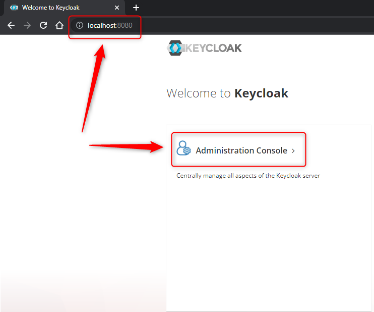

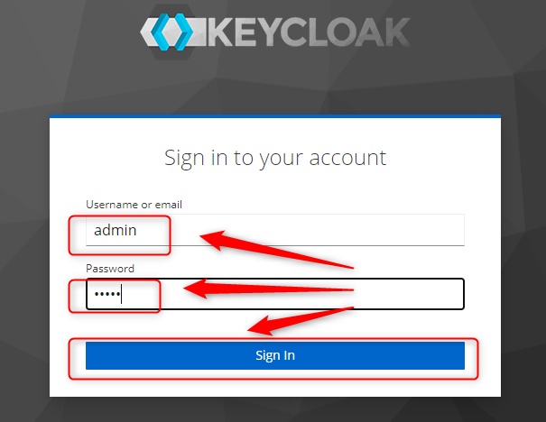

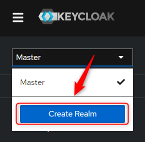

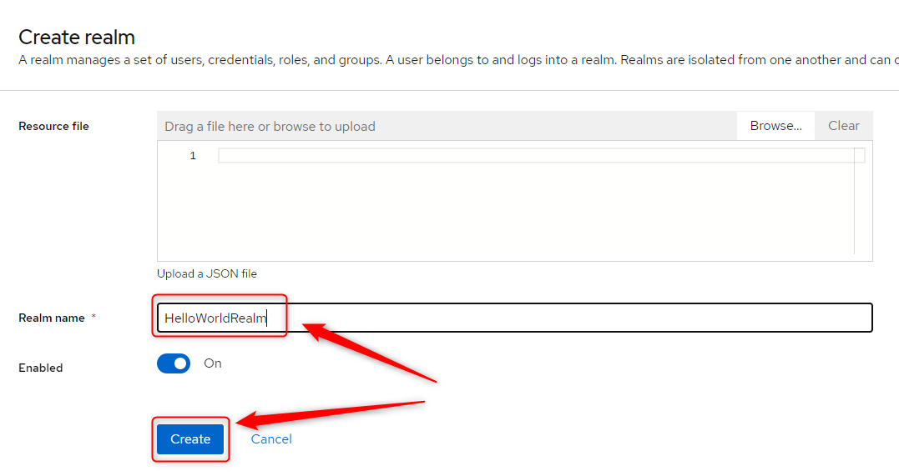

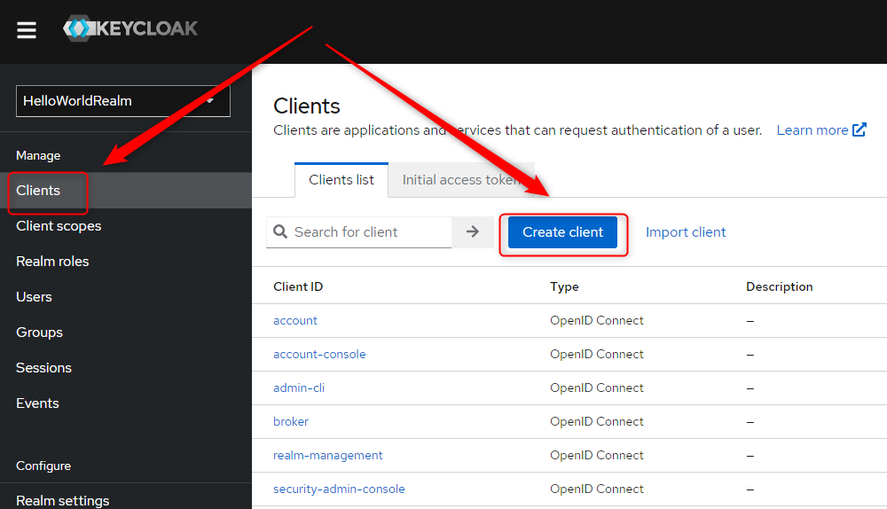

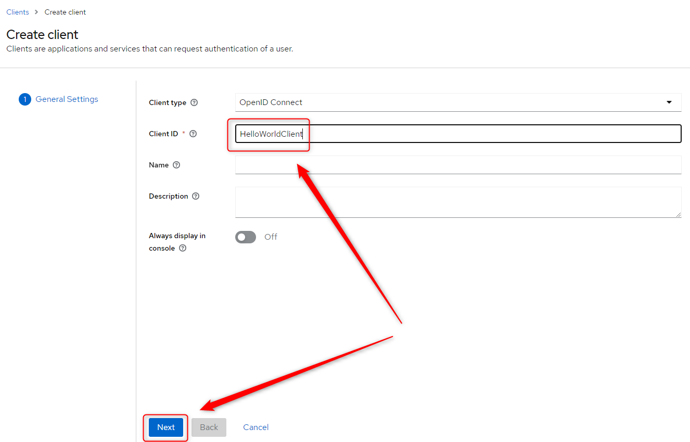

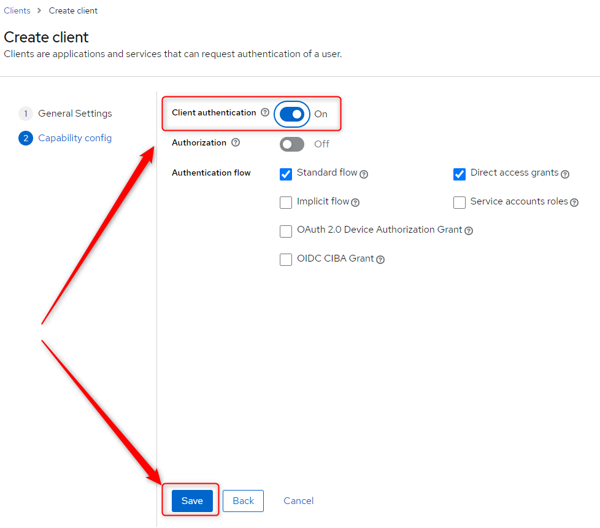

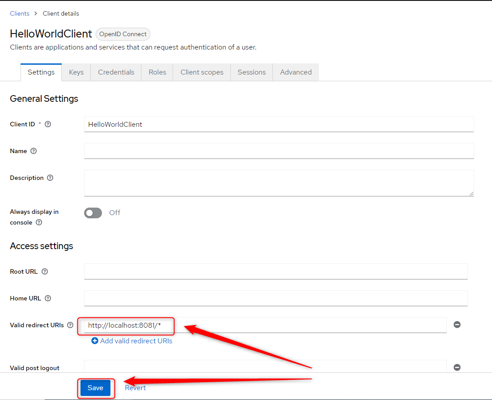

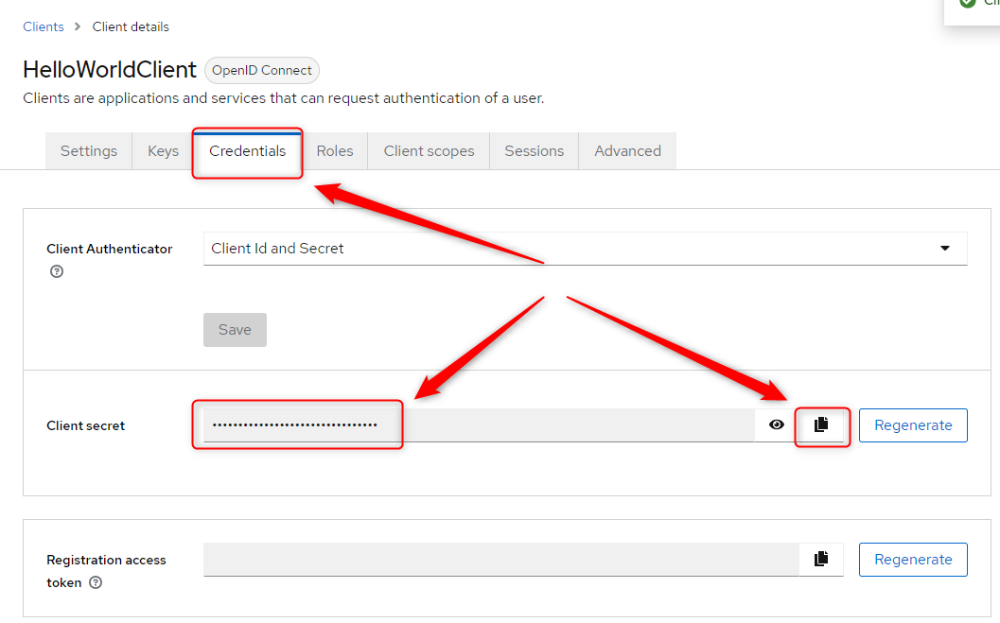

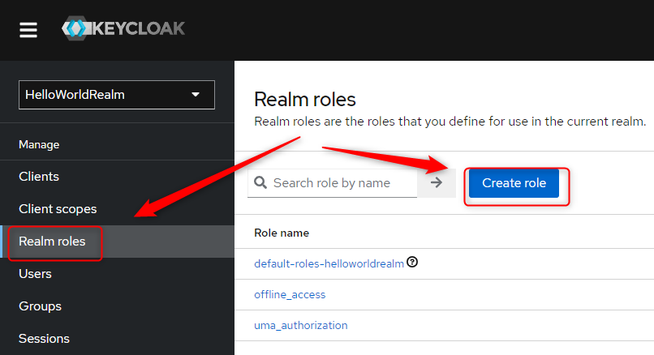

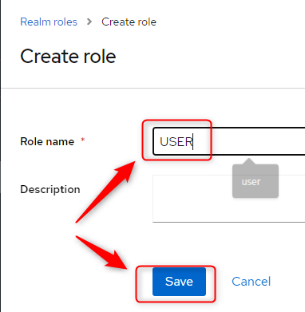

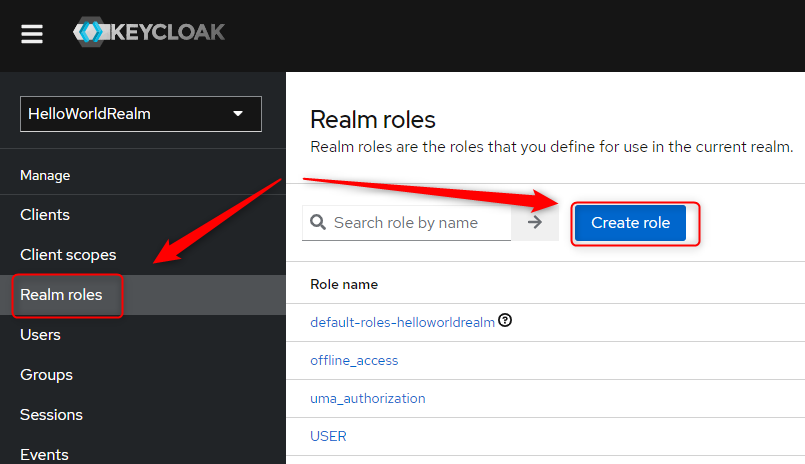

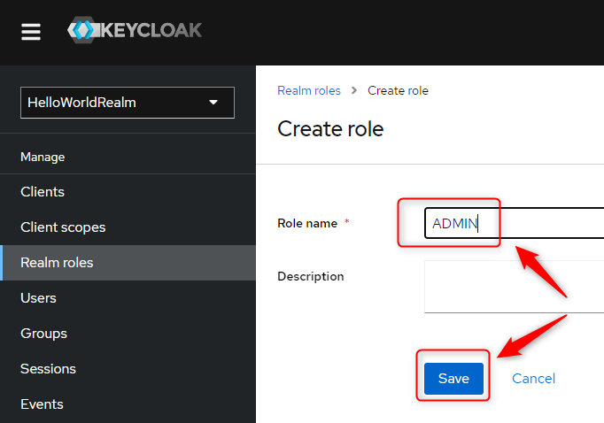

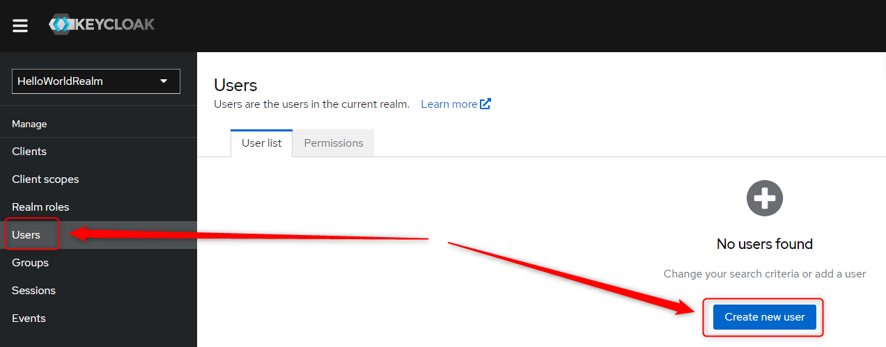

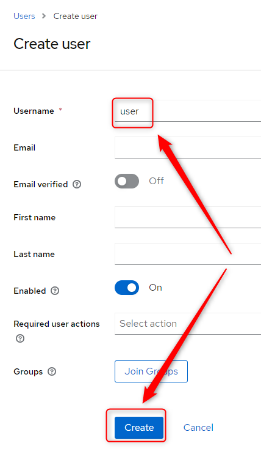

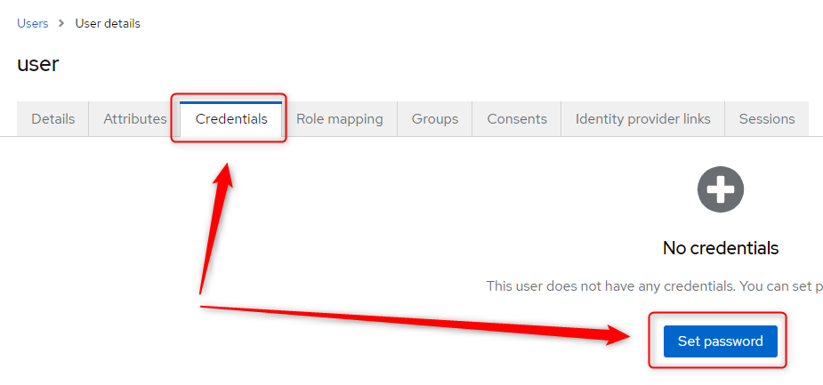

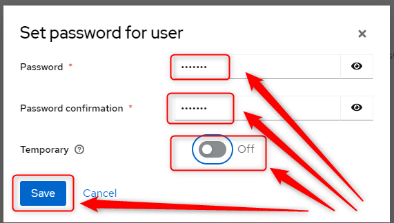

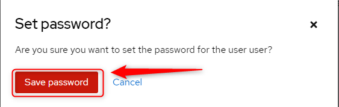

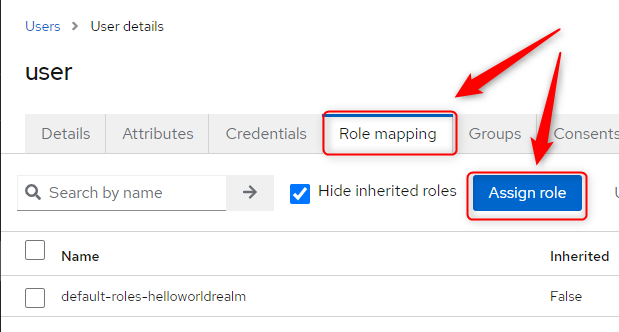

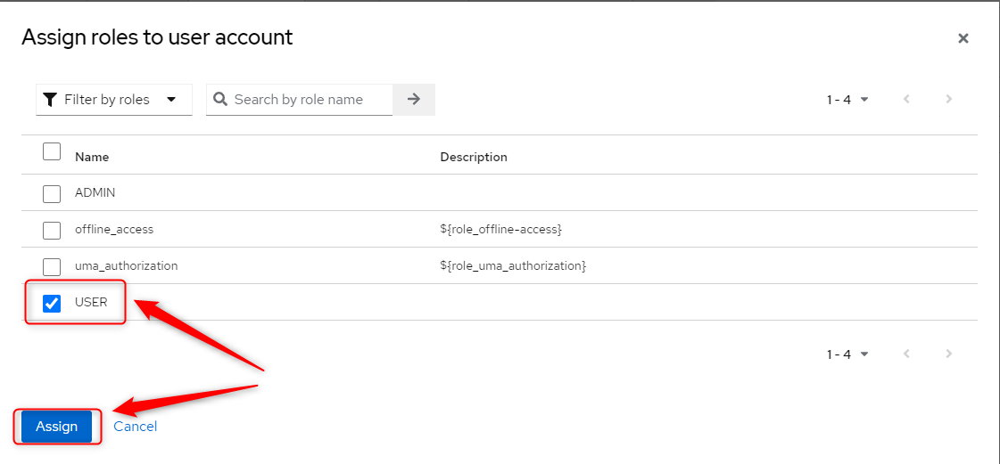

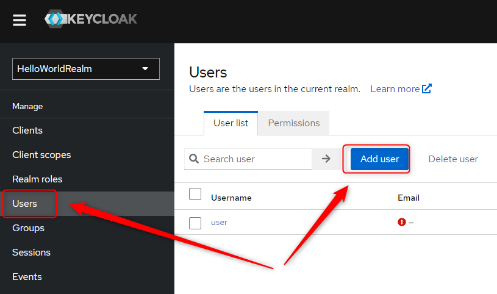

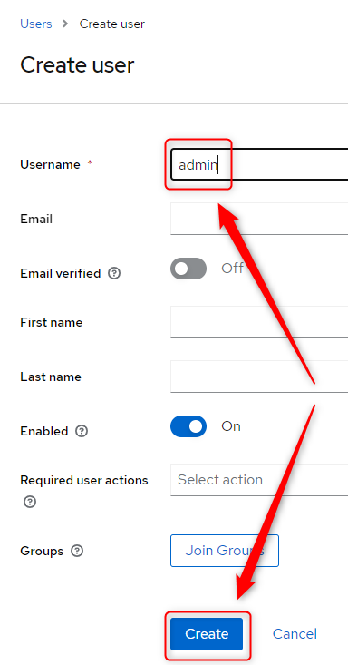

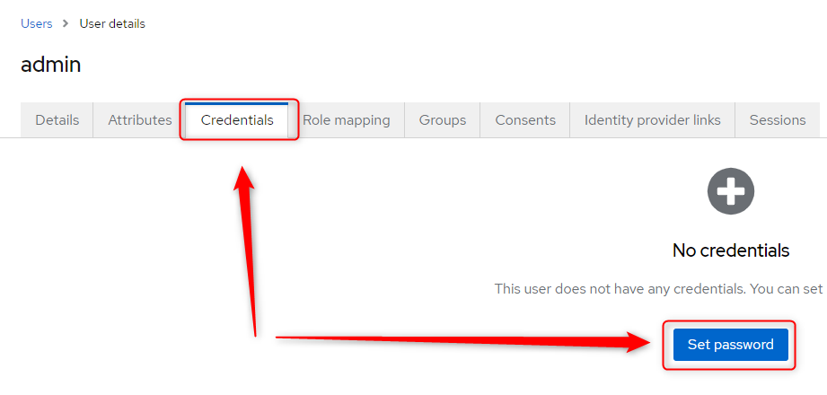

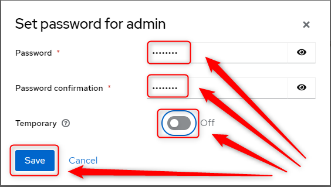

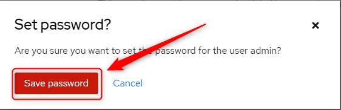

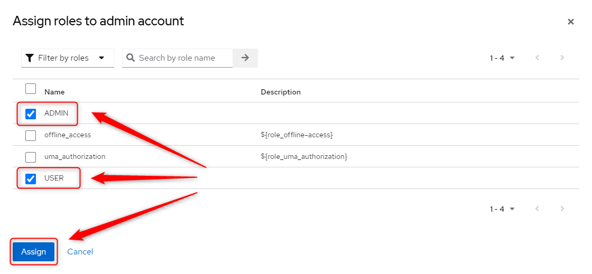

USAGE PRINTSCREENTS
-------------------

