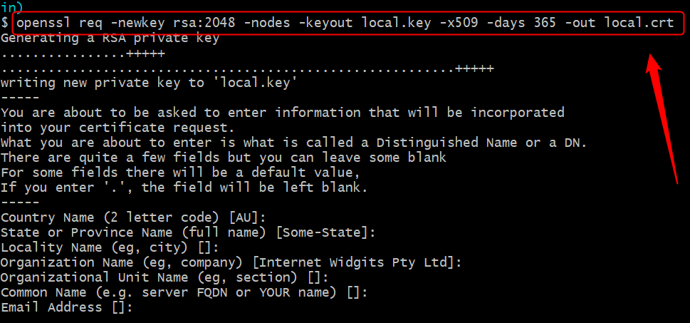

USAGE
-----

Usage steps:
1. Configure SAML in Okta (for more details please check section **Okta Configuration**)
     * Create key and certificate
     * Configure application in Okta
     * Configure groups in Okta
     * Configure users in Okta
1. Configure application
     * Place created **local.key** and **local.crt** in location **src/main/resources/saml**
     * Update property **metadata-uri** in file **application.yaml**     
1. Start application with `mvn spring-boot:run`
1. In any browser display not secured Public Page with `http://localhost:8080`
1. In any browser display secured User Page (credentials **user@gmail.com / Password1234** or **admin@gmail.com / Password1234**) with `http://localhost:8080/user`
1. In any browser display secured Admin Page (credentials **admin@gmail.com / Password1234**) with `http://localhost:8080/admin`
1. Clean up environment:
    * Stop application with `ctrl + C`


DESCRIPTION
-----------

##### Goal
The goal of this project is to present how to implement **authentication and authorization** in **Java** application type **HTML** with usage **Spring Boot** and **Thymeleaf** frameworks and **Spring Security** dependencies. **Authentication** is handled by **SSO** type **SAML** provided by vendor **OKTA**. It means that after connecting application and Okta you can handle users and groups in Okta. **Authorization** is handled by Spring Security configured in **SecurityConfig** class.

##### Flow
The following flow takes place in this project:
1. Using any browser the User sends request to Server for not secured content.
1. Server sends back response to User via browser with not secured content.
1. Using any browser the user sends request to Server for secured content.
1. Servier redirects request to Okta.
1. Okta sends back to User via browser response with Login form.
1. User via browser sends request to Okta with credentials from Login form. 
1. Okta authenticates User and then redirects request to Server.
1. Server authorizes User. If everything is ok then Server sends back response to User via browser with secured content.

##### Launch
To launch this application please make sure that the **Preconditions** are met and then follow instructions from **Usage** section.

##### Technologies
This project uses following technologies:
* **Spring Boot** framework: `https://docs.google.com/document/d/1mvrJT5clbkr9yTj-AQ7YOXcqr2eHSEw2J8n9BMZIZKY/edit?usp=sharing`
* **Thymeleaf** framework: `https://docs.google.com/document/d/1FTMKfQ5-f6PZ4cW7LSsm5_NeiBgkTe4gzSue2BCX0Lg/edit?usp=sharing`
* **Security**: `https://docs.google.com/document/d/1nhPRbfD10KJOYsgI1HUwUz95ReiJPbXK85_zMyAptoY/edit?usp=sharing`
* **Java**: `https://docs.google.com/document/d/119VYxF8JIZIUSk7JjwEPNX1RVjHBGbXHBKuK_1ytJg4/edit?usp=sharing`
* **Maven**: `https://docs.google.com/document/d/1cfIMcqkWlobUfVfTLQp7ixqEcOtoTR8X6OGo3cU4maw/edit?usp=sharing`
* **Git**: `https://docs.google.com/document/d/1Iyxy5DYfsrEZK5fxZJnYy5a1saARxd5LyMEscJKSHn0/edit?usp=sharing`


PRECONDITIONS
-------------

##### Preconditions - Tools
* Installed **Operating System** (tested on Windows 10)
* Installed **Java** (tested on version 17.0.5)
* Installed **Maven** (tested on version 3.8.5)
* Installed **Git** (tested on version 2.33.0.windows.2)
* Installed **Postman** (tested on version 8.11.1)

##### Preconditions - Actions
* **Download** source code using Git 
* * Open any **Command Line** (for instance "Windonw PowerShell" on Windows OS) tool on **project's folder**. Type commands from section **USAGE** there.


OKTA CONFIGURATION
------------------

#### Create key and certificate

In any location please open any Command Line tool with installed **openssl** (for instance Git Bash) and run following command (for every question you can just click "Enter" leaving fields empty):

```
openssl req -newkey rsa:2048 -nodes -keyout local.key -x509 -days 365 -out local.crt
```

As a result you should receive files **local.key** and **local.crt**.

