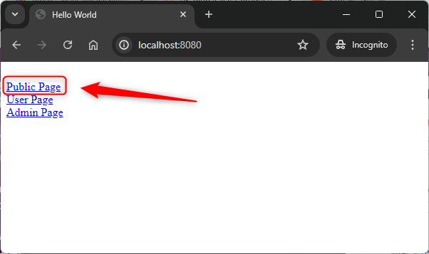
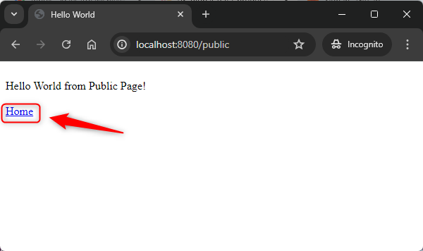
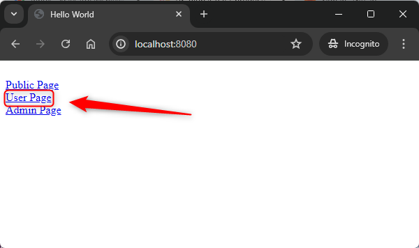
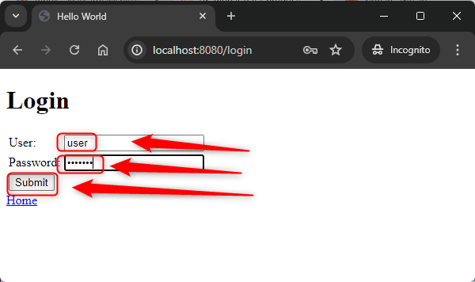
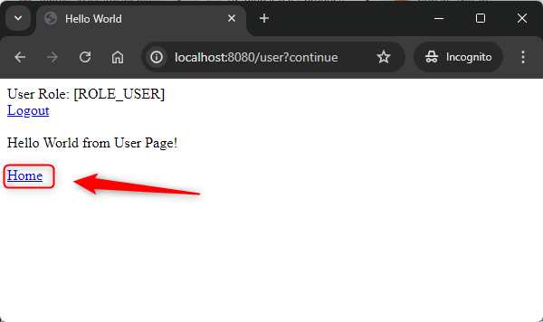
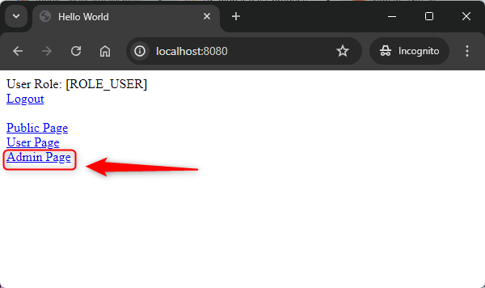
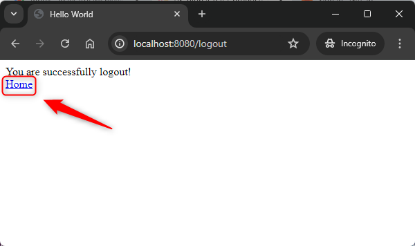
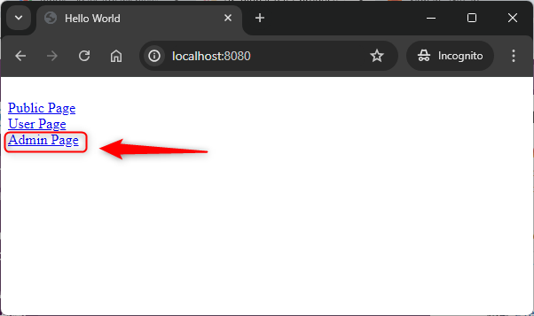
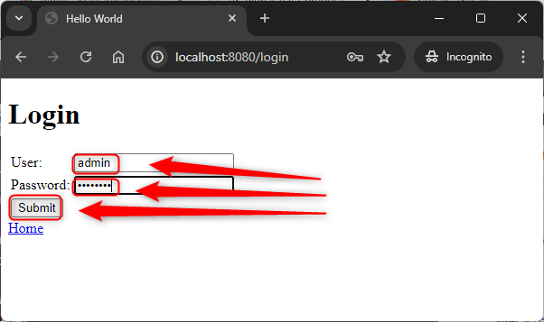
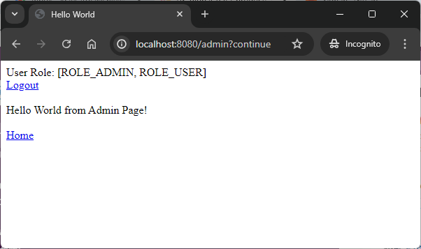

USAGE COMMANDS
--------------

> Please be aware that following tools should be installed in advance on your computer: **Java**, **Maven** and **Git**. 

> Please **clone/download** project, open **project's main folder** in your favorite **command line tool** and then **proceed with steps below**. 

Usage steps:
1. Start application with `mvn spring-boot:run`
1. (Optional) Check database (url: `jdbc:h2:mem:db-embedded;DB_CLOSE_DELAY=-1`, username: `sa`, password: -, table: `USER_TBL`) with `http://localhost:8080/h2-console`
1. In any browser display Home Page with `http://localhost:8080`
1. In any browser display not secured Public Page with `http://localhost:8080/public`
1. In any browser display secured User Page (credentials **user / user123** or **admin / admin123**) with `http://localhost:8080/user`
1. In any browser display secured Admin Page (credentials **admin / admin123**) with `http://localhost:8080/admin`
1. Clean up environment:
    * Stop application with `ctrl + C`

USAGE IMAGES
------------

DESCRIPTION
-----------

##### Goal
The goal of this project is to present how to implement **security** type **default form** for **UI** application type **HTML** in **Java** programming language with usage **Spring Boot** and **Thymeleaf** frameworks and **Spring Security** dependencies. Users are stored in **embedded database** type **H2**.

##### Terminology
Terminology explanation:
* **Security**: in IT it means authentication + authorization. Authentication - application confirms that you are you and checks your role. Authorization - application confirms that you have access to requested resources.
* **Default Form**: it's provided by Spring Security form where user can authenticate himself. Here user can provide username and password.
* **UI**: it's type of application designed for humans.
* **HTML**: it stands for HyperText Markup Language, is the standard language used to create and design documents on the World Wide Web.
* **Java**: object-oriented programming language.
* **Spring Boot**: framework for Java. It consists of: Spring + Container + Configuration.
* **Thymeleaf**: Thymeleaf is a modern server-side Java template engine for web and standalone environments. It is used for processing and generating HTML, XML, JavaScript, CSS, and plain text. Thymeleaf's main goal is to bring elegant natural templates to your development workflow.
* **Spring Security**: Spring Security is a powerful and highly customizable authentication and access-control framework for the Java application development environment. It is part of the Spring Framework ecosystem and provides comprehensive security services for enterprise applications.
* **Embedded Database**: this type of database is embedded in application. It means that it starts together with application.
* **H2**: type of embedded database.

##### Launch
To launch this application please make sure that the **Preconditions** are met and then follow instructions from **Usage** section.

PRECONDITIONS
-------------

##### Preconditions - Tools
* Installed **Operating System** (tested on Windows 10)
* Installed **Java** (tested on version 11.0.16.1)
* Installed **Maven** (tested on version 3.8.5)
* Installed **Git** (tested on version 2.33.0.windows.2)

##### Preconditions - Actions
* **Download** source code using Git 
* Open any **Command Line** (for instance "Windonw PowerShell" on Windows OS) tool on **project's folder**.