EXAMPLE
-------

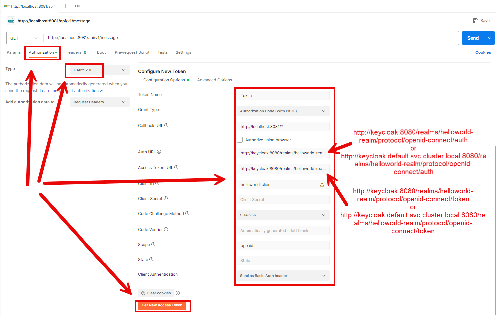

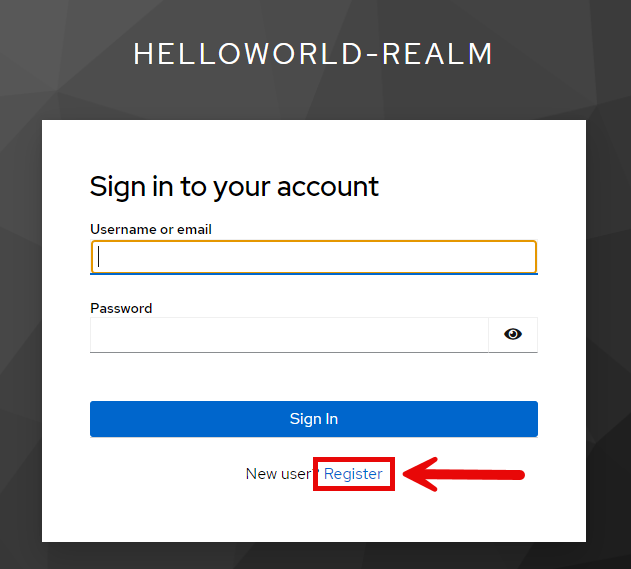

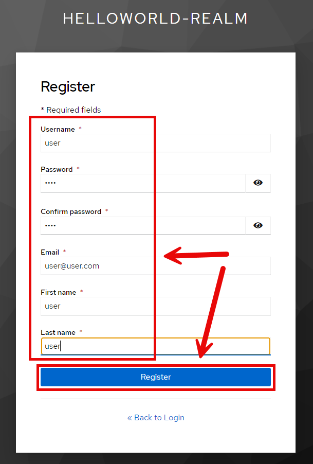

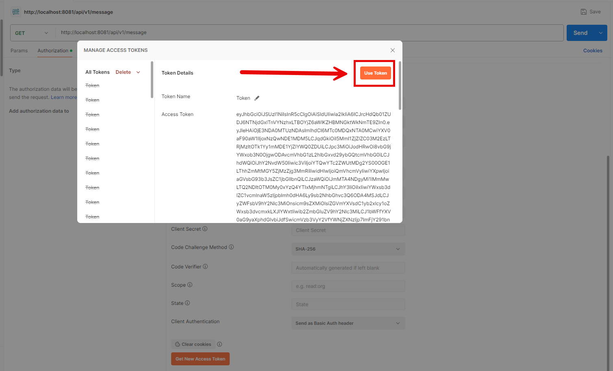

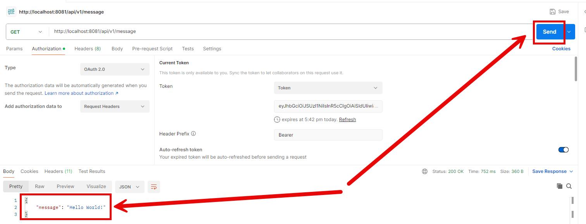

DESCRIPTION
-----------

##### Goal
The goal of this project is to present how to implement **Token Relay** between two **REST API** applications with usage **Java** programming language and **Spring Boot 3** framework. Token Relay means that user logs in to the first secured application and token is automatically added to request to the second secured application. 

##### Elements
This project consists of following elements:
* **First**: Rest API application
   * Input: endpoint "api/vi/message"
   * Content: RestClient communication with second application. Token is automatically added to request.
   * Output: JSON with message
* **Second**: Rest API application
   * Input: endpoint "api/vi/message"
   * Content: N/A
   * Output: JSON with message

##### Terminology
Terminology explanation:
* **Git**: Git is a distributed version control system (VCS) that tracks changes in code, allowing multiple developers to collaborate efficiently. It helps manage different versions of a project, enabling branching, merging, and rollback to previous states.
* **Maven**: Maven is a build automation and project management tool for Java-based projects, used primarily for dependency management and project configuration.
* **Java**: Java is a high-level, object-oriented programming language known for its platform independence, achieved through the Java Virtual Machine (JVM). It is widely used for web, mobile, and enterprise applications. Java follows the "write once, run anywhere" (WORA) principle, making it a popular choice for cross-platform development.
* **Spring Boot**: Spring Boot is a Java-based framework that simplifies the development of stand-alone, production-ready Spring applications by providing auto-configuration, embedded servers, and a convention-over-configuration approach.
* **REST API**: A REST API (Representational State Transfer API) is a web service that allows systems to communicate over HTTP using standard methods like GET, POST, PUT, and DELETE. It follows REST principles, ensuring scalability, statelessness, and resource-based interactions, typically using JSON or XML for data exchange.
* **Token Relay**: Token Relay is the process of forwarding an authentication token from one service or application to another to maintain user authentication and authorization across multiple systems. It enables secure access delegation without exposing user credentials.

USAGES
------

This project can be tested in following configurations:
* **Usage Manual**: infrastructure services are started as Docker containers. Services are started manually.
* **Usage Docker Compose**: all services are started as Docker containers defined in docker compose file.
* **Usage Kubernetes (Kind)**: all services are started as Kubernetes pods.

USAGE MANUAL
------------

> **Usage Manual** means that infrastructure services are started as Docker containers. Services are started manually.

> Please **clone/download** project, open **project's main folder** in your favorite **command line tool** and then **proceed with steps below**.

> **Prerequisites**:
* **Operating System** (tested on Windows 11)
* **Git** (tested on version 2.33.0.windows.2)
* **Docker** (tested on version 4.33.1)

##### Required steps:
1. Start **Docker** tool
1. In the first command line tool **start Keycloak container** with `docker-compose -f docker-compose-infrastructure.yaml up -d --build`
1. In the second command line tool **start First service** with mvn -f ./springboot3-api-rest-security-resourceserver-tokenrelay-first spring-boot:run
1. In the third command line tool **start Second service** with mvn -f ./springboot3-api-rest-security-resourceserver-tokenrelay-second spring-boot:run
1. In any REST Client (e.g. Postman) visit **REST API** application with `http://localhost:8081/api/v1/message`
   * Authorization -> Type -> OAuth 2.0
   * Token Name: **Token**
   * Grant Type: **Authorization Code (With PKCE)
   * Callback URL: http://localhost:8081/*
   * Auth URL: **http://localhost:8080/realms/helloworld-realm/protocol/openid-connect/auth**
   * Access Token URL: **http://localhost:8080/realms/helloworld-realm/protocol/openid-connect/token**
   * Client ID: **helloworld-client**
   * Code Challenge Method: **SHA-256**
   * Click **Get New Access Token -> Register new user -> Use Token**
   * Click **Send**
   * Expected text **{message: Hello World}**
1. Clean up environment
   * In the third command line tool **stop Second service** with `ctrl + c`
   * In the second command line tool **stop First service** with `ctrl + c`
   * In the first command line tool **remove Docker containers** with `docker-compose -f docker-compose-infrastructure.yaml down --rmi all`
   * Stop **Docker** tool

##### Optional steps:
1. In a command line tool validate Docker Compose with `docker-compose config`
1. In a command line tool check list of Docker images with `docker images`
1. In a command line tool check list of all Docker containers with `docker ps -a`
1. In a command line tool check list of active Docker containers with `docker ps`
1. In a command line tool check list of Docker nerworks with `docker network ls`
1. In a command line tool check container logs with `docker logs {container-name}`

USAGE DOCKER COMPOSE
--------------------

> **Usage Docker Compose** means all services are started as Docker containers defined in docker compose file.

> Please **clone/download** project, open **project's main folder** in your favorite **command line tool** and then **proceed with steps below**.

> **Prerequisites**:  
* **Operating System** (tested on Windows 11)
* **Git** (tested on version 2.33.0.windows.2)
* **Docker** (tested on version 4.33.1)

##### Required steps:
1. Update **hosts** file (Run as Administrator; Windows: "Windows\System32\drivers\etc\hosts"; MAC/Linux: "etc/hosts") with new line **127.0.0.1 keycloak**
1. Start **Docker** tool
1. In a command line tool **start Docker containers** with `docker-compose up -d --build`
1. In any REST Client (e.g. Postman) visit **REST API** application with `http://localhost:8081/api/v1/message`
   * Authorization -> Type -> OAuth 2.0
   * Token Name: **Token**
   * Grant Type: **Authorization Code (With PKCE)
   * Callback URL: http://localhost:8081/*
   * Auth URL: **http://keycloak:8080/realms/helloworld-realm/protocol/openid-connect/auth**
   * Access Token URL: **http://keycloak:8080/realms/helloworld-realm/protocol/openid-connect/token**
   * Client ID: **helloworld-client**
   * Code Challenge Method: **SHA-256**
   * Click **Get New Access Token -> Use Token**
   * Click **Send**
   * Expected text **{message: Hello World}**
1. Clean up environment 
     * In a command line tool **remove Docker containers** with `docker-compose down --rmi all`
     * Stop **Docker** tool
     * Remove new line from **hosts**

##### Optional steps:
1. In a command line tool validate Docker Compose with `docker-compose config`
1. In a command line tool check list of Docker images with `docker images`
1. In a command line tool check list of all Docker containers with `docker ps -a`
1. In a command line tool check list of active Docker containers with `docker ps`
1. In a command line tool check list of Docker nerworks with `docker network ls`
1. In a command line tool check container logs with `docker logs {container-name}`

USAGE KUBERNETES (KIND)
---------------------------

> **Usage Kubernetes** means that all services are started as Kubernetes pods. 

> Please **clone/download** project, open **project's main folder** in your favorite **command line tool** and then **proceed with steps below**.

> **Prerequisites**:  
* **Operating System** (tested on Windows 11)
* **Git** (tested on version 2.33.0.windows.2)
* **Kind** (tested on version 0.26.0)

##### Required steps:
1. Update **hosts** file (Run as Administrator; Windows: "Windows\System32\drivers\etc\hosts"; MAC/Linux: "etc/hosts") with new line **127.0.0.1 keycloak.default.svc.cluster.local**
1. Start **Docker** tool
1. In the first command line tool create and start cluster **Kind** with `kind create cluster --name helloworld`
1. In the second command line tool **start Kubernetes Pods** with `kubectl apply -f kubernetes.yaml`
1. In the second command line tool **check status of Kubernetes Pods** with `kubectl get pods`
   * Expected mysql, be and fe as **READY 1/1** (it can take few minutes)
1. In the second command line tool **forward port of Keycloak service** with `kubectl port-forward service/keycloak 8080:8080`
1. In the third command line tool **forward port of First service** with `kubectl port-forward service/first 8081:8081`
1. In any REST Client (e.g. Postman) visit **REST API** application with `http://localhost:8081/api/v1/message`
   * Authorization -> Type -> OAuth 2.0
   * Token Name: **Token**
   * Grant Type: **Authorization Code (With PKCE)
   * Callback URL: http://localhost:8081/*
   * Auth URL: **http://keycloak.default.svc.cluster.local:8080/realms/helloworld-realm/protocol/openid-connect/auth**
   * Access Token URL: **http://keycloak.default.svc.cluster.local:8080/realms/helloworld-realm/protocol/openid-connect/token**
   * Client ID: **helloworld-client**
   * Code Challenge Method: **SHA-256**
   * Click **Get New Access Token -> Use Token**
   * Click **Send**
   * Expected text **{message: Hello World}**
1. Clean up environment 
     * In the third command line tool **stop forwarding port of First service** with `ctrl + C`
     * In the second command line tool **stop forwarding port of Keycloak service** with `ctrl + C`
     * In the second command line tool **remove Kubernetes Pods** with `kubectl delete -f kubernetes.yaml`
     * In the first command line tool delete cluster **Kind** with `kind delete cluster --name helloworld`
     * Stop **Docker** tool
     * Remove new line from **hosts**

##### Optional steps:
1. In a command line tool build Docker First image with `docker build -f springboot3-api-rest-security-resourceserver-tokenrelay-first/Dockerfile -t wisniewskikr/springboot3-api-rest-security-resourceserver-tokenrelay-first:0.0.1 ./springboot3-api-rest-security-resourceserver-tokenrelay-first`
1. In a command line tool push Docker First image to Docker Repository with `docker push wisniewskikr/springboot3-api-rest-security-resourceserver-tokenrelay-first:0.0.1` 
1. In a command line tool build Docker Second image with `docker build -f springboot3-api-rest-security-resourceserver-tokenrelay-second/Dockerfile -t wisniewskikr/springboot3-api-rest-security-resourceserver-tokenrelay-second:0.0.1 ./springboot3-api-rest-security-resourceserver-tokenrelay-second`
1. In a command line tool push Docker Second image to Docker Repository with `docker push wisniewskikr/springboot3-api-rest-security-resourceserver-tokenrelay-second:0.0.1` 
1. In the first command line tool with administrator privileges check clusers with `kind get clusters`
1. In a command line tool check Kubernetes Deployments with `kubectl get deployments`
1. In a command line tool check Kubernetes Deployments details with **kubectl describe deployment {deployment-name}**
1. In a command line tool check Kubernetes Services with `kubectl get services`
1. In a command line tool check Kubernetes Services details with **kubectl describe service {service-name}**
1. In a command line tool check Kubernetes Pods with `kubectl get pods`
1. In a command line tool check Kubernetes Pods details with **kubectl describe pod {pod-name}**
1. In a command line tool check Kubernetes Pods logs with **kubectl logs {pod-name}**

KEYCLOAK CONFIGURATION
----------------------

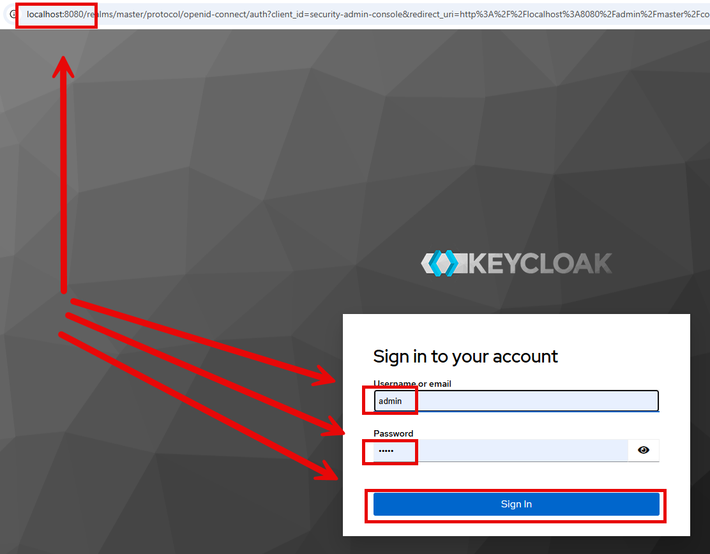

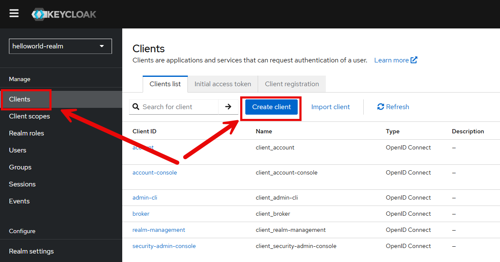

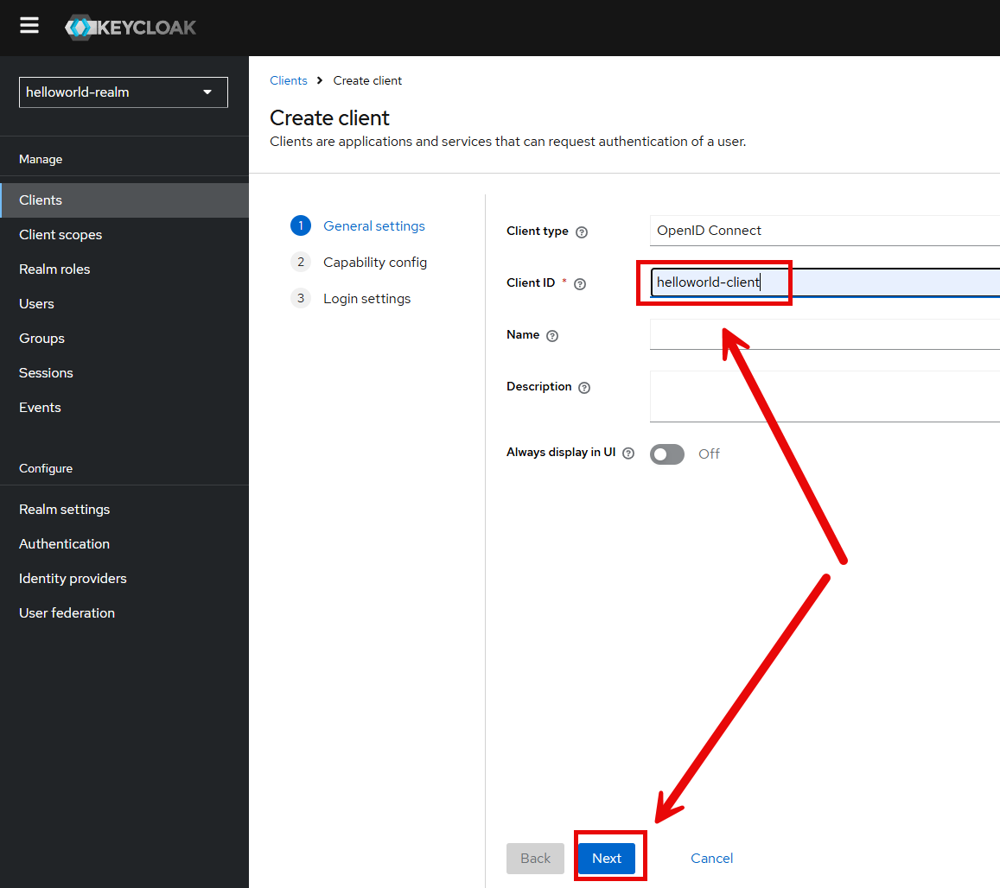

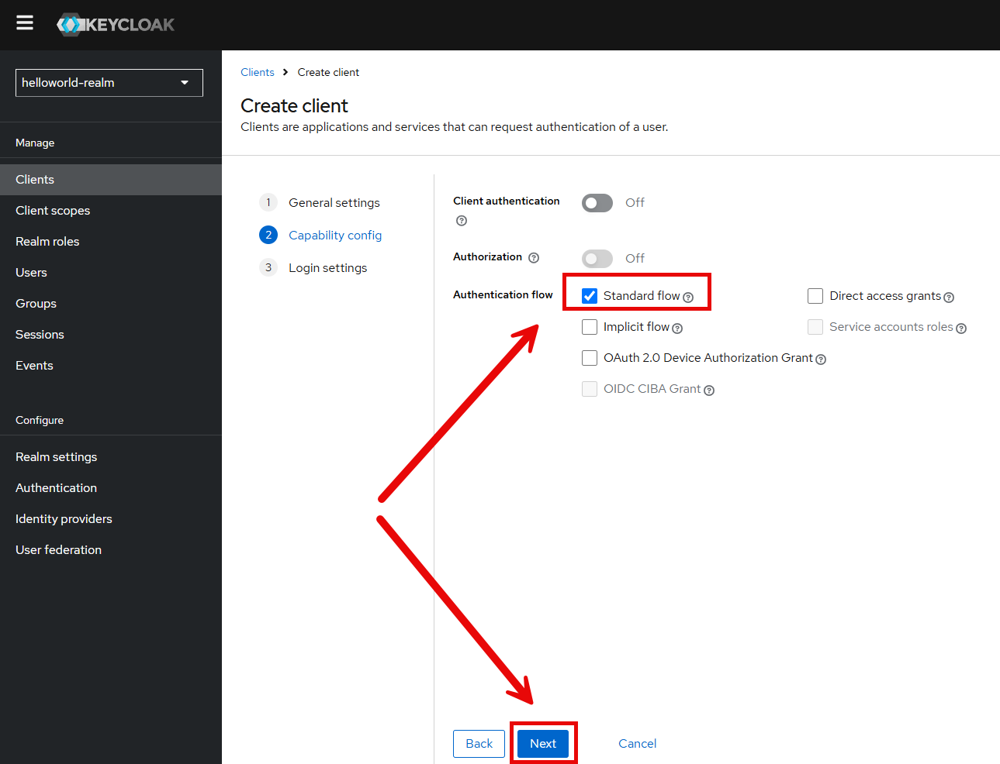

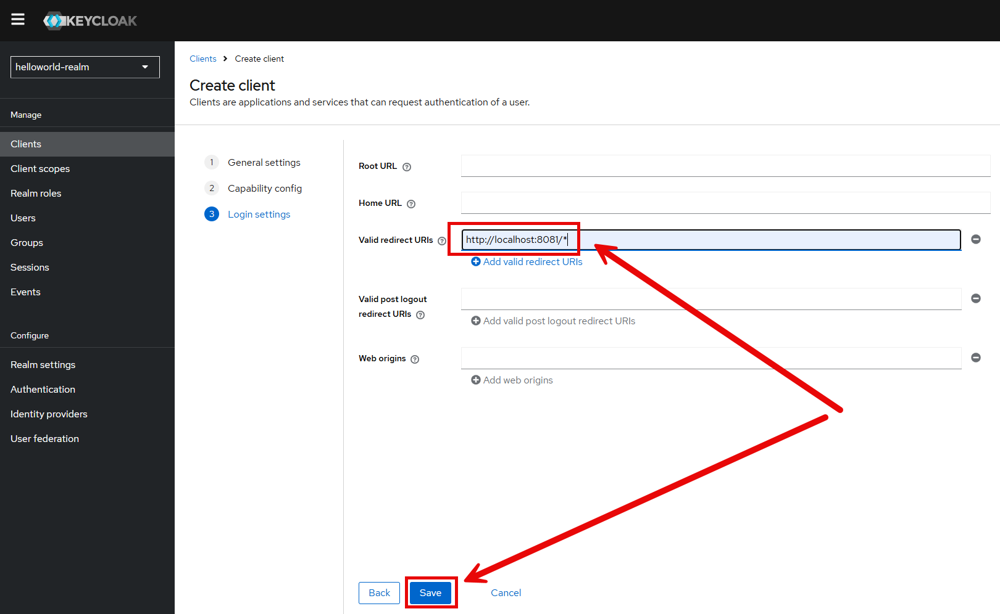

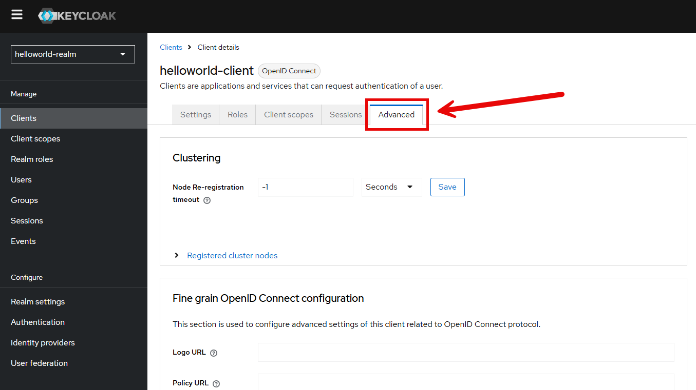

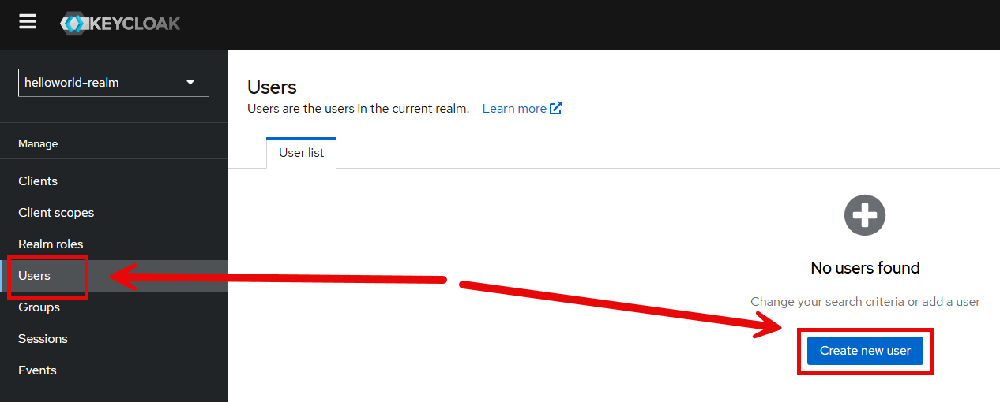

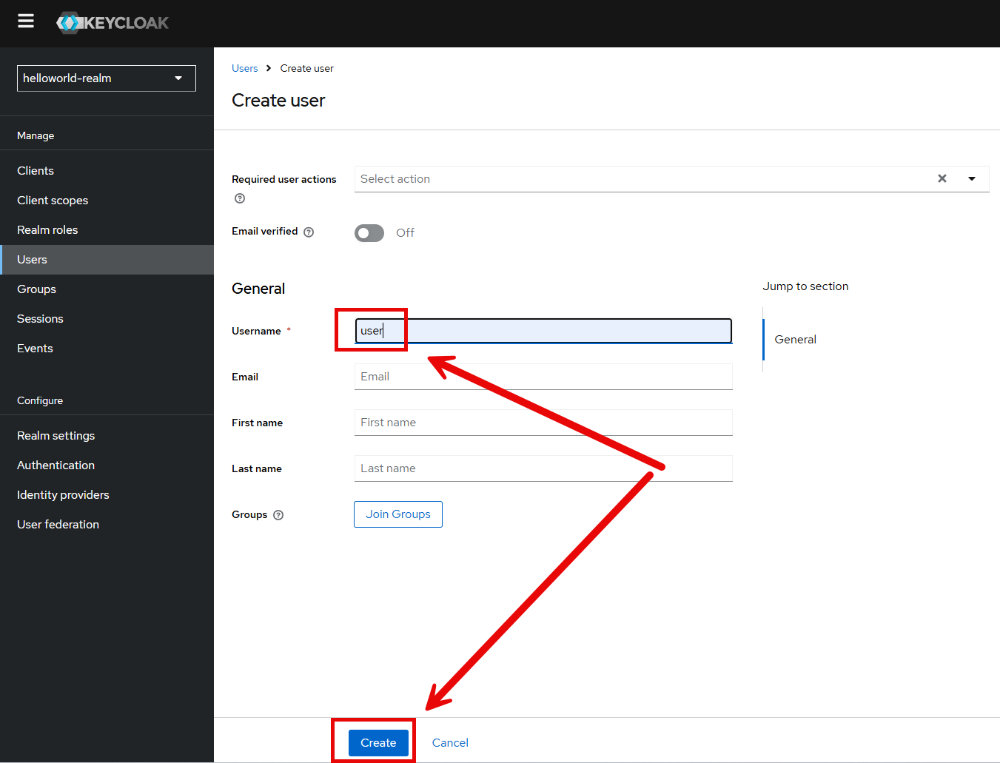

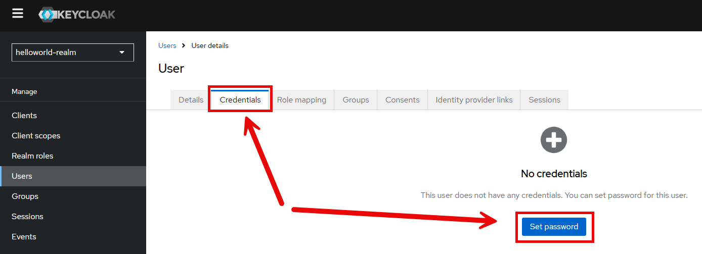

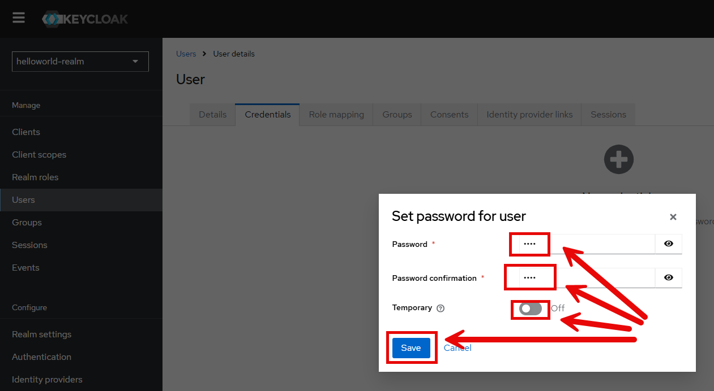

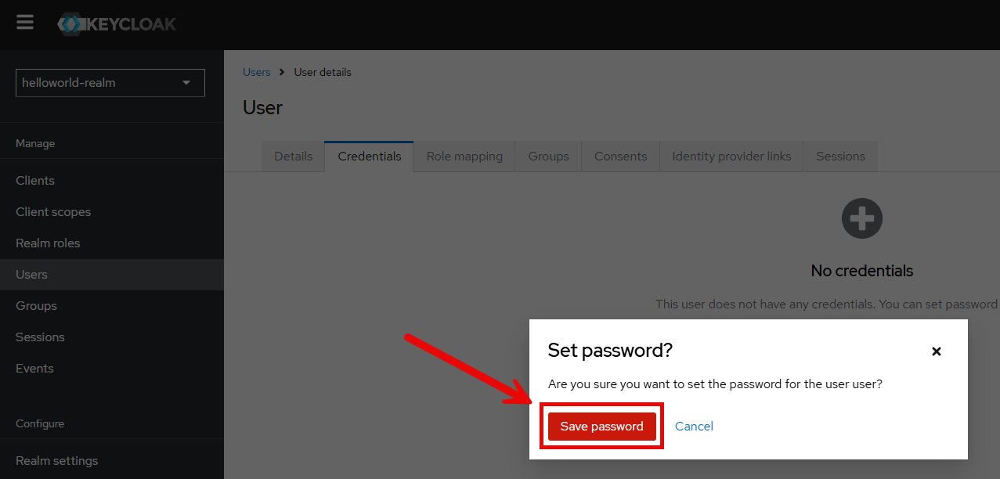

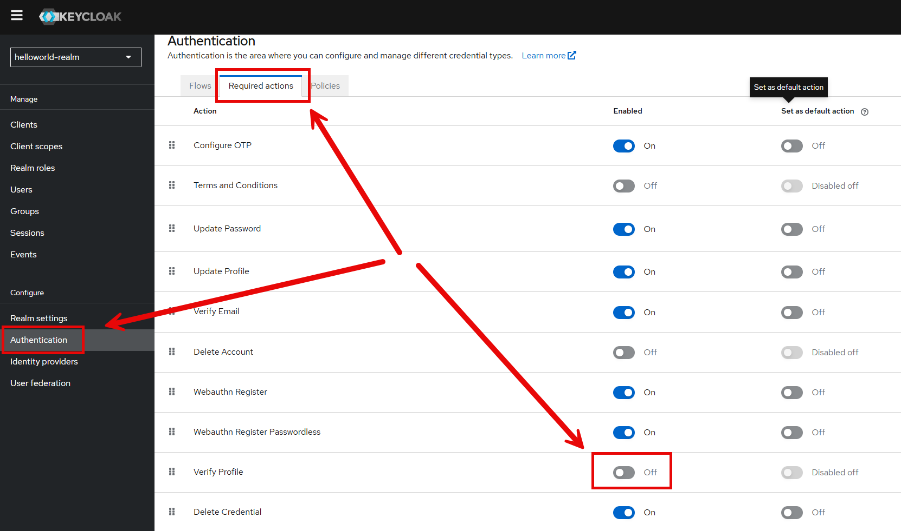

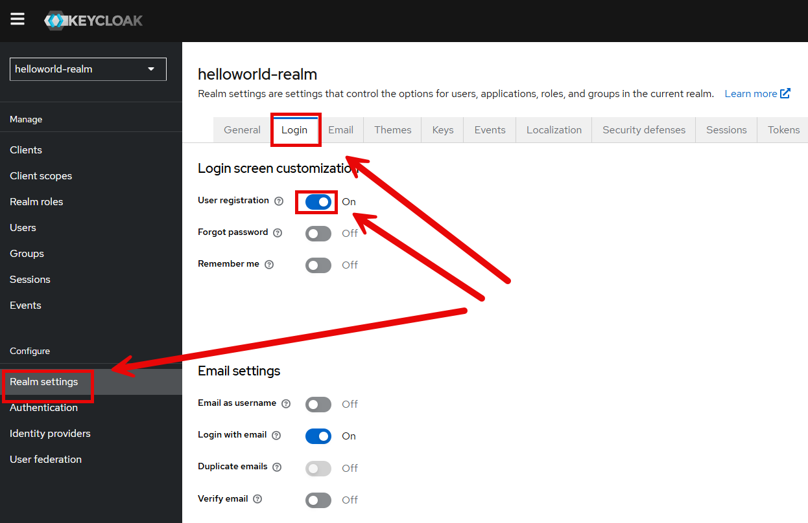