EXAMPLE OAUTH 2.0
-----------------

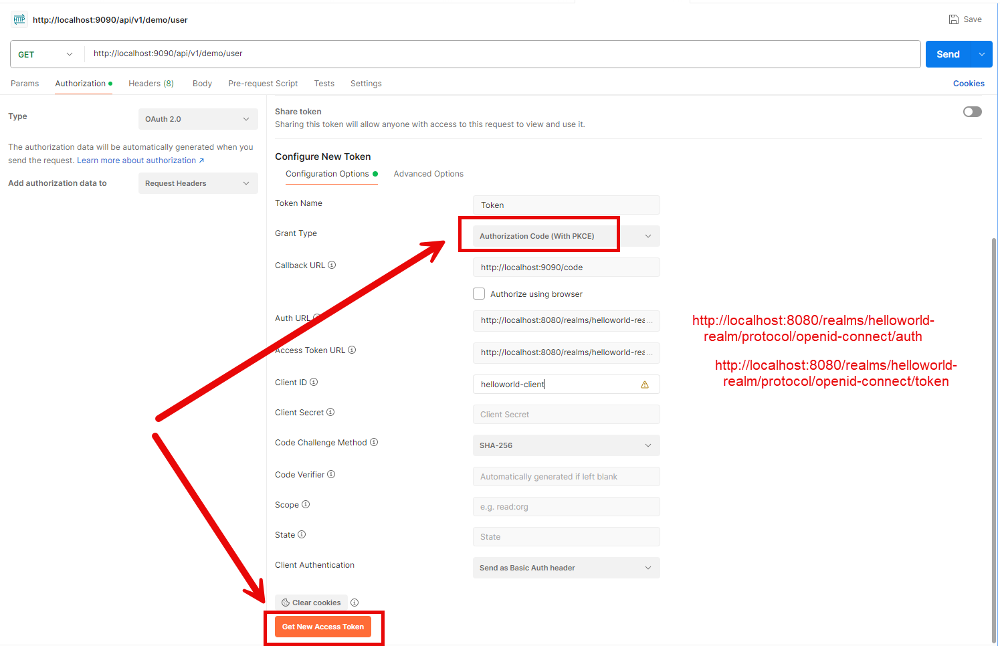

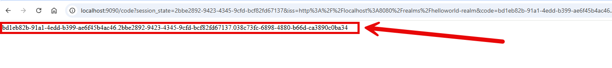

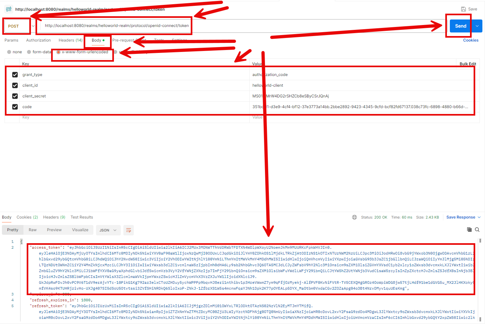

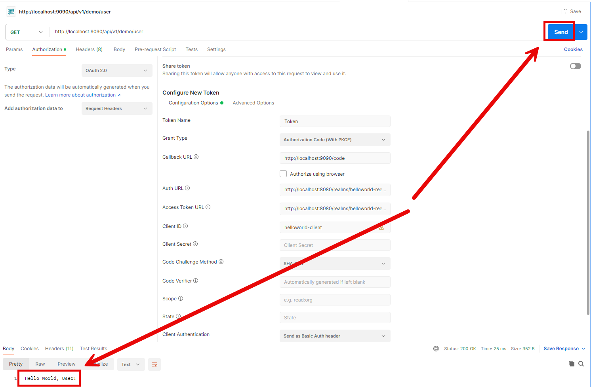

DESCRIPTION
-----------

##### Goal
The goal of this project is to present how to implement **security** in **REST API** application using **Keycloak** tool with usage **Java** programming language and **Spring Boot 3** framework. This application is used as **resource server** (verifies JWT tokens) and for authentication uses **authorization code with PKCE** (two steps: 1. User logs in and gets authorization code; 2. User generates token basing on authorization code). PKCE means that user doesn't have to new "secret id" any more.

##### Elements
This project consists of following elements:
* **Rest API**: Rest API application which returns
   * Not secured "Hello World!" message
   * Secured "Hello World, User!" message
   * Secured "Hello World, Admin!" message  
* **Keycloak**: IAM tool for user management and entrypoint for JWT

##### Terminology
Terminology explanation:
* **Git**: tool for distributed version control
* **Maven**: tool for build automation
* **Java**: object-oriented programming language
* **Spring Boot**: framework for Java. It consists of: Spring + Container + Configuration
* **REST API**: A REST API (Representational State Transfer API) is a web service that allows systems to communicate over HTTP using standard methods like GET, POST, PUT, and DELETE. It follows REST principles, ensuring scalability, statelessness, and resource-based interactions, typically using JSON or XML for data exchange.
* **Keycloak**: Keycloak is an open-source identity and access management solution that provides authentication, authorization, and user management for applications and services. It supports Single Sign-On (SSO), social logins, multi-factor authentication, and integration with LDAP and Active Directory.
* **Resource Server**: is a Spring Boot starter that provides auto-configuration and dependencies to build an OAuth2 resource server. It enables authentication and authorization by validating access tokens issued by an OAuth2 authorization server.
* **Authorization Code With PKCE (Proof Key for Code Exchange)**: it is an OAuth 2.0 extension that enhances security by preventing authorization code interception attacks. It replaces client secrets with a dynamically generated code verifier and a code challenge, ensuring that only the original client can exchange the authorization code for an access token. This is especially useful for mobile and public clients where storing secrets securely is impractical. 

Authorization Code Grant steps:
1. User Authorization – The user is redirected to the authorization server and logs in.
1. Authorization Code Issued – After successful login, the authorization server redirects back with a short-lived authorization code.
1. Code Exchange for Token – The client app sends the authorization code to the authorization server (along with client credentials) to obtain an access token (and optionally a refresh token).
1. Access Token Usage – The client uses the access token to access protected resources on behalf of the user.

USAGES
------

This project can be tested in following configurations:
* **Usage Docker Compose**: all services are started as Docker containers definied in docker compose file.

USAGE DOCKER COMPOSE
--------------------

> **Usage Docker Compse** means all services are started as Docker containers definied in docker compose file.

> Please **clone/download** project, open **project's main folder** in your favorite **command line tool** and then **proceed with steps below**.

> **Prerequisites**:  
* **Operating System** (tested on Windows 11)
* **Git** (tested on version 2.33.0.windows.2)
* **Docker** (tested on version 4.33.1)

##### Required steps:
1. Start **Docker** tool
1. In a command line tool **start Docker containers** with `docker-compose up -d --build`
1. In a browser visit **Keycloak** console with `http://localhost:8080`
   * Use credentials admin/admin and configure Realm, Client and User (please check section **Keycloak Configuration**)
1. In any REST Client (e.g. Postman) visit **REST API** application with `http://localhost:9090/api/v1/demo`
   * Expected "Hello World!" message
   * Expected JWT token
1. In any REST Client (e.g. Postman) visit **REST API** application with `http://localhost:9090/api/v1/demo/user`
   * Authorization -> Type -> OAuth 2.0
   * Token Name: **Token**
   * Grant Type: **Authorization Code (With PKCE)
   * Callback URL: **http://localhost:9090/code**
   * Auth URL: **http://localhost:8080/realms/helloworld-realm/protocol/openid-connect/auth**
   * Access Token URL: **http://localhost:8080/realms/helloworld-realm/protocol/openid-connect/token**
   * Client ID: **helloworld-client**
   * Code Challenge Method: **SHA-256**
   * Click **Get New Access Token -> Use Token**
   * Click **Send**
   * Expected text **Hello World, User!**
1. Clean up environment 
     * In a command line tool **remove Docker containers** with `docker-compose down --rmi all`
     * Stop **Docker** tool

##### Optional steps:
1. In a command line tool validate Docker Compose with `docker-compose config`
1. In a command line tool check list of Docker images with `docker images`
1. In a command line tool check list of all Docker containers with `docker ps -a`
1. In a command line tool check list of active Docker containers with `docker ps`
1. In a command line tool check list of Docker nerworks with `docker network ls`
1. In a command line tool check BE container logs with `docker logs be-container`
1. In a command line tool check FE container logs with `docker logs fe-container`

KEYCLOAK CONFIGURATION
----------------------

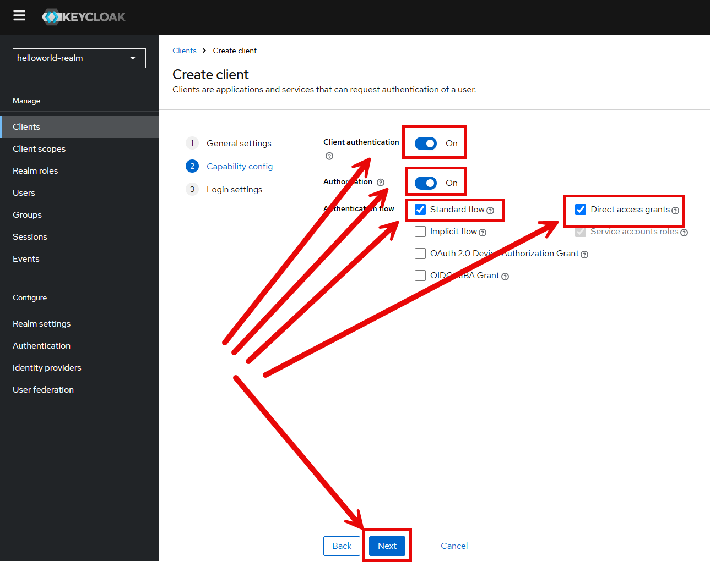

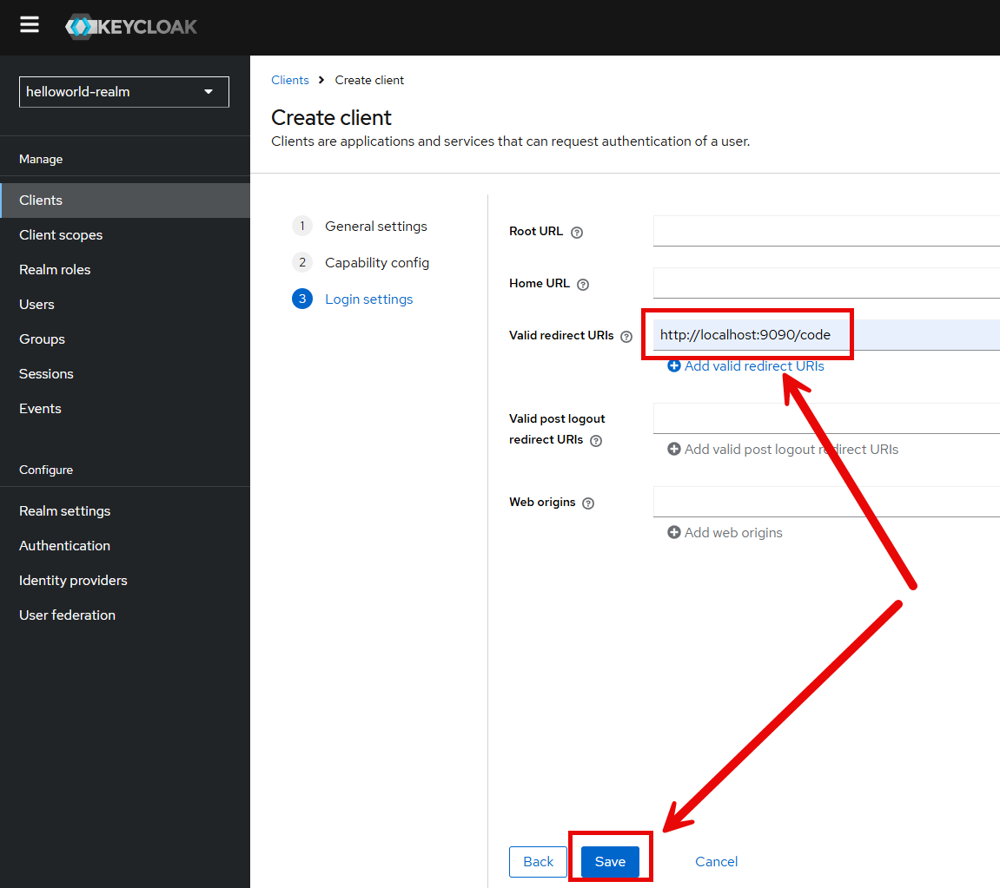

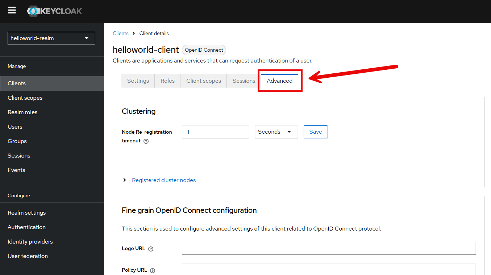

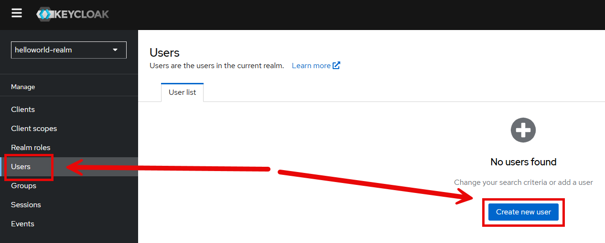

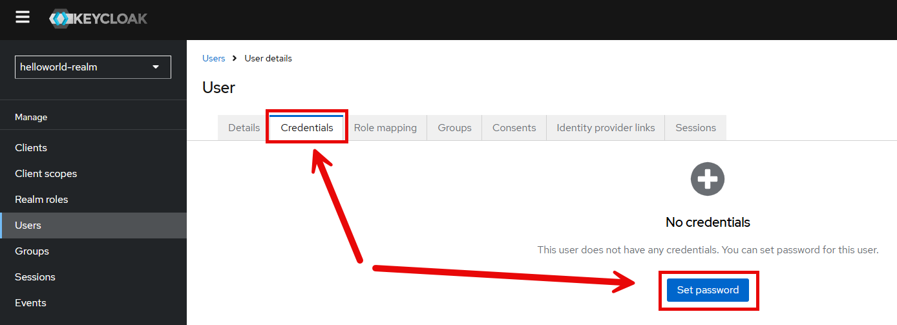

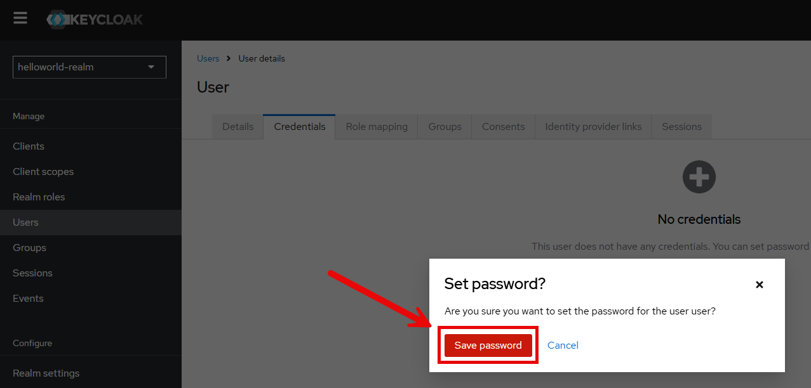

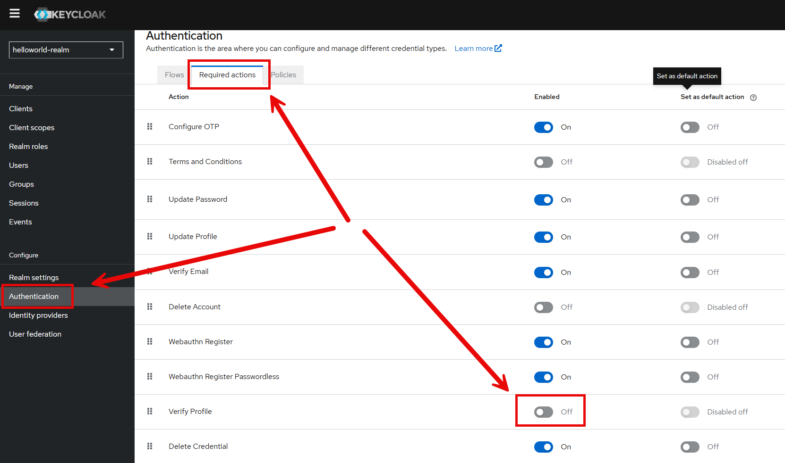
