EXAMPLE
-------

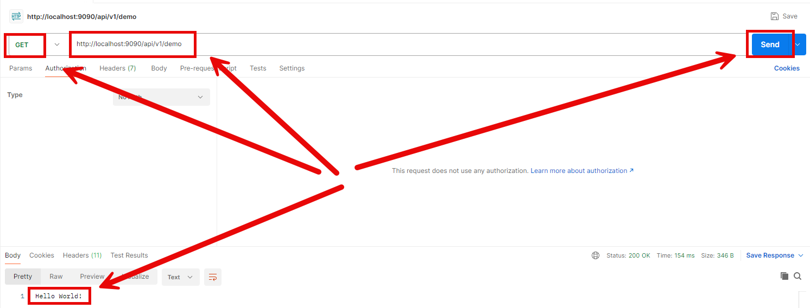

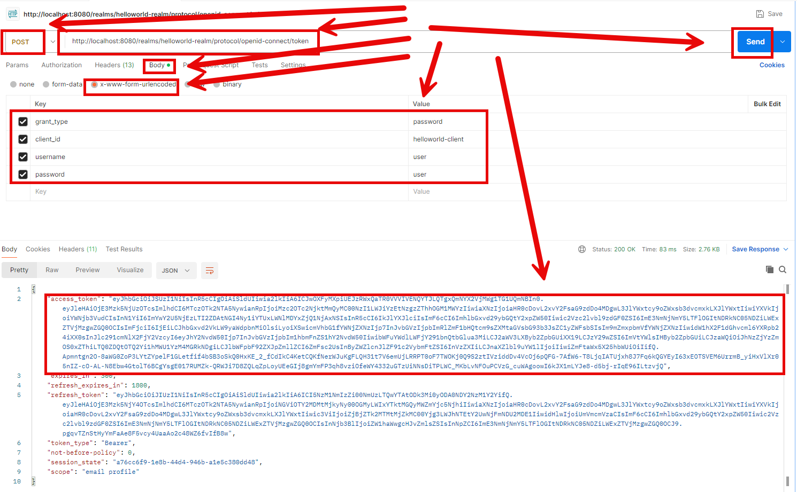

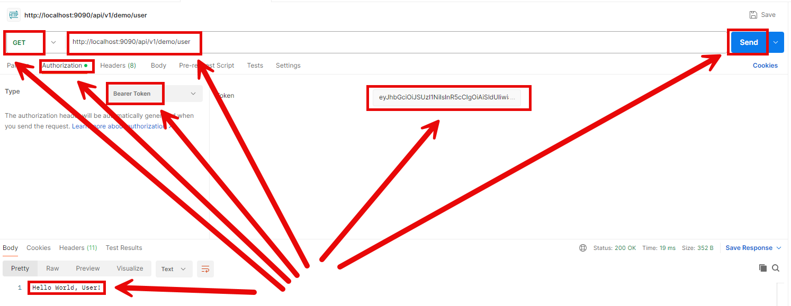

DESCRIPTION
-----------

##### Goal
The goal of this project is to present how to implement **security** in **REST API** application using **Keycloak** tool with usage **Java** programming language and **Spring Boot 3** framework. This application handles only users, without any roles. It means that if user exists in Keycloak then he/she has access to aplication - otherwise not.

##### Elements
This project consists of following elements:
* **Rest API**: Rest API application which returns
   * Not secured "Hello World!" message
   * Secured "Hello World, User!" message 
* **Keycloak**: IAM tool for user management and entrypoint for JWT

##### Terminology
Terminology explanation:
* **Git**: tool for distributed version control
* **Maven**: tool for build automation
* **Java**: object-oriented programming language
* **Spring Boot**: framework for Java. It consists of: Spring + Container + Configuration
* **REST API**: A REST API (Representational State Transfer API) is a web service that allows systems to communicate over HTTP using standard methods like GET, POST, PUT, and DELETE. It follows REST principles, ensuring scalability, statelessness, and resource-based interactions, typically using JSON or XML for data exchange.
* **Keycloak**: Keycloak is an open-source identity and access management solution that provides authentication, authorization, and user management for applications and services. It supports Single Sign-On (SSO), social logins, multi-factor authentication, and integration with LDAP and Active Directory.

USAGES
------

This project can be tested in following configurations:
* **Usage Docker Compose**: all services are started as Docker containers definied in docker compose file.
* **Usage Kubernetes (Kind)**: all services are started as Kubernetes pods.

USAGE DOCKER COMPOSE
--------------------

> **Usage Docker Compse** means all services are started as Docker containers definied in docker compose file.

> Please **clone/download** project, open **project's main folder** in your favorite **command line tool** and then **proceed with steps below**.

> **Prerequisites**:  
* **Operating System** (tested on Windows 11)
* **Git** (tested on version 2.33.0.windows.2)
* **Docker** (tested on version 4.33.1)

##### Required steps:
1. Start **Docker** tool
1. In a command line tool **start Docker containers** with `docker-compose up -d --build`
1. In a browser visit **Keycloak** console with `http://localhost:8080`
   * Use credentials admin/admin and configure Realm, Client and User (please check section **Keycloak Configuration**)
1. In any REST Client (e.g. Postman) visit **REST API** application with `http://localhost:9090/api/v1/demo`
   * Expected "Hello World!" message
1. In any REST Client (e.g. Postman) visit **Keycloack** JWT generator with `http://localhost:8080/realms/helloworld-realm/protocol/openid-connect/token`
   * Method: **POST**
   * client_id: **helloworld_client**
   * username: **user**
   * password: **user**
   * Expected JWT token
1. In any REST Client (e.g. Postman) visit **REST API** application with `http://localhost:9090/api/v1/demo/user`
   * Bearer Token: JWT token
   * Expected "Hello World, User!" message
1. Clean up environment 
     * In a command line tool **remove Docker containers** with `docker-compose down --rmi all`
     * Stop **Docker** tool

##### Optional steps:
1. In a command line tool validate Docker Compose with `docker-compose config`
1. In a command line tool check list of Docker images with `docker images`
1. In a command line tool check list of all Docker containers with `docker ps -a`
1. In a command line tool check list of active Docker containers with `docker ps`
1. In a command line tool check list of Docker nerworks with `docker network ls`
1. In a command line tool check BE container logs with `docker logs be-container`
1. In a command line tool check FE container logs with `docker logs fe-container`

USAGE KUBERNETES (KIND) - WIP
-----------------------------

> **Usage Kubernetes** means that all services are started as Kubernetes pods. 

> Please **clone/download** project, open **project's main folder** in your favorite **command line tool** and then **proceed with steps below**.

> **Prerequisites**:  
* **Operating System** (tested on Windows 11)
* **Git** (tested on version 2.33.0.windows.2)
* **Docker** (tested on version 4.33.1)
* **Kind** (tested on version 0.26.0)

##### Required steps:
1. Start **Docker** tool
1. In the first command line tool create and start cluster **Kind** with `kind create cluster --name helloworld`
1. In the second command line tool **start Kubernetes Pods** with `kubectl apply -f kubernetes.yaml`
1. In the second command line tool **check status of Kubernetes Pods** with `kubectl get pods`
   * Expected mysql, be and fe as **READY 1/1** (it can take few minutes)
1. In the second command line tool **forward port of Keycloak service** with `kubectl port-forward service/keycloak 8080:8080`
1. In the third command line tool **forward port of REST API service** with `kubectl port-forward service/app 9090:9090`
1. In a browser visit **Keycloak** console with `http://localhost:8080`
   * Use credentials admin/admin and configure Realm, Client and User (please check section **Keycloak Configuration**)
1. In any REST Client (e.g. Postman) visit **REST API** application with `http://localhost:9090/api/v1/demo`
   * Expected "Hello World!" message
1. In any REST Client (e.g. Postman) visit **Keycloack** JWT generator with `http://localhost:8080/realms/helloworld-realm/protocol/openid-connect/token`
   * Method: **POST**
   * client_id: **helloworld_client**
   * username: **user**
   * password: **user**
   * Expected JWT token
1. In any REST Client (e.g. Postman) visit **REST API** application with `http://localhost:9090/api/v1/demo/user`
   * Bearer Token: JWT token
   * Expected "Hello World, User!" message
1. Clean up environment 
     * In the third command line tool **stop forwarding port of REST API service** with `ctrl + C`
     * In the second command line tool **stop forwarding port of Keycloak service** with `ctrl + C`
     * In the second command line tool **remove Kubernetes Pods** with `kubectl delete -f kubernetes.yaml`
     * In the first command line tool delete cluster **Kind** with `kind delete cluster --name helloworld`
     * Stop **Docker** tool

##### Optional steps:
1. In a command line tool build Docker REST API image with `docker build -t wisniewskikr/springboot3-api-rest-security6-keycloak-user:0.0.1-SNAPSHOT .`
1. In a command line tool push Docker REST API image to Docker Repository with `docker push wisniewskikr/springboot3-api-rest-security6-keycloak-user:0.0.1-SNAPSHOT` 
1. In the first command line tool with administrator privileges check clusers with `kind get clusters`
1. In a command line tool check Kubernetes Deployments with `kubectl get deployments`
1. In a command line tool check Kubernetes Deployments details with **kubectl describe deployment {deployment-name}**
1. In a command line tool check Kubernetes Services with `kubectl get services`
1. In a command line tool check Kubernetes Services details with **kubectl describe service {service-name}**
1. In a command line tool check Kubernetes Pods with `kubectl get pods`
1. In a command line tool check Kubernetes Pods details with **kubectl describe pod {pod-name}**
1. In a command line tool check Kubernetes Pods logs with **kubectl logs {pod-name}**

KEYCLOAK CONFIGURATION
----------------------

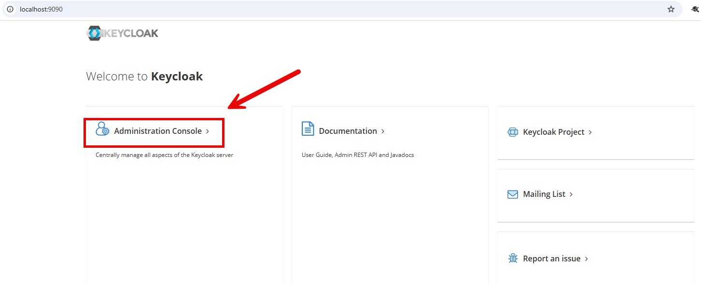

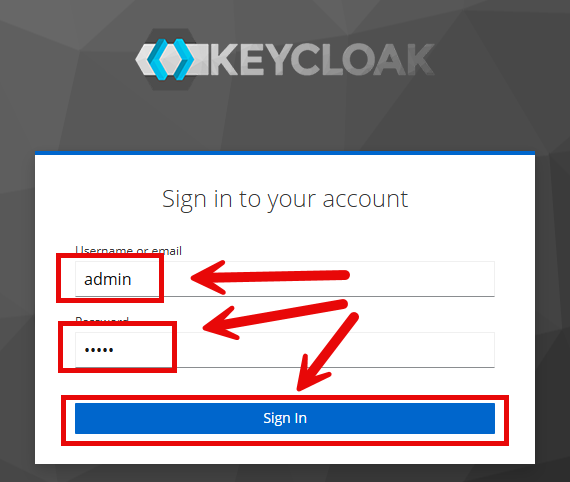

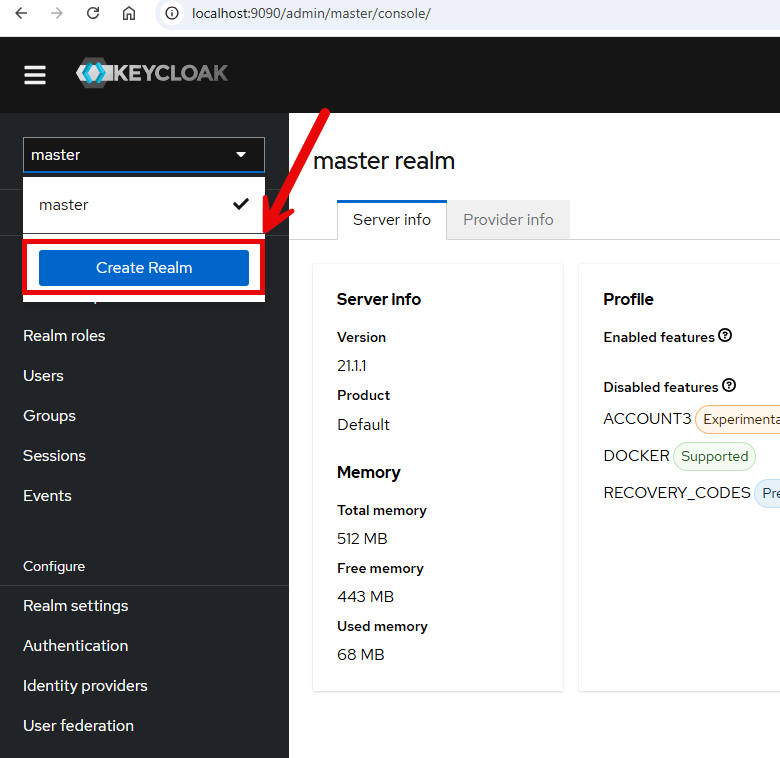

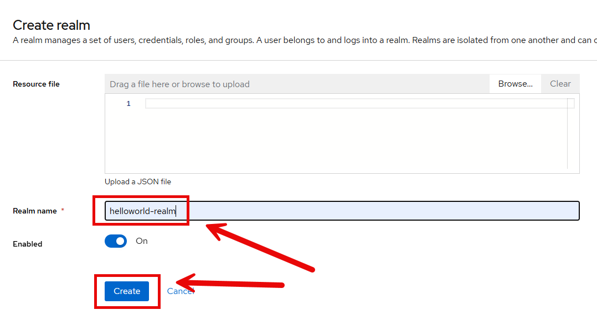

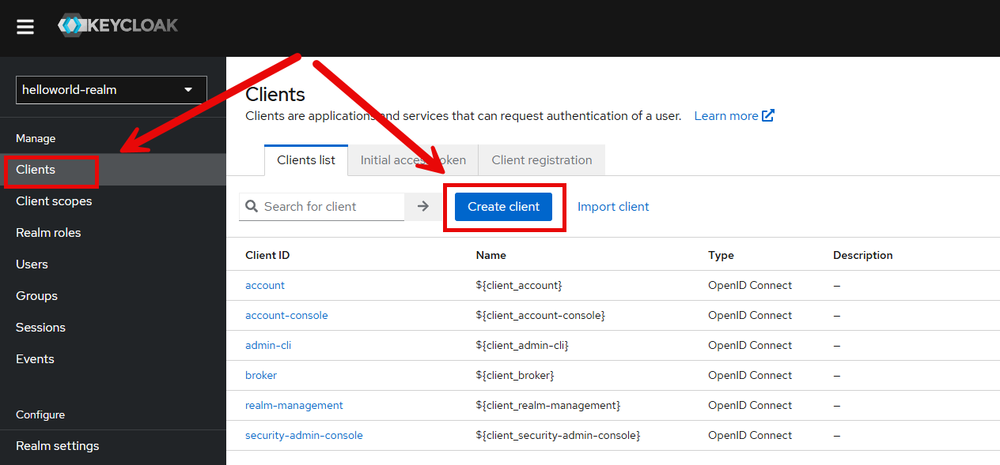

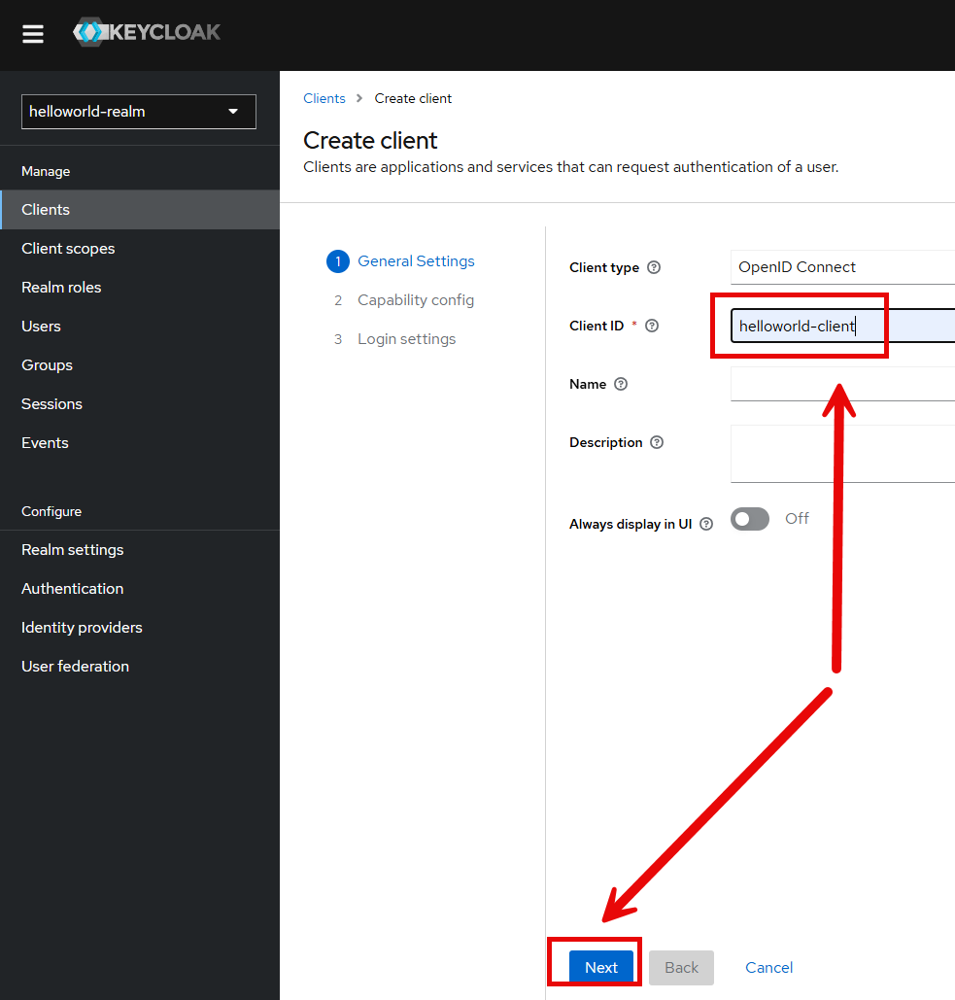

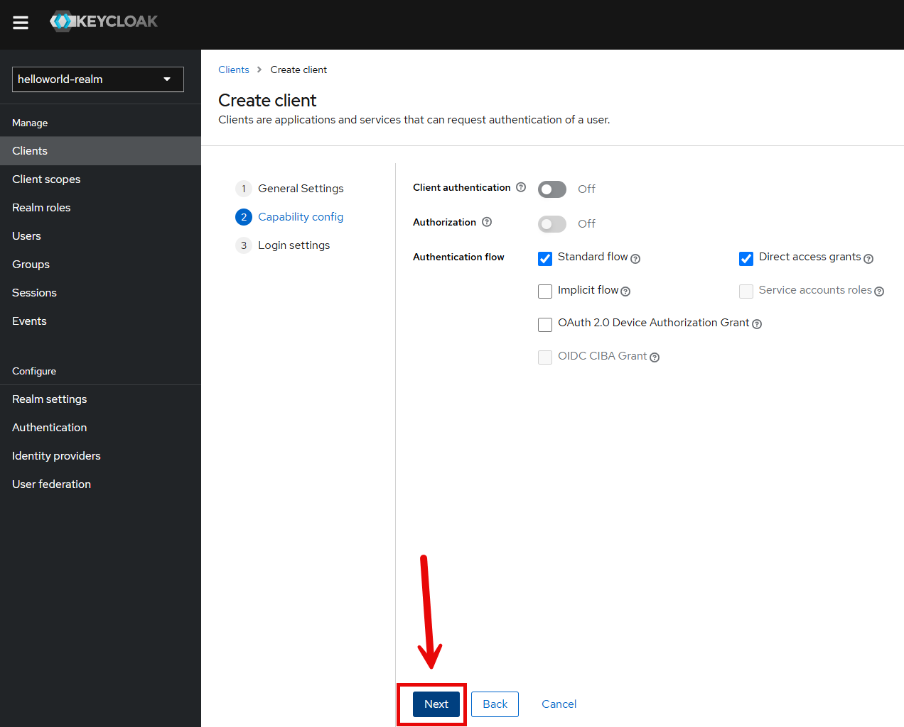

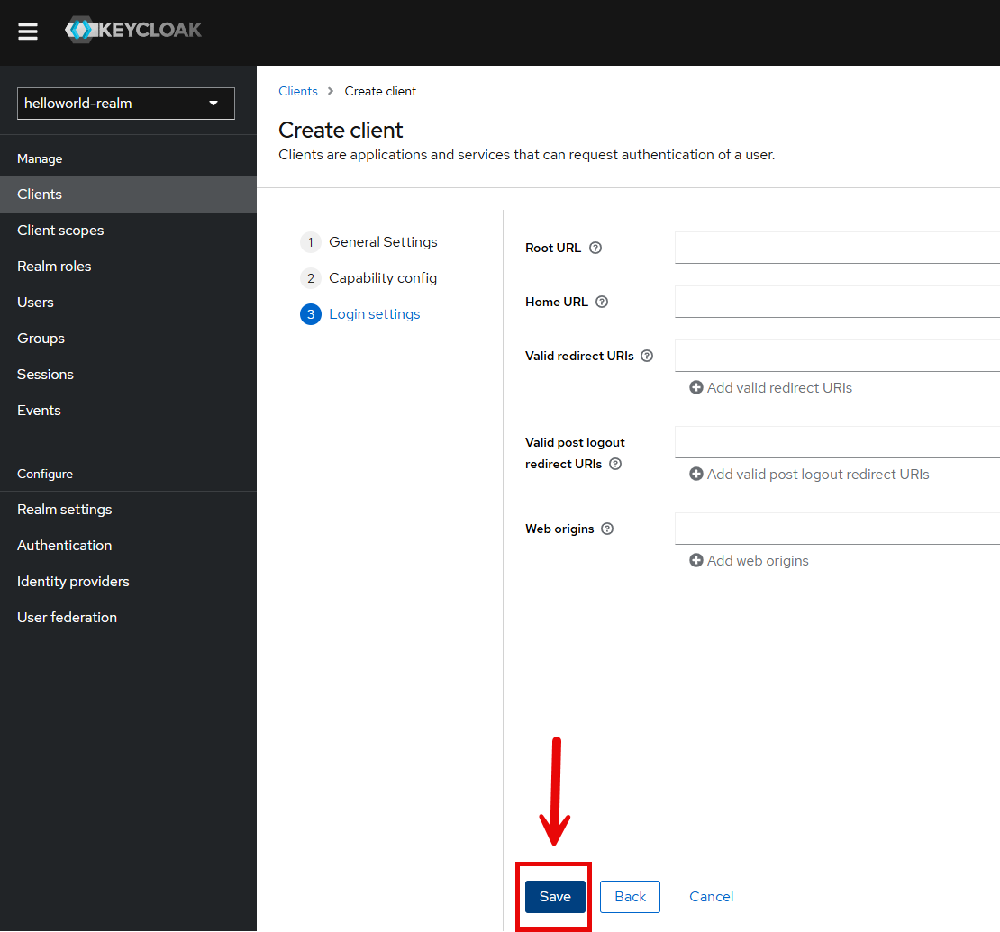

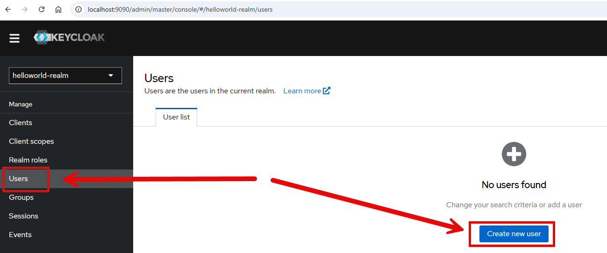

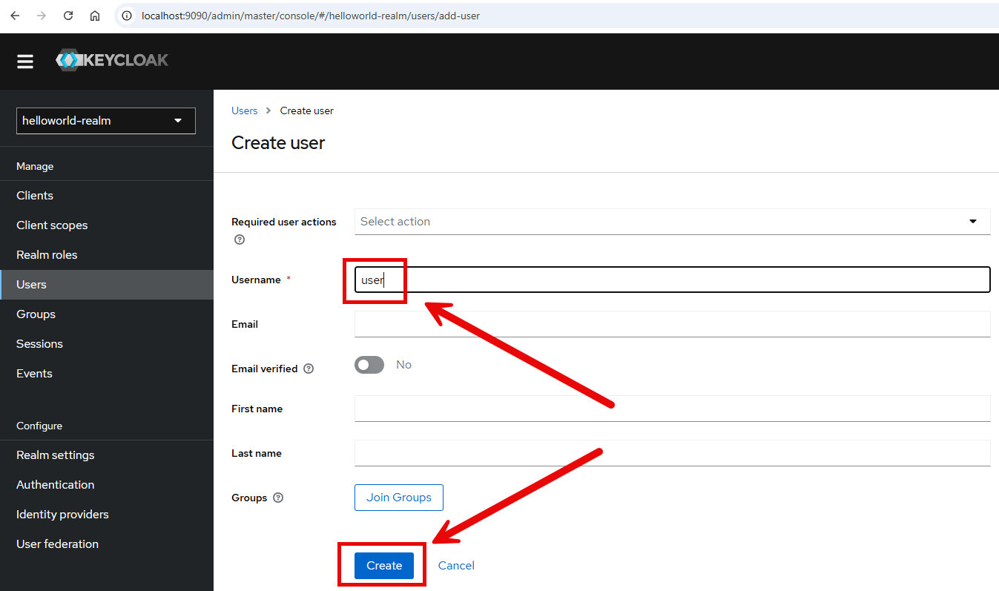

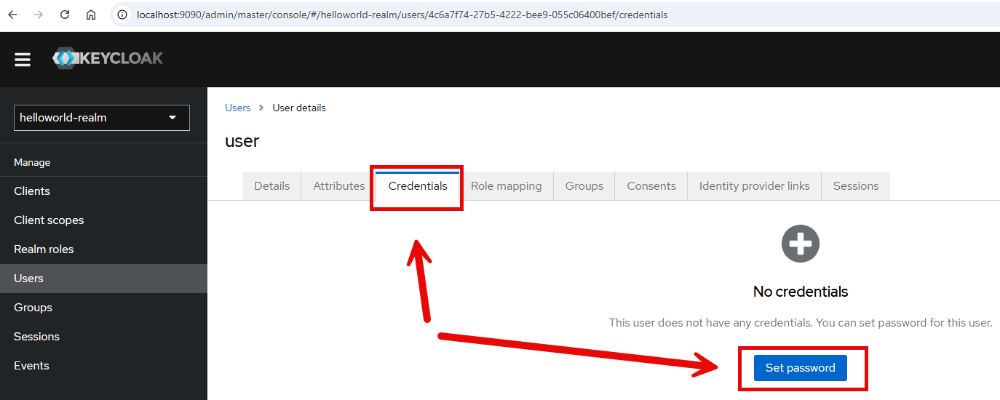

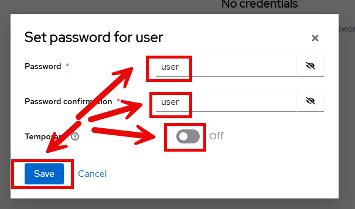

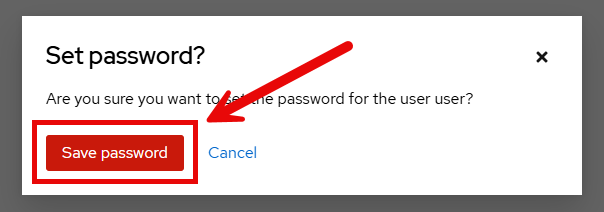

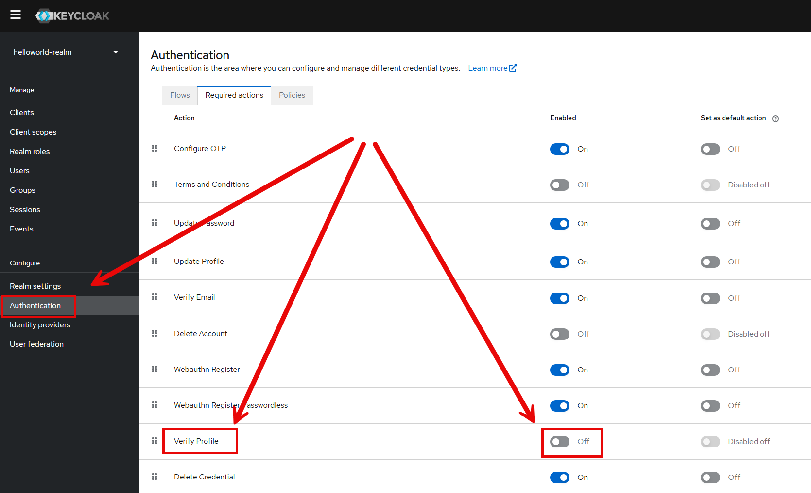