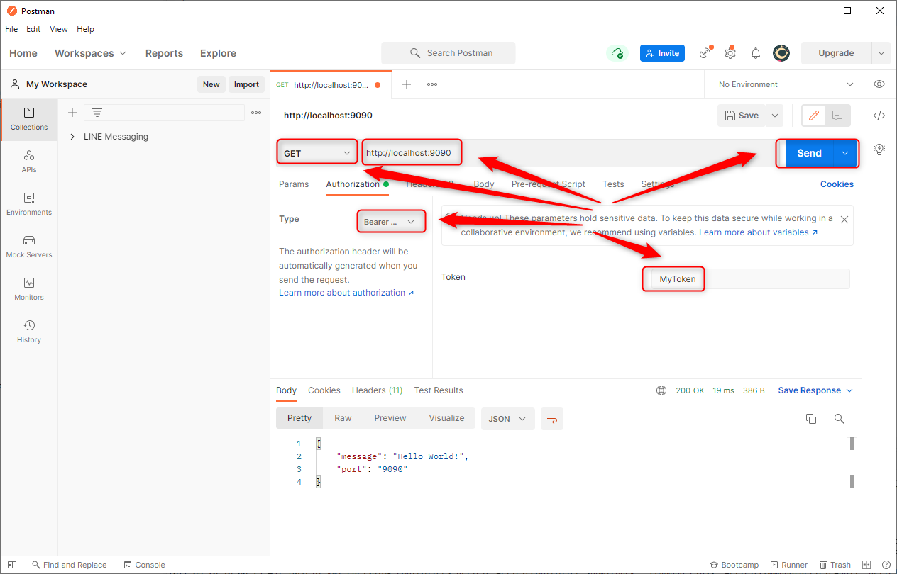
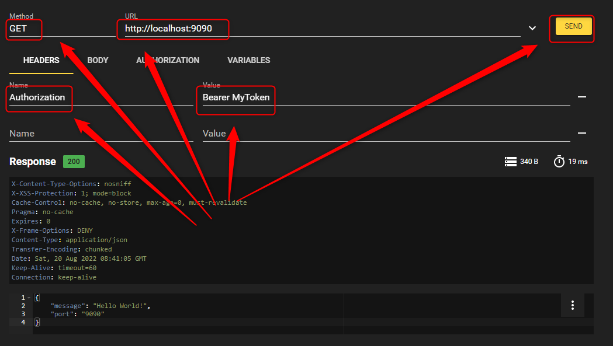

DESCRIPTION
-----------

##### Goal
The goal of this project is to present how to implement **Client Authentication** between two applications connected by **API (Web Client)** using **API Key Bearer** authentication. The result is **Hello World** message and **port** numbers of **Client** and **Server** services in a **JSON** format in a **browser** using **Java** applications with **Spring Boot** framework.

##### Details
This project consists of two applications:
* **Client**: this application is called **Display**. It displays text message and ports of Client and Server
* **Server**: this application is called **Text**. It provides text message to Client

Server application requires Client Authentication. In other words Server wants to be sure that communicates with trusted Client. That's why Client has to identify itself by API Key type Bearer - provides in HTTP header:
* **Key**: Authorization
* **Value**: Bearer {Token}

##### Launch
To launch this application please make sure that the **Preconditions** are met and then follow instructions from **Usage** section.

##### Technologies
This application uses:
* **Spring Boot** framework: `https://docs.google.com/document/d/1mvrJT5clbkr9yTj-AQ7YOXcqr2eHSEw2J8n9BMZIZKY/edit?usp=sharing`
* **Security**: `https://docs.google.com/document/d/1nhPRbfD10KJOYsgI1HUwUz95ReiJPbXK85_zMyAptoY/edit?usp=sharing`

PRECONDITIONS
-------------

##### Preconditions - Tools
* Installed **Operating System** (tested on Windows 10)
* Installed **Java** (tested on version 1.8.0_291). Tool details: `https://docs.google.com/document/d/119VYxF8JIZIUSk7JjwEPNX1RVjHBGbXHBKuK_1ytJg4/edit?usp=sharing`
* Installed **Maven** (tested on version 3.8.5). Tool details: `https://docs.google.com/document/d/1cfIMcqkWlobUfVfTLQp7ixqEcOtoTR8X6OGo3cU4maw/edit?usp=sharing`
* Installed **Git** (tested on version 2.33.0.windows.2). Tool details: `https://docs.google.com/document/d/1Iyxy5DYfsrEZK5fxZJnYy5a1saARxd5LyMEscJKSHn0/edit?usp=sharing`

##### Preconditions - Actions
* **Download** source code and open any **Command Line** tool on **project's folder**. You can do it in following way:
    * Open any Command Line tool (for instance "Windonw PowerShell" on Windows OS) and go to folder where you want to download source code 
    * Clone Github repository with `git clone https://github.com/wisniewskikr/chrisblog-it.git`
    * Go to source code folder with `cd chrisblog-it\java-springboot-security-client-authentication\springboot-security-api-client-authentication-api-key-bearer`

USAGE
-----

Usage steps:
1. In the first Command Line tool start application with `mvn -f ./springboot-helloworld-browser-json-ports-text spring-boot:run`
2. In the second Command Line tool start application with `mvn -f ./springboot-helloworld-browser-json-ports-display spring-boot:run`
3. Visit `http://localhost:8080`
4. Clean up environment:
    * In the first Command Line with `ctrl + C`
    * In the second Command Line with `ctrl + C`
    
    
USAGE POSTMAN
-------------

Usage steps:
1. In the Command Line tool start application with `mvn -f ./springboot-helloworld-browser-json-ports-text spring-boot:run`
1. Use Postman GET method (Bearer Token: "MyToken") with `http://localhost:9090`

1. Clean up environment:
    * In the Command Line with `ctrl + C`

USAGE RESTER
------------

Usage steps:
1. In the Command Line tool start application with `mvn -f ./springboot-helloworld-browser-json-ports-text spring-boot:run`
1. Use Postman GET method (Header: "Authorization / Bearer MyToken") with `http://localhost:9090`

1. Clean up environment:
    * In the Command Line with `ctrl + C`
    