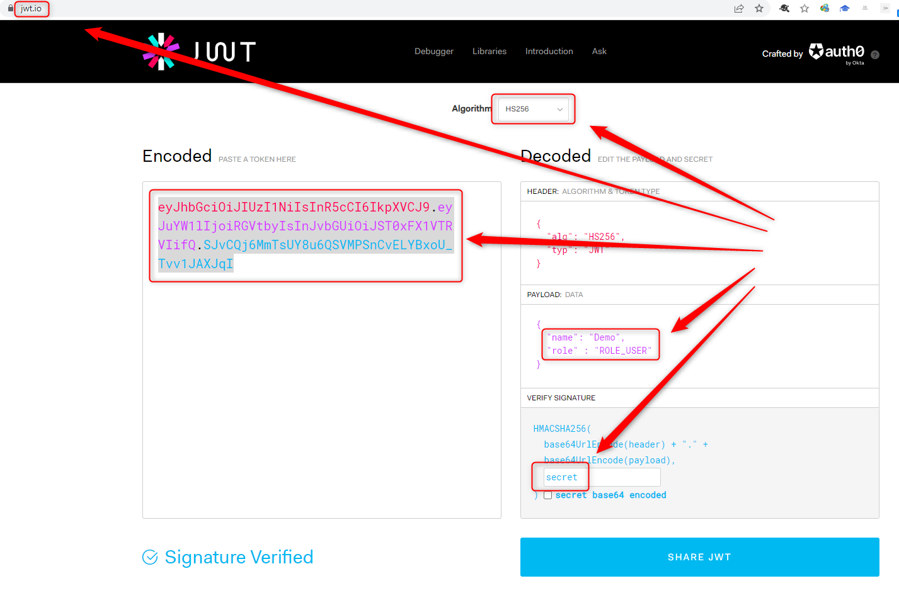
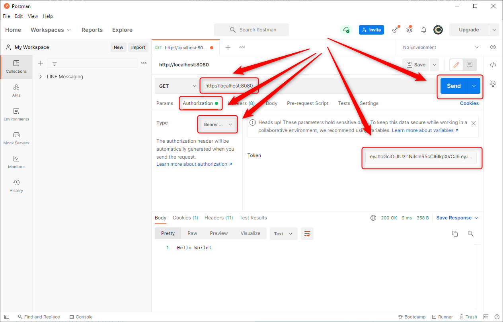

DESCRIPTION
-----------

##### Goal
The goal of this project is to present how to implement **OAuth2 authorization** with **JSON Web Token JWT** using **Java** application with **Spring Boot** framework. This OAuth2 authorization is implemented with usage **Spring Security**. The token for authorization is provided from **outside** project - for instance from external application.

##### Flow
The following flow takes place in this project:
1. User uses any browser for connecting with any Internet application which is able to generate JWT token
1. User uses Client API (for instance Postman) for sending GET request for secured content. Token from previous step should be included in this request
1. Server checks if sent token is valid. If everything is ok secured content is sent back
1. Client API displays secured content to the user 

##### Launch
To launch this application please make sure that the **Preconditions** are met and then follow instructions from **Usage** section.

##### Technologies
This project uses following technologies:
* **Spring Boot** framework: `https://docs.google.com/document/d/1mvrJT5clbkr9yTj-AQ7YOXcqr2eHSEw2J8n9BMZIZKY/edit?usp=sharing`
* **Security**: `https://docs.google.com/document/d/1nhPRbfD10KJOYsgI1HUwUz95ReiJPbXK85_zMyAptoY/edit?usp=sharing`

PRECONDITIONS
-------------

##### Preconditions - Tools
* Installed **Operating System** (tested on Windows 10)
* Installed **Java** (tested on version 1.8.0_291). Tool details: `https://docs.google.com/document/d/119VYxF8JIZIUSk7JjwEPNX1RVjHBGbXHBKuK_1ytJg4/edit?usp=sharing`
* Installed **Maven** (tested on version 3.8.5). Tool details: `https://docs.google.com/document/d/1cfIMcqkWlobUfVfTLQp7ixqEcOtoTR8X6OGo3cU4maw/edit?usp=sharing`
* Installed **Git** (tested on version 2.33.0.windows.2). Tool details: `https://docs.google.com/document/d/1Iyxy5DYfsrEZK5fxZJnYy5a1saARxd5LyMEscJKSHn0/edit?usp=sharing`
* Installed **Postman** (tested on version 8.11.1)

##### Preconditions - Actions
* **Download** source code using Git 
* * Open any **Command Line** (for instance "Windonw PowerShell" on Windows OS) tool on **project's folder** (exact localization of project you can check in GIT repositories on page `https://github.com/`)

USAGE
-----

Usage steps:
1. Start application with `mvn spring-boot:run`
1. Generate token (**Algorithm**: HS256, **Payload**: "name":"Demo", "role":"ROLE_USER", **Signature**: "secret") with `https://jwt.io`
1. Send GET request with Postman (**Bearer Authorization** with **JWT Token** from previous step) to URL `http://localhost:8080`
1. Clean up environment with `ctrl + C`

