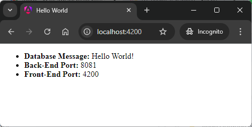

EXAMPLE
-------

USAGE MANUAL DEV
----------------

> **Usage Manual** means that Back-End and Front-End services are started **manually** from a command line. Database is provided as **Docker container**. Front-End application is run on **Develop** environment - package is not build and internal server is used as provider.

> Please **clone/download** project, open **project's main folder** in your favorite **command line tool** and then **proceed with steps below**. 

> Please be aware that following tools should be installed on your local PC:  
* **Operating System** (tested on Windows 11)
* **Java** (tested on version 17.0.5)
* **Maven** (tested on version 3.8.5)
* **Git** (tested on version 2.33.0.windows.2)
* **Docker** (tested on version 4.33.1 - it has to be up and running)
* **node.js** (tested on version 20.11.0)
* **angular CLI**  (tested on version 17.1.1)

##### Required steps:
1. In the first command line tool **start Docker MySql container** with `docker run -d --name mysql-container -e MYSQL_ROOT_PASSWORD=my_secret_password -e MYSQL_DATABASE=database -e MYSQL_USER=admin -e MYSQL_PASSWORD=admin123 -p 3306:3306 mysql:5.7`
1. In the second command line tool **start Back-End application** with `mvn -f ./fe-angular-be-springboot-db-sql-mysql_BE spring-boot:run`
1. In the third command line tool **start Front-End application** with `cd .\fe-angular-be-springboot-db-sql-mysql_FE\ | npm install | ng serve`
1. In a http browser (e.g. Chrome) visit `http://localhost:4200`
   * Expected HTML page with **Database Message**, **Back-End Id**, **Back-End Port**, **Front-End Id** and **Front-End Port** 
1. Clean up environment 
     * In the third command line tool **stop Front-End application** with `ctrl + C`
     * In the second command line tool **stop Back-End application** with `ctrl + C`
     * In the first command line tool **stop and remove Docker MySql container** with `docker rm -f mysql-container`
     * In the first command line tool **remove Docker MySql image** with `docker rmi mysql:5.7`

##### Optional steps:
1. In a browser check Back-End application healthcheck with `http://localhost:8081/actuator/health`
1. In a browser check Back-End application API result with `http://localhost:8081/message/1`
1. In a command line tool check list of Docker images with `docker images`
1. In a command line tool check list of all Docker containers with `docker ps -a`
1. In a command line tool check list of active Docker containers with `docker ps`

USAGE MANUAL PRD
----------------

> **Usage Manual** means that Back-End and Front-End services are started **manually** from a command line. Database is provided as **Docker container**. Front-End application is run on **Production** environment - package is build and external server is used as provider.

> Please **clone/download** project, open **project's main folder** in your favorite **command line tool** and then **proceed with steps below**. 

> Please be aware that following tools should be installed on your local PC:  
* **Operating System** (tested on Windows 11)
* **Java** (tested on version 17.0.5)
* **Maven** (tested on version 3.8.5)
* **Git** (tested on version 2.33.0.windows.2)
* **Docker** (tested on version 4.33.1 - it has to be up and running)
* **node.js** (tested on version 20.11.0)
* **angular CLI**  (tested on version 17.1.1)

##### Required steps:
1. In the first command line tool **start Docker MySql container** with `docker run -d --name mysql-container -e MYSQL_ROOT_PASSWORD=my_secret_password -e MYSQL_DATABASE=database -e MYSQL_USER=admin -e MYSQL_PASSWORD=admin123 -p 3306:3306 mysql:5.7`
1. In the second command line tool **start Back-End application** with `mvn -f ./fe-angular-be-springboot-db-sql-mysql_BE spring-boot:run`
1. In the third command line tool **start Front-End application** with `cd .\fe-angular-be-springboot-db-sql-mysql_FE\ | ng build --configuration=production | node server.js`
1. In a http browser (e.g. Chrome) visit `http://localhost:4200`
   * Expected HTML page with **Database Message**, **Back-End Id**, **Back-End Port**, **Front-End Id** and **Front-End Port** 
1. Clean up environment 
     * In the third command line tool **stop Front-End application** with `ctrl + C`
     * In the second command line tool **stop Back-End application** with `ctrl + C`
     * In the first command line tool **stop and remove Docker MySql container** with `docker rm -f mysql-container`
     * In the first command line tool **remove Docker MySql image** with `docker rmi mysql:5.7`

##### Optional steps:
1. In a browser check Back-End application healthcheck with `http://localhost:8081/actuator/health`
1. In a browser check Back-End application API result with `http://localhost:8081/message/1`
1. In a command line tool check list of Docker images with `docker images`
1. In a command line tool check list of all Docker containers with `docker ps -a`
1. In a command line tool check list of active Docker containers with `docker ps`

USAGE DOCKER
------------

> **Usage Docker** means that Back-End, Front-End services and Database are provided as **Docker containers**. 

> Please **clone/download** project, open **project's main folder** in your favorite **command line tool** and then **proceed with steps below**.

> Please be aware that following tools should be installed on your local PC:  
* **Operating System** (tested on Windows 11)
* **Git** (tested on version 2.33.0.windows.2)
* **Docker** (texted on version 4.33.1 - it has to be up and running)

##### Required steps:
1. In a command line tool create **Docker Network** with `docker network create helloworld-network`
1. In a command line tool build and start **Docker container MySql** database with `docker run -d --name mysql-container -e MYSQL_ROOT_PASSWORD=my_secret_password -e MYSQL_DATABASE=database -e MYSQL_USER=admin -e MYSQL_PASSWORD=admin123 -p 3306:3306 --network helloworld-network mysql:5.7`
1. In a command line tool build **Docker image BE** with `docker build -f fe-angular-be-springboot-db-sql-mysql_BE/Dockerfile -t be-image:0.0.1 ./fe-angular-be-springboot-db-sql-mysql_BE`
1. In a command line tool build and start **Docker container BE** with `docker run -p 8081:8081 --name be-container --network helloworld-network -e spring.datasource.url=jdbc:mysql://mysql-container:3306/database -d be-image:0.0.1`
1. In a command line tool build **Docker image FE** with `docker build -f fe-angular-be-springboot-db-sql-mysql_FE/Dockerfile-docker -t fe-image:0.0.1 ./fe-angular-be-springboot-db-sql-mysql_FE`
1. In a command line tool build and start **Docker container FE** with `docker run -p 4200:80 --name fe-container --network helloworld-network -d fe-image:0.0.1`
1. In a browser visit `http://localhost:4200`
   * Expected HTML page with **Database Message**, **Back-End Id**, **Back-End Port**, **Front-End Id** and **Front-End Port** 
1. Clean up environment 
     * In a command line tool stop and remove **BE Docker container** with `docker rm -f fe-container`
     * In a command line tool remove **BE Docker image** with `docker rmi fe-image:0.0.1`
     * In a command line tool stop and remove **FE Docker container** with `docker rm -f be-container`
     * In a command line tool remove **FE Docker image** with `docker rmi be-image:0.0.1`
     * In a command line tool stop and remove **Database Docker container** with `docker rm -f mysql-container`
     * In a command line tool remove **Database Docker image** with `docker rmi mysql:5.7`
     * In a command line tool remove **Docker Nerwork** with `docker network rm helloworld-network`

##### Optional steps:
1. In a browser check Back-End application healthcheck with `http://localhost:8081/actuator/health`
1. In a browser check Back-End application API result with `http://localhost:8081/message/1`
1. In a command line tool check list of Docker images with `docker images`
1. In a command line tool check list of all Docker containers with `docker ps -a`
1. In a command line tool check list of active Docker containers with `docker ps`
1. In a command line tool check list of Docker nerworks with `docker network ls`
1. In a command line tool check BE container logs with `docker logs be-container`
1. In a command line tool check FE container logs with `docker logs fe-container`

USAGE DOCKER COMPOSE
--------------------

> **Usage Docker Compse** means that Back-End, Front-End services and Database are provided as **Docker containers** definied in **Docker Compose** file. 

> Please **clone/download** project, open **project's main folder** in your favorite **command line tool** and then **proceed with steps below**.

> Please be aware that following tools should be installed on your local PC:  
* **Operating System** (tested on Windows 11)
* **Git** (tested on version 2.33.0.windows.2)
* **Docker** (texted on version 4.33.1 - it has to be up and running)

##### Required steps:
1. In a command line tool **start Docker containers** with `docker-compose up -d --build`
1. In a browser visit `http://localhost:4200`
   * Expected HTML page with **Database Message**, **Back-End Id**, **Back-End Port**, **Front-End Id** and **Front-End Port** 
1. Clean up environment 
     * In a command line tool **remove Docker containers** with `docker-compose down --rmi all`

##### Optional steps:
1. In a browser check Back-End application healthcheck with `http://localhost:8081/actuator/health`
1. In a browser check Back-End application API result with `http://localhost:8081/message/1`
1. In a command line tool validate Docker Compose with `docker-compose config`
1. In a command line tool check list of Docker images with `docker images`
1. In a command line tool check list of all Docker containers with `docker ps -a`
1. In a command line tool check list of active Docker containers with `docker ps`
1. In a command line tool check list of Docker nerworks with `docker network ls`
1. In a command line tool check BE container logs with `docker logs be-container`
1. In a command line tool check FE container logs with `docker logs fe-container`

USAGE KUBERNETES (MINIKUBE)
---------------------------

> **Usage Kubernetes** means that Back-End, Front-End services and Database are provided as **Docker containers** managed by **Kubernetes** type **Minikube**. 

> Please **clone/download** project, open **project's main folder** in your favorite **command line tool** and then **proceed with steps below**.

> Please be aware that following tools should be installed on your local PC:  
* **Operating System** (tested on Windows 11)
* **Git** (tested on version 2.33.0.windows.2)
* **Minikube** (texted on version 1.33.1)

##### Required steps:
1. In the first command line tool **with administrator privileges** start **Minikube** with `minikube start`
1. In the second command line tool **start Kubernetes Pods** with `kubectl apply -f kubernetes.yaml`
1. In the second command line tool **check status of Kubernetes Pods** with `kubectl get pods`
   * Expected mysql, be and fe as **READY 1/1** (it can take few minutes)
1. In the first command line tool **with administrator privileges** display FE service in a Browser with `minikube service fe`
   * Expected HTML page with **Database Message**, **Back-End Id**, **Back-End Port**, **Front-End Id** and **Front-End Port**
1. Clean up environment 
     * In the second command line tool **remove Kubernetes Pods** with `kubectl delete -f kubernetes.yaml`
     * In the first command line tool **with administrator privileges** stop **Minikube** with `minikube stop`

##### Optional steps:
1. In a command line tool build Docker BE image with `docker build -f fe-angular-be-springboot-db-sql-mysql_BE/Dockerfile -t wisniewskikr/fe-angular-be-springboot-db-sql-mysql_be:0.0.1 ./fe-angular-be-springboot-db-sql-mysql_BE`
1. In a command line tool push Docker BE image to Docker Repository with `docker push wisniewskikr/fe-angular-be-springboot-db-sql-mysql_be:0.0.1` 
1. In a command line tool build Docker FE image with `docker build -f fe-angular-be-springboot-db-sql-mysql_FE/Dockerfile-kubernetes -t wisniewskikr/fe-angular-be-springboot-db-sql-mysql_fe:0.0.1 ./fe-angular-be-springboot-db-sql-mysql_FE`
1. In a command line tool push Docker FE image to Docker Repository with `docker push wisniewskikr/fe-angular-be-springboot-db-sql-mysql_fe:0.0.1` 
1. In the first command line tool with administrator privileges check status of Minikube with `minikube status`
1. In the first command line tool with administrator privileges check Docker images in Minikube with `minikube ssh docker images`
1. In the first command line tool with administrator privileges check Docker containers in Minikube with `minikube ssh docker ps`
1. In a command line tool check Kubernetes Deployments with `kubectl get deployments`
1. In a command line tool check Kubernetes Deployments details with **kubectl describe deployment {deployment-name}**
1. In a command line tool check Kubernetes Services with `kubectl get services`
1. In a command line tool check Kubernetes Services details with **kubectl describe service {service-name}**
1. In a command line tool check Kubernetes Pods with `kubectl get pods`
1. In a command line tool check Kubernetes Pods details with **kubectl describe pod {pod-name}**
1. In a command line tool check Kubernetes Pods logs with **kubectl log {pod-name}**

DESCRIPTION
-----------

##### Goal
The goal of this project is to present how to create **chain of services** which communicate each other and provide single ouput on HTML page. This chain of services consists of following elements:
* **Database**: type SQL - **MySql**
* **Back-End**: an application created in **Java** programming language with usage **Spring Boot** framework
* **Front-End**: an application created in **Java** programming language with usage **Spring Boot** framework. **Thymeleaf** engine is used to display data

##### Terminology
Terminology explanation:
* **Java**: object-oriented programming language
* **Spring Boot**: framework for Java. It consists of: Spring + Container + Configuration
* **Maven**: tool for build automation
* **Git**: tool for distributed version control
* **TypeScirpt**: TypeScript is a statically typed superset of JavaScript that adds optional type annotations, allowing for improved code quality, error checking, and editor support. It compiles to plain JavaScript, making it compatible with any environment that runs JavaScript.
* **Angular**: Angular is a popular open-source web application framework developed and maintained by Google. It is used for building dynamic, single-page applications (SPAs) with a focus on performance and modularity. Angular provides tools for two-way data binding, dependency injection, and component-based architecture, enabling developers to create scalable and maintainable web applications.
* **Database**: A database is an organized collection of data that is stored and managed electronically, allowing for efficient retrieval, manipulation, and updating of information. It is typically managed by a database management system (DBMS).
* **MySql**: MySQL is an open-source relational database management system (RDBMS) that uses Structured Query Language (SQL) for managing and organizing data. It's widely used for web applications and is known for its speed, reliability, and ease of use.
* **Back-End**: The back-end refers to the server-side part of a software application, responsible for managing the database, server logic, and application programming interface (API). It processes requests from the front-end (user interface), handles data storage, retrieval, and business logic, and sends the appropriate responses back to the front-end.
* **Front-End**: Front-end refers to the part of a website or application that users interact with directly. It includes the visual elements, layout, and design, typically built using HTML, CSS, and JavaScript. The front-end is responsible for the user experience (UX) and interface (UI) that allows users to navigate and interact with the system.

##### Launch
To launch this application please make sure that the **Preconditions** are met and then follow instructions from **Usage** section.