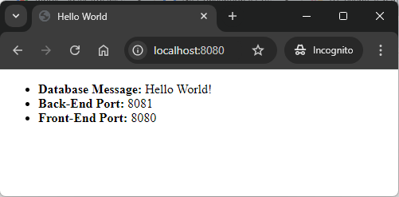

EXAMPLE
-------

USAGE CLASSIC
-------------

> **Usage Classic** means that Back-End and Front-End servers are started manually by developer from a command line. Database is provided as Docker container.

> Please be aware that following tools should be installed on your local PC: **Java**, **Maven** **Git** and **Docker**. Docker has to be **up and running**. 

> Please **clone/download** project, open **project's main folder** in your favorite **command line tool** and then **proceed with steps below**. 

Required steps:
1. In the first command line tool start MySql database with `docker run -d --name mysql-container -e MYSQL_ROOT_PASSWORD=my_secret_password -e MYSQL_DATABASE=database -e MYSQL_USER=admin -e MYSQL_PASSWORD=admin123 -p 3306:3306 mysql:5.7`
1. In the second command line tool start Back-End application with `mvn -f ./fe-thymeleaf-be-springboot-db-sql-mysql_BE spring-boot:run`
1. In the third command line tool start Front-End application with `mvn -f ./fe-thymeleaf-be-springboot-db-sql-mysql_FE spring-boot:run`
1. In a browser visit `http://localhost:8080`
   * Expected HTML page with **Message from Database**, **Id of Back-End**, **Port of Back-End**, **Id of Front-End** and **Port of Front-End** 
1. Clean up environment 
     * In the third command line tool stop Front-End application with `ctrl + C`
     * In the second command line tool stop Back-End application with `ctrl + C`
     * In the first command line tool stop and remove Docker container with `docker rm -f mysql-container`
     * In the first command line tool remove Docker image with `docker rmi mysql:5.7`

Optional steps:
1. In a browser check Back-End application with `http://localhost:8081/message/1`
1. In a command line tool check list of Docker images with `docker images`
1. In a command line tool check list of all Docker containers with `docker ps -a`
1. In a command line tool check list of active Docker containers with `docker ps`

DESCRIPTION
-----------

##### Goal
The goal of this project is to present how to create **chain of services** which communicate each other and provide single ouput on HTML page. This chain of services consists of following elements:
* **Database**: type SQL - **MySql**
* **Back-End**: an application created in **Java** programming language with usage **Spring Boot** framework
* **Front-End**: an application created in **Java** programming language with usage **Spring Boot** framework. **Thymeleaf** engine is used to display data

##### Terminology
Terminology explanation:
* **Java**: object-oriented programming language
* **Spring Boot**: framework for Java. It consists of: Spring + Container + Configuration
* **Maven**: tool for build automation
* **Git**: tool for distributed version control
* **Database**: A database is an organized collection of data that is stored and managed electronically, allowing for efficient retrieval, manipulation, and updating of information. It is typically managed by a database management system (DBMS).
* **MySql**: MySQL is an open-source relational database management system (RDBMS) that uses Structured Query Language (SQL) for managing and organizing data. It's widely used for web applications and is known for its speed, reliability, and ease of use.
* **Back-End**: The back-end refers to the server-side part of a software application, responsible for managing the database, server logic, and application programming interface (API). It processes requests from the front-end (user interface), handles data storage, retrieval, and business logic, and sends the appropriate responses back to the front-end.
* **Front-End**: Front-end refers to the part of a website or application that users interact with directly. It includes the visual elements, layout, and design, typically built using HTML, CSS, and JavaScript. The front-end is responsible for the user experience (UX) and interface (UI) that allows users to navigate and interact with the system.

##### Launch
To launch this application please make sure that the **Preconditions** are met and then follow instructions from **Usage** section.

PRECONDITIONS
-------------

##### Preconditions - Tools
* Installed **Operating System** (tested on Windows 11)
* Installed **Java** (tested on version 17.0.5)
* Installed **Maven** (tested on version 3.8.5)
* Installed **Git** (tested on version 2.33.0.windows.2)
* Installed **Docker** (texted on version 4.33.1)

##### Preconditions - Actions
* Start **Docker**
* Download **Source Code** (using Git or in any other way) 
* Open any **Command Line** tool (for instance "Windonw PowerShell" on Windows OS) on downloaded **project's main folder**