EXAMPLE
-------

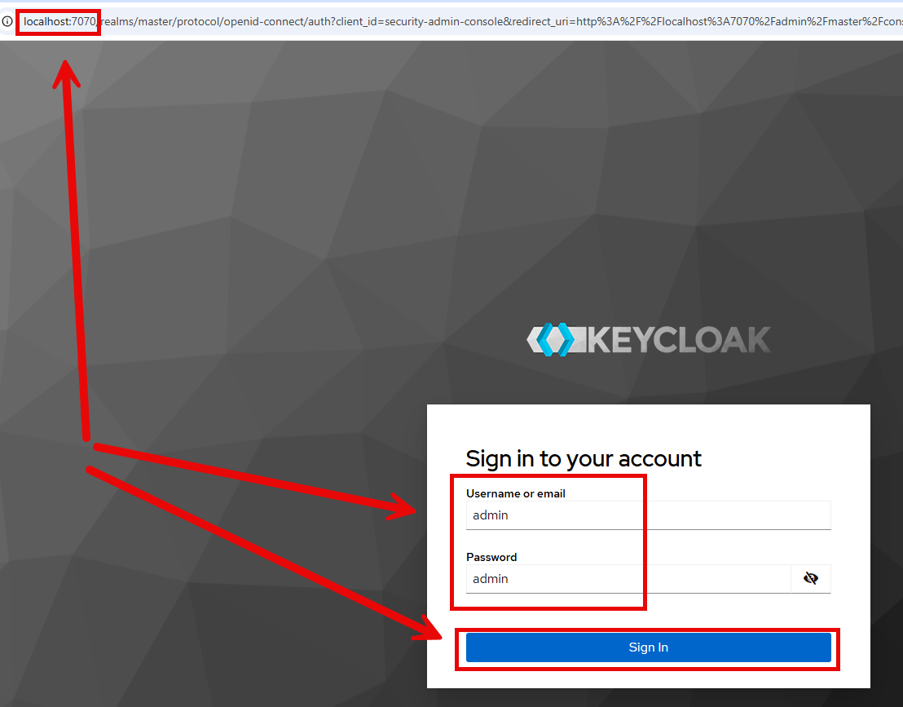

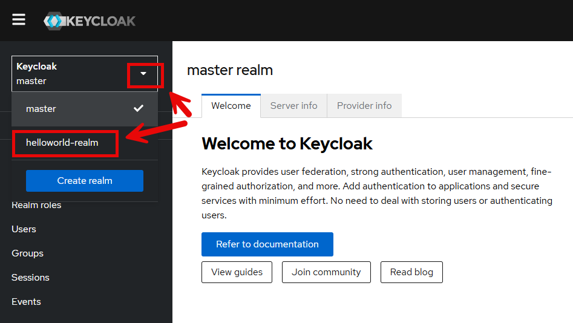

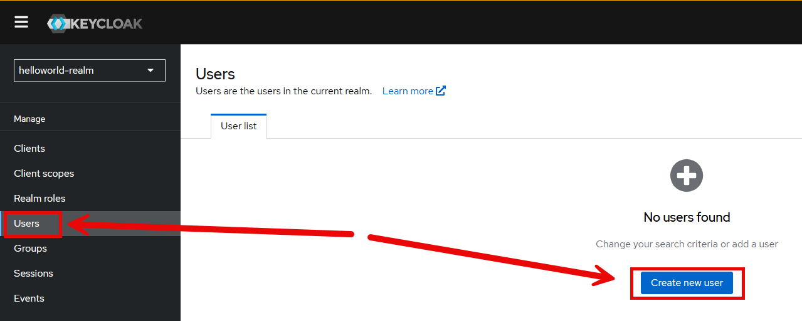

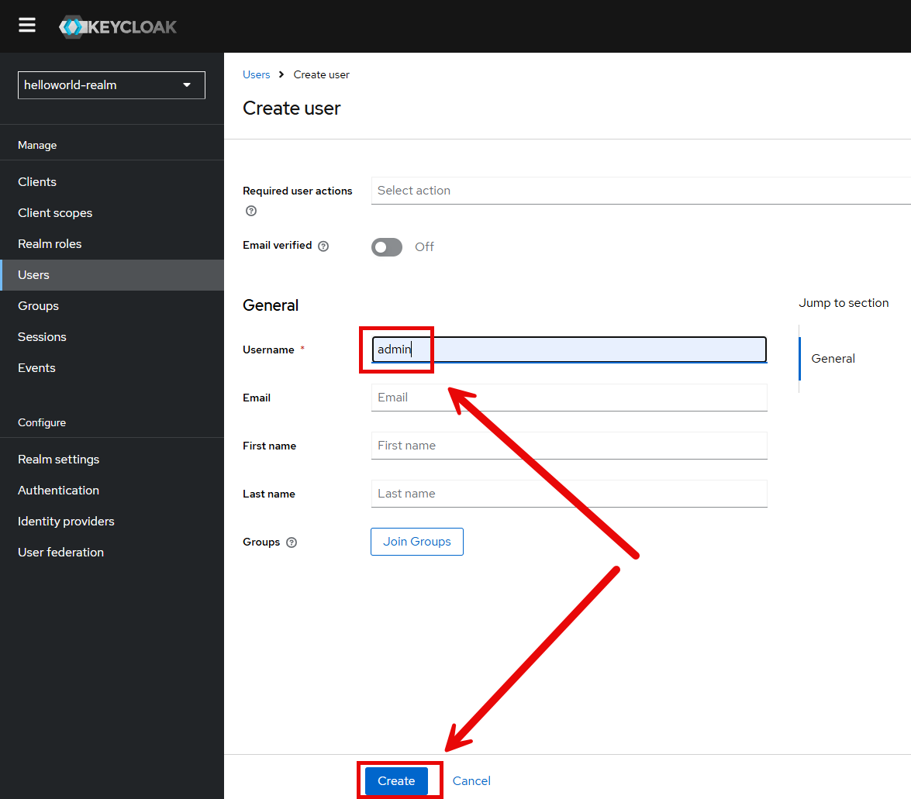

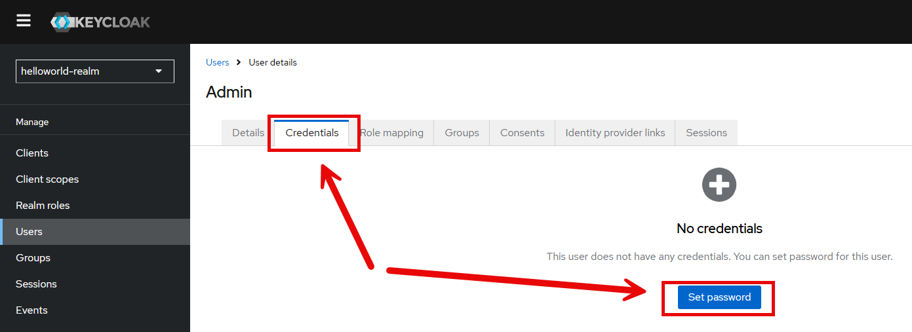

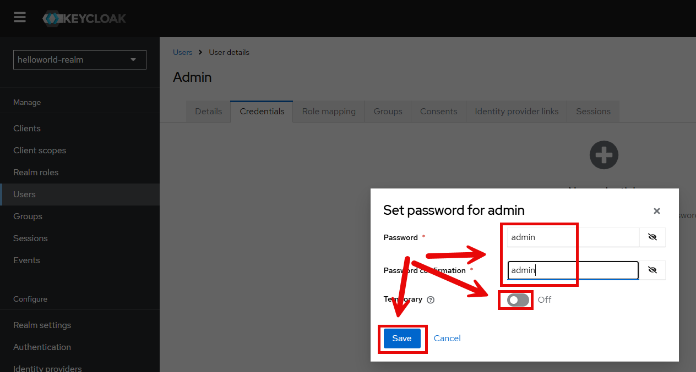

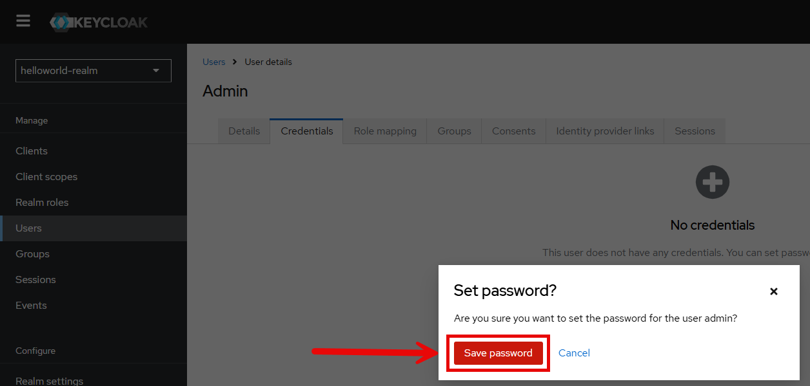

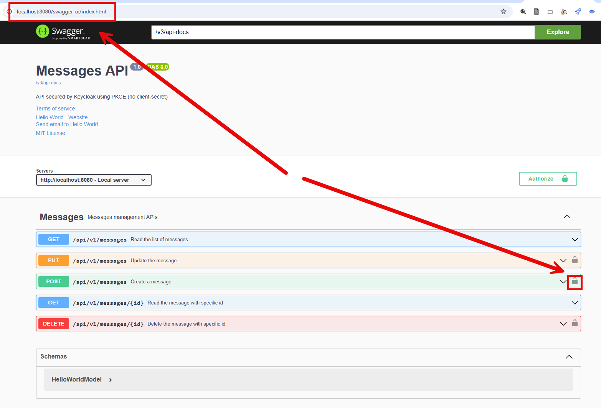

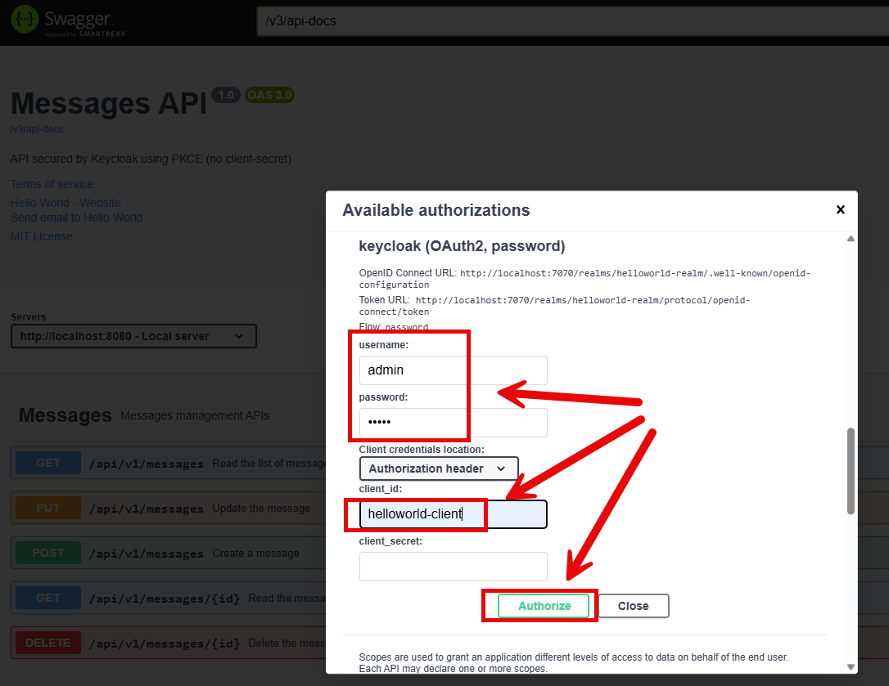

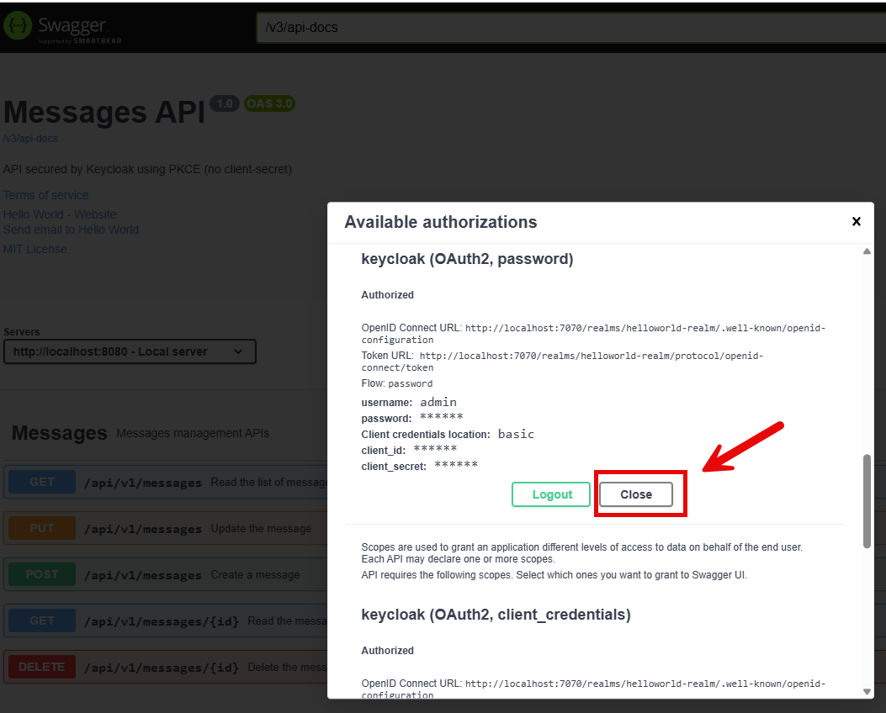

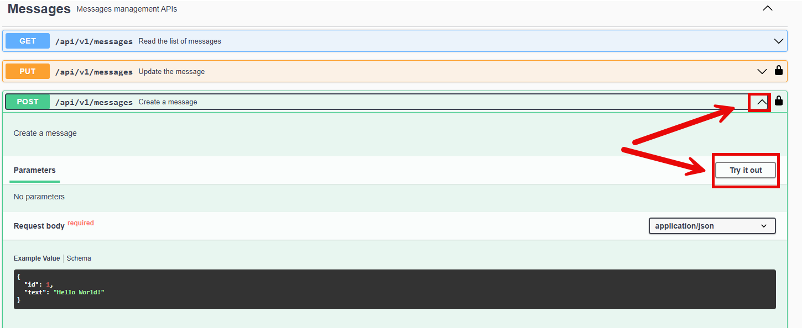

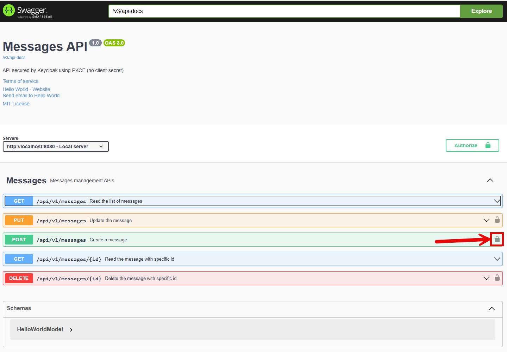

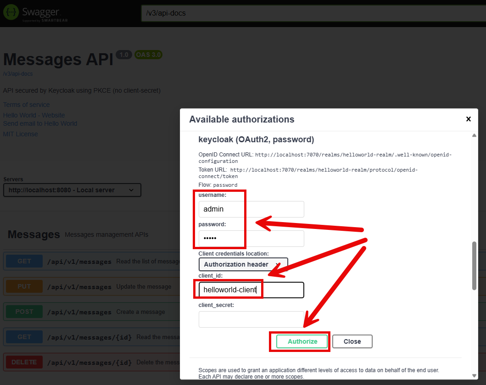

DESCRIPTION
-----------

##### Goal
The goal of this project is to present how to implement **Swagger 3** and **Keycloak** in application
with usage **Java** programming language and **Spring Boot 3** framework.

Swagger 3 enables run REST calls from any Internet Browser. It also providers documentation of all endpoints of
application. In this example some of these endpoints are secured by Keycloak.

##### Terminology
Terminology explanation:
* **Git**: Git is a distributed version control system (VCS) that tracks changes in code, allowing multiple developers to collaborate efficiently. It helps manage different versions of a project, enabling branching, merging, and rollback to previous states.
* **Maven**: Maven is a build automation and project management tool for Java-based projects, used primarily for dependency management and project configuration.
* **Java**: Java is a high-level, object-oriented programming language known for its platform independence, achieved through the Java Virtual Machine (JVM). It is widely used for web, mobile, and enterprise applications. Java follows the "write once, run anywhere" (WORA) principle, making it a popular choice for cross-platform development.
* **Spring Boot**: Spring Boot is a Java-based framework that simplifies the development of stand-alone, production-ready Spring applications by providing auto-configuration, embedded servers, and a convention-over-configuration approach.
* **Swagger 3**: Swagger 3 (also known as OpenAPI Specification 3) is a standard, language-agnostic framework for describing, documenting, and designing RESTful APIs in a machine-readable format.
* **Keycloak**: Keycloak is an open-source identity and access management solution that provides single sign-on (SSO), authentication, and authorization for applications and services.

USAGES
------

This project can be tested in following configurations:
* **Usage Manual**: infrastructure services are started as Docker containers. Services are started manually.
* **Usage Docker Compose**: all services are started as Docker containers defined in docker compose file.
* **Usage Kubernetes (Kind)**: all services are started as Kubernetes pods.

USAGE MANUAL
------------

> **Usage Manual** means that infrastructure services are started as Docker containers. Services are started manually.

> Please **clone/download** project, open **project's main folder** in your favorite **command line tool** and then **proceed with steps below**.

> **Prerequisites**:
* **Operating System** (tested on Windows 11)
* **Git** (tested on version 2.33.0.windows.2)
* **Docker** (tested on version 4.33.1)

##### Required steps:
1. Start **Docker** tool
1. In the first command line tool **start Keycloak container** with `docker-compose -f docker-compose-infrastructure.yaml up -d --build`
1. In the second command line tool **start First service** with `mvn spring-boot:run`
1. In any Internet Browser (e.g. Chrome) create new user **admin** with password **admin** with `http://locaholst:7070`
1. In any Internet Browser (e.g. Chrome) visit **Swagger 3** of application with `http://localhost:8080/swagger-ui/index.html`
   * Create new message with **POST** method (log in to **Keycloak** with credentials "admin/admin" and client id "helloworld-client") and endpoint `api/v1/messages`
1. Clean up environment
   * In the second command line tool **stop First service** with `ctrl + c`
   * In the first command line tool **remove Docker containers** with `docker-compose -f docker-compose-infrastructure.yaml down --rmi all`
   * Stop **Docker** tool

##### Optional steps:
1. In a command line tool validate Docker Compose with `docker-compose config`
1. In a command line tool check list of Docker images with `docker images`
1. In a command line tool check list of all Docker containers with `docker ps -a`
1. In a command line tool check list of active Docker containers with `docker ps`
1. In a command line tool check list of Docker nerworks with `docker network ls`
1. In a command line tool check container logs with `docker logs {container-name}`

USAGE DOCKER COMPOSE
--------------------

> **Usage Docker Compose** means all services are started as Docker containers defined in docker compose file.

> Please **clone/download** project, open **project's main folder** in your favorite **command line tool** and then **proceed with steps below**.

> **Prerequisites**:
* **Operating System** (tested on Windows 11)
* **Git** (tested on version 2.33.0.windows.2)
* **Docker** (tested on version 4.33.1)

##### Required steps:
1. Update **hosts** file (Run as Administrator; Windows: "Windows\System32\drivers\etc\hosts"; MAC/Linux: "etc/hosts") with new line **127.0.0.1 keycloak**
1. Start **Docker** tool
1. In a command line tool **start Docker containers** with `docker-compose up -d --build`
1. In any Internet Browser (e.g. Chrome) create new user **admin** with password **admin** with `http://locaholst:7070`
1. In any Internet Browser (e.g. Chrome) visit **Swagger 3** of application with `http://localhost:8080/swagger-ui/index.html`
   * Create new message with **POST** method (log in to **Keycloak** with credentials "admin/admin" and client id "helloworld-client") and endpoint `api/v1/messages`
1. Clean up environment
   * In a command line tool **remove Docker containers** with `docker-compose down --rmi all`
   * Stop **Docker** tool
   * Remove new line from **hosts**

##### Optional steps:
1. In a command line tool validate Docker Compose with `docker-compose config`
1. In a command line tool check list of Docker images with `docker images`
1. In a command line tool check list of all Docker containers with `docker ps -a`
1. In a command line tool check list of active Docker containers with `docker ps`
1. In a command line tool check list of Docker nerworks with `docker network ls`
1. In a command line tool check container logs with `docker logs {container-name}`

USAGE KUBERNETES (KIND)
---------------------------

> **Usage Kubernetes** means that all services are started as Kubernetes pods.

> Please **clone/download** project, open **project's main folder** in your favorite **command line tool** and then **proceed with steps below**.

> **Prerequisites**:
* **Operating System** (tested on Windows 11)
* **Git** (tested on version 2.33.0.windows.2)
* **Kind** (tested on version 0.26.0)

##### Required steps:
1. Update **hosts** file (Run as Administrator; Windows: "Windows\System32\drivers\etc\hosts"; MAC/Linux: "etc/hosts") with new line **127.0.0.1 keycloak.default.svc.cluster.local**
1. Start **Docker** tool
1. In the first command line tool create and start cluster **Kind** with `kind create cluster --name helloworld`
1. In the second command line tool **start Kubernetes Pods** with `kubectl apply -f kubernetes.yaml`
1. In the second command line tool **check status of Kubernetes Pods** with `kubectl get pods`
   * Expected all pods as **READY 1/1** (it can take few minutes)
1. In the second command line tool **forward port of Keycloak service** with `kubectl port-forward service/keycloak 7070:7070`
1. In the third command line tool **forward port of First service** with `kubectl port-forward service/app 8080:8080`
1. In any Internet Browser (e.g. Chrome) create new user **admin** with password **admin** with `http://locaholst:7070`
1. In any Internet Browser (e.g. Chrome) visit **Swagger 3** of application with `http://localhost:8080/swagger-ui/index.html`
   * Create new message with **POST** method (log in to **Keycloak** with credentials "admin/admin" and client id "helloworld-client") and endpoint `api/v1/messages`
1. Clean up environment
   * In the third command line tool **stop forwarding port of App service** with `ctrl + C`
   * In the second command line tool **stop forwarding port of Keycloak service** with `ctrl + C`
   * In the second command line tool **remove Kubernetes Pods** with `kubectl delete -f kubernetes.yaml`
   * In the first command line tool delete cluster **Kind** with `kind delete cluster --name helloworld`
   * Stop **Docker** tool
   * Remove new line from **hosts**

##### Optional steps:
1. In a command line tool build Docker App image with `docker build -f java-springboot-api-rest-helloworld-swagger3-keycloak/Dockerfile -t wisniewskikr/java-springboot-api-rest-helloworld-swagger3-keycloak:0.0.1 ./java-springboot-api-rest-helloworld-swagger3-keycloak`
1. In a command line tool push Docker App image to Docker Repository with `docker push wisniewskikr/java-springboot-api-rest-helloworld-swagger3-keycloak:0.0.1`
1. In the first command line tool with administrator privileges check clusers with `kind get clusters`
1. In a command line tool check Kubernetes Deployments with `kubectl get deployments`
1. In a command line tool check Kubernetes Deployments details with **kubectl describe deployment {deployment-name}**
1. In a command line tool check Kubernetes Services with `kubectl get services`
1. In a command line tool check Kubernetes Services details with **kubectl describe service {service-name}**
1. In a command line tool check Kubernetes Pods with `kubectl get pods`
1. In a command line tool check Kubernetes Pods details with **kubectl describe pod {pod-name}**
1. In a command line tool check Kubernetes Pods logs with **kubectl logs {pod-name}**

KEYCLOAK CONFIGURATION
----------------------

