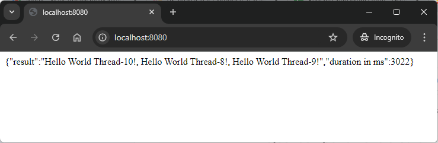

DESCRIPTION
-----------

##### Goal
The goal of this project is to present how to use class **CompletableFuture** with Spring Boot annotation **@EnableAsync** in **inner** method of FE application calling BE application in chain of applications (services). Back-End application **works 3 seconds per call**. Front-End application calls **3 times** Back-End application in one inner method. So with multithread expected result of method call is about **3 seconds**.

This chain of services consists of following applications:
* **Back-End**: an application created in **Java** programming language with usage **Spring Boot** framework
* **Front-End**: an application created in **Java** programming language with usage **Spring Boot** framework.

##### Terminology
Terminology explanation:
* **Git**: tool for distributed version control
* **Maven**: tool for build automation
* **Java**: object-oriented programming language
* **Spring Boot**: framework for Java. It consists of: Spring + Container + Configuration
* **Back-End**: The back-end refers to the server-side part of a software application, responsible for managing the database, server logic, and application programming interface (API). It processes requests from the front-end (user interface), handles data storage, retrieval, and business logic, and sends the appropriate responses back to the front-end.
* **Front-End**: Front-end refers to the part of a website or application that users interact with directly. It includes the visual elements, layout, and design, typically built using HTML, CSS, and JavaScript. The front-end is responsible for the user experience (UX) and interface (UI) that allows users to navigate and interact with the system.
* **CompletableFuture**: CompletableFuture is a class in Java that represents a future result of an asynchronous computation. It allows you to write non-blocking, asynchronous code that can be completed at a later time. You can chain multiple tasks, handle exceptions, and combine multiple futures together, making it a powerful tool for concurrency.
* **@EnableAsync**: In Java, @EnableAsync is an annotation used to enable Spring's asynchronous method execution capability. When applied, it allows methods annotated with @Async to run in a separate thread, enabling non-blocking, concurrent execution of tasks.

##### Implementation
Implementation details for Back-End:
* Pause flow for 3 seconds by **Thread.sleep(3000);**

Implementation details for Front-End:
* In Spring Boot start class annotation **@EnableAsync** was added
* Method with new thread was marked with annotation **@Async**
* Method with new thread returns class **CompletableFuture** as **CompletableFuture.completedFuture(null)**
* Methods **CompletableFuture.allOf(future1, future2, future3)** and **combinedFuture.join()** join and run all CompletableFutures

EXAMPLE
-------

USAGE MANUAL
------------

> **Usage Manual** means that Back-End and Front-End services are provided as **Java and Maven applications** and started **manually**.

> Please **clone/download** project, open **project's main folder** in your favorite **command line tool** and then **proceed with steps below**. 

> Please be aware that following tools should be installed on your local PC:  
* **Operating System** (tested on Windows 11)
* **Java** (tested on version 17.0.5)
* **Maven** (tested on version 3.8.5)
* **Git** (tested on version 2.33.0.windows.2)

##### Required steps:
1. In the first command line tool **start Back-End application** with `mvn -f ./springboot-threads-inner-completablefuture-enableasync_BE spring-boot:run`
1. In the second command line tool **start Front-End application** with `mvn -f ./springboot-threads-inner-completablefuture-enableasync_FE spring-boot:run`
1. In a browser visit `http://localhost:8080`
   * Expected HTML page with similar JSON: **{"result":"Hello World http-nio-8080-exec-1! | Hello World http-nio-8080-exec-1! | Hello World http-nio-8080-exec-1!","duration in ms":3164}**
1. Clean up environment:
     * In the second command line tool **stop Front-End application** with `ctrl + C`
     * In the first command line tool **stop Back-End application** with `ctrl + C`
     

##### Optional steps:
1. In a browser check Back-End application healthcheck with `http://localhost:8081/actuator/health`
1. In a browser check Back-End application API result with `http://localhost:8081/{name}`
1. In a browser check Front-End application healthcheck with `http://localhost:8080/actuator/health`
1. In a browser check Front-End application API result with `http://localhost:8080/`