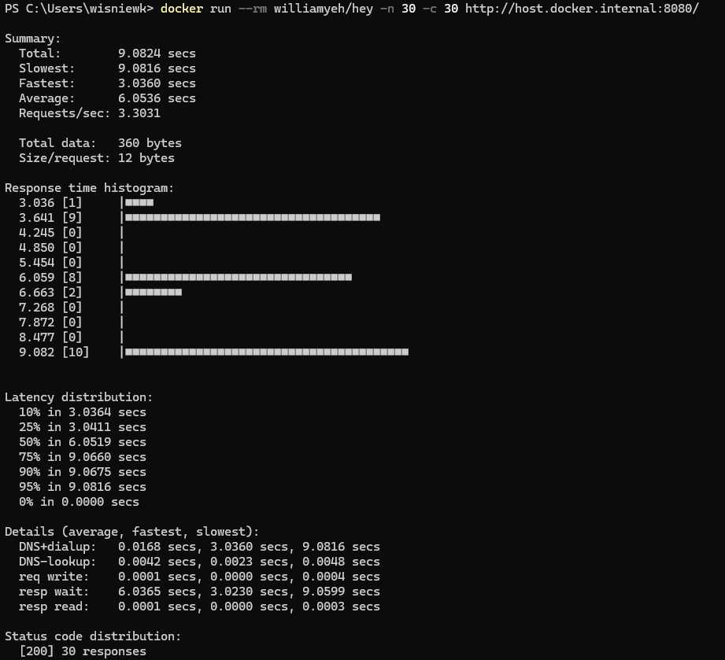

DESCRIPTION
-----------

##### Goal
The goal of this project is to present how to create **chain of applications (services)** which communicate each other and provide single ouput as an HTML page. This output consists of following elements:
* **Database Message**: the HTML displays the message stored in database. It's the simple text "Hello World!".
* **Back-End Port**: the HTML page displays the port of Back-End application.
* **Front-End Port**: the HTML page displays port of Front-End application.

This chain of services consists of following applications:
* **Database**: SQL database - in this case type **MySql**
* **Back-End**: an application created in **Java** programming language with usage **Spring Boot** framework
* **Front-End**: an application created in **Java** programming language with usage **Spring Boot** framework. **Thymeleaf** engine is used to display data

##### Terminology
Terminology explanation:
* **Git**: tool for distributed version control
* **Maven**: tool for build automation
* **Java**: object-oriented programming language
* **Spring Boot**: framework for Java. It consists of: Spring + Container + Configuration
* **Database**: A database is an organized collection of data that is stored and managed electronically, allowing for efficient retrieval, manipulation, and updating of information. It is typically managed by a database management system (DBMS).
* **MySql**: MySQL is an open-source relational database management system (RDBMS) that uses Structured Query Language (SQL) for managing and organizing data. It's widely used for web applications and is known for its speed, reliability, and ease of use.
* **Back-End**: The back-end refers to the server-side part of a software application, responsible for managing the database, server logic, and application programming interface (API). It processes requests from the front-end (user interface), handles data storage, retrieval, and business logic, and sends the appropriate responses back to the front-end.
* **Front-End**: Front-end refers to the part of a website or application that users interact with directly. It includes the visual elements, layout, and design, typically built using HTML, CSS, and JavaScript. The front-end is responsible for the user experience (UX) and interface (UI) that allows users to navigate and interact with the system.
* **Thymeleaf**: Thymeleaf is a modern server-side Java template engine for Java-based web applications. It processes HTML, XML, JavaScript, CSS, and plain text, integrating with the Spring framework. It allows dynamic content rendering on the server while ensuring templates are HTML-compliant. Thymeleaf's key features include natural templates (which work as valid HTML even before rendering), easy integration with Spring MVC, and powerful expressions for iterating, conditional display, and data binding. It's often used to create dynamic web pages that combine static HTML with server-side logic in a clean and intuitive way.

EXAMPLE
-------

USAGE MANUAL
------------

> **Usage Manual** means that Back-End and Front-End services are provided as **Java and Maven applications** and started **manually**. Database is provided as **Docker container**.

> Please **clone/download** project, open **project's main folder** in your favorite **command line tool** and then **proceed with steps below**. 

> Please be aware that following tools should be installed on your local PC:  
* **Operating System** (tested on Windows 11)
* **Java** (tested on version 17.0.5)
* **Maven** (tested on version 3.8.5)
* **Git** (tested on version 2.33.0.windows.2)
* **Docker** (texted on version 4.33.1 - it has to be up and running)

##### Required steps:
1. In the second command line tool **start Back-End application** with `mvn -f ./fe-springboot-be-springboot-threads-no_BE spring-boot:run`
1. In the third command line tool **start Front-End application** with `mvn -f ./fe-springboot-be-springboot-threads-no_FE spring-boot:run`
1. In a browser visit `http://localhost:8080`
   * Expected HTML page with **Database Message**, **Back-End Port** and **Front-End Port** 
1. Clean up environment 
     * In the third command line tool **stop Front-End application** with `ctrl + C`
     * In the second command line tool **stop Back-End application** with `ctrl + C`
     * In the first command line tool **stop and remove Docker MySql container** with `docker rm -f mysql-container`
     * In the first command line tool **remove Docker MySql image** with `docker rmi mysql:5.7`

##### Optional steps:
1. In a browser check Back-End application healthcheck with `http://localhost:8081/actuator/health`
1. In a browser check Back-End application API result with `http://localhost:8081/message/1`
1. In a browser check Front-End application healthcheck with `http://localhost:8080/actuator/health`
1. In a command line tool check list of Docker images with `docker images`
1. In a command line tool check list of all Docker containers with `docker ps -a`
1. In a command line tool check list of active Docker containers with `docker ps`