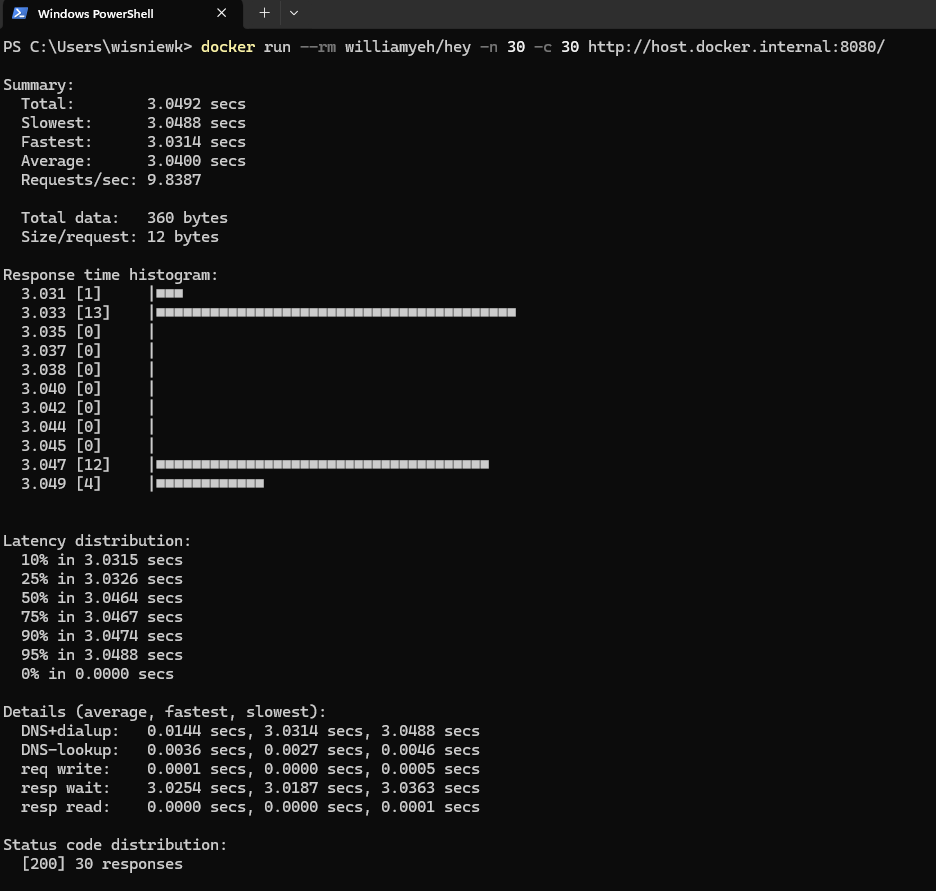

DESCRIPTION
-----------

##### Goal
The goal of this project is to present how to use **Java Virtual Threads** configured as **Spring property** for chain of applications (services). Tool Hey **simulates 30 threads** at the same time. Server Tomcat for Front-End application is **restricted to only 10 threads** but Front-End application uses Virtual Threads. Back-End application **works 3 seconds per call**. So **expected result of this example is 3 seconds** instead of 9 seconds for applications without Virtual Threads.

This chain of services consists of following applications:
* **Back-End**: an application created in **Java** programming language with usage **Spring Boot** framework
* **Front-End**: an application created in **Java** programming language with usage **Spring Boot** framework.

##### Terminology
Terminology explanation:
* **Git**: tool for distributed version control
* **Maven**: tool for build automation
* **Java**: object-oriented programming language
* **Spring Boot**: framework for Java. It consists of: Spring + Container + Configuration
* **Back-End**: The back-end refers to the server-side part of a software application, responsible for managing the database, server logic, and application programming interface (API). It processes requests from the front-end (user interface), handles data storage, retrieval, and business logic, and sends the appropriate responses back to the front-end.
* **Front-End**: Front-end refers to the part of a website or application that users interact with directly. It includes the visual elements, layout, and design, typically built using HTML, CSS, and JavaScript. The front-end is responsible for the user experience (UX) and interface (UI) that allows users to navigate and interact with the system.
* **Virtual Threads**: A Java Virtual Thread is a lightweight, user-mode thread introduced in Java as part of Project Loom. Unlike traditional platform (OS) threads, virtual threads are managed by the JVM and allow for the creation of millions of concurrent tasks with low overhead, improving scalability and simplifying the development of concurrent applications.

##### Implementation
Implementation details for Back-End:
* Pause flow for 3 seconds by **Thread.sleep(3000);**

Implementation details for Front-End:
* Limit Tomcat threads to 10 by adding property **server.tomcat.threads.max=10** (by default Tomcat uses from 10 to 200 threads)
* Turn on Virtual Threads by adding property **spring.threads.virtual.enabled=true**

EXAMPLE
-------

USAGE MANUAL
------------

> **Usage Manual** means that Back-End and Front-End services are provided as **Java and Maven applications** and started **manually**. Tool **Hey** is provided as **Docker Image**.

> Please **clone/download** project, open **project's main folder** in your favorite **command line tool** and then **proceed with steps below**. 

> Please be aware that following tools should be installed on your local PC:  
* **Operating System** (tested on Windows 11)
* **Java** (tested on version 17.0.5)
* **Maven** (tested on version 3.8.5)
* **Git** (tested on version 2.33.0.windows.2)
* **Docker** (texted on version 4.33.1 - it has to be up and running)

##### Required steps:
1. In the first command line tool **start Back-End application** with `mvn -f ./fe-springboot-be-springboot-threads-virtual-executorservice_BE spring-boot:run`
1. In the second command line tool **start Front-End application** with `mvn -f ./fe-springboot-be-springboot-threads-virtual-executorservice_FE spring-boot:run`
1. In the third command line tool **run Docker Hey image** for testing 30 threads with `docker run --rm williamyeh/hey -n 30 -c 30 http://host.docker.internal:8080/`
   * Expected **Summary -> Total** with value **over 3 seconds** (test for 30 threads -> FE restricted to 10 threads but with Virtual Threads -> BE API call restricted to at least 3 seconds)
1. Clean up environment:
     * In the third command line tool **remove Docker Hey image** with `docker rmi williamyeh/hey`
     * In the second command line tool **stop Front-End application** with `ctrl + C`
     * In the first command line tool **stop Back-End application** with `ctrl + C`
     

##### Optional steps:
1. In a browser check Back-End application healthcheck with `http://localhost:8081/actuator/health`
1. In a browser check Back-End application API result with `http://localhost:8081/`
1. In a browser check Front-End application healthcheck with `http://localhost:8080/actuator/health`
1. In a browser check Front-End application API result with `http://localhost:8080/`
1. In a command line tool check list of Docker images with `docker images`
1. In a command line tool check list of all Docker containers with `docker ps -a`
1. In a command line tool check list of active Docker containers with `docker ps`