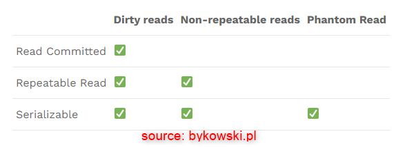

DESCRIPTION
-----------

##### Goal
The goal of this project is to present how to create **Hello World** application in **Java** programming language with usage **Spring Boot** framework and **transactions** with **isolation** type **SERIALIZABLE**.

**Transaction** means that all database operations should be performed or none of them. There can not be such situation that some databases operations are performed and some not. In Spring Boot transactions are handled by annotation **@Transactional** (class SentenceService).

**Isolation** means what part of database should be locked during specific transaction. This lock should resolve following problems:
* **Dirty Reads**: this bug is related to rolling out transaction after some error. Other transaction can have the same result before roll out and another after roll out. It's bug. Value is displayed but it does not exist in database any more
* **Not Repetable Reads**: this bug is related to updating database. Other transaction can have different result before update and after update. It's bug. Result should be always the same
* **Phantom Reads**: this bug is related to list of items. Other transaction can have different list of items before delete few of them and after delete few of them. It's bug. Result should be always the same 

Different types of transaction`s isolation resolves different bugs. Types are hierarchical - higher isolation resolves more bugs. But also blocks bigger part of database and othre operations have to wait in this time. Types of isolation:
* **READ UNCOMMITED**: database is not blocked. It doesn't resolve bugs type Dirty Reads, Not Repetable Reads or Phantom Reads
* **READ COMMITED**: single field in database is blocked. It resolves bugs type Dirty Reads. It doesn't resolve bugs type Not Repetable Reads or Phantom Reads 
* **REPETABLE READ**: row in database is blocked. It resolves bugs type Dirty Reads and Repetable Reads. I doesn't resolve bugs type Phantom Reads
* **SERIALIZABLE**: table in database is blocked. It resolves bugs type Dirty Reads and Repetable Reads and Phantom Reads 
* **DEFAULT**: it depends on specific database. Most often it's REPETABLE READ but you have to confirm it in documentation

##### Flow
The following flow takes place in this project:
1. User via any browser sends request to application HelloWorld for content
1. Application HelloWorld calls methods with Dirty Reads, Not Repetable Reads and Phantom Reads problems. Specific transaction isolation is set up for this project
1. These methods returns response as JSON. This JSON contains results before and after error. Specific transaction isolation should resolve or not this error. 
1. Application HelloWorld sends back response with JSON to User via browser

##### Launch
To launch this application please make sure that the **Preconditions** are met and then follow instructions from **Usage** section.

##### Technologies
This project uses following technologies:
* **Spring Boot** framework: `https://docs.google.com/document/d/1mvrJT5clbkr9yTj-AQ7YOXcqr2eHSEw2J8n9BMZIZKY/edit?usp=sharing`

PRECONDITIONS
-------------
##### Preconditions - Tools
* Installed **Operating System** (tested on Windows 10)
* Installed **Java** (tested on version 1.8.0_291). Tool details: `https://docs.google.com/document/d/119VYxF8JIZIUSk7JjwEPNX1RVjHBGbXHBKuK_1ytJg4/edit?usp=sharing`
* Installed **Maven** (tested on version 3.8.5). Tool details: `https://docs.google.com/document/d/1cfIMcqkWlobUfVfTLQp7ixqEcOtoTR8X6OGo3cU4maw/edit?usp=sharing`
* Installed **Git** (tested on version 2.33.0.windows.2). Tool details: `https://docs.google.com/document/d/1Iyxy5DYfsrEZK5fxZJnYy5a1saARxd5LyMEscJKSHn0/edit?usp=sharing`

##### Preconditions - Actions
* **Download** source code using Git 
* Open any **Command Line** (for instance "Windonw PowerShell" on Windows OS) tool on **project's folder** (exact localization of project you can check in GIT repositories on page `https://github.com/wisniewskikr/chrisblog-it-java`)

USAGE
-----

Usage steps:
1. Start application with `mvn spring-boot:run`
1. Visit `http://localhost:8080`
1. (Optional) Check database in console (url: "jdbc:h2:mem:db-embedded", user: "admin", password: "admin123") with `http://localhost:8080/console`
1. Clean up environment with `ctrl + C`