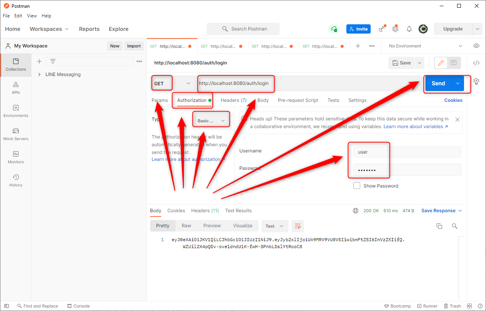
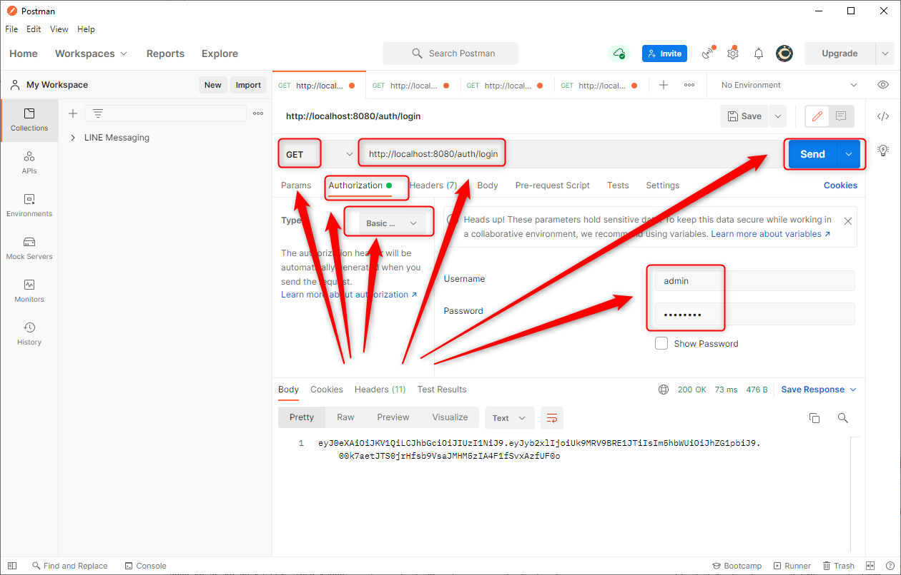

DESCRIPTION
-----------

##### Goal
The goal of this project is to present how to implement **Basic Authentication and OAuth2 Authorization** using **Java** application with **Spring Boot** framework. Basic Authentication is based on **Spring Security**. OAuth2 Authorization is also based on **Spring Security** and checks if role provided in token is valid for requested resource.

##### Flow
The following flow takes place in this project:
1. User uses any Client API (for instance Postman) for sending GET request to Server for token. Values of "username" and "password" are sent as Basic Authentication
1. Server validates credentials. If everything is ok then token is sent back to Client API
1. Client API displays token to the User 
1. User uses any Client API for sending GET request to Server for secured content. Token is sent as Bearer Authorization
1. Server checks token and included in token role. If everything is ok then secured content is sent back to Client API
1. Client API displays secured content to the User

##### Launch
To launch this application please make sure that the **Preconditions** are met and then follow instructions from **Usage** section.

##### Technologies
This project uses following technologies:
* **Spring Boot** framework: `https://docs.google.com/document/d/1mvrJT5clbkr9yTj-AQ7YOXcqr2eHSEw2J8n9BMZIZKY/edit?usp=sharing`
* **Security**: `https://docs.google.com/document/d/1nhPRbfD10KJOYsgI1HUwUz95ReiJPbXK85_zMyAptoY/edit?usp=sharing`

PRECONDITIONS
-------------

##### Preconditions - Tools
* Installed **Operating System** (tested on Windows 10)
* Installed **Java** (tested on version 1.8.0_291). Tool details: `https://docs.google.com/document/d/119VYxF8JIZIUSk7JjwEPNX1RVjHBGbXHBKuK_1ytJg4/edit?usp=sharing`
* Installed **Maven** (tested on version 3.8.5). Tool details: `https://docs.google.com/document/d/1cfIMcqkWlobUfVfTLQp7ixqEcOtoTR8X6OGo3cU4maw/edit?usp=sharing`
* Installed **Git** (tested on version 2.33.0.windows.2). Tool details: `https://docs.google.com/document/d/1Iyxy5DYfsrEZK5fxZJnYy5a1saARxd5LyMEscJKSHn0/edit?usp=sharing`
* Installed **Postman** (tested on version 8.11.1)

##### Preconditions - Actions
* **Download** source code using Git 
* * Open any **Command Line** (for instance "Windonw PowerShell" on Windows OS) tool on **project's folder** (exact localization of project you can check in GIT repositories on page `https://github.com/`)

USAGE
-----

Usage steps:
1. Start application with `mvn spring-boot:run`
1. Send GET request (Basic Authentication with credentials: "username" : "user", "password" : "user123") with Postman to URL `http://localhost:8080/token`
1. Send GET request with Postman to URL `http://localhost:8080/`
1. Send GET request (with token as Bearer Authorization) with Postman to URL `http://localhost:8080/user`
1. Send GET request (with token as Bearer Authorization)  with Postman to URL `http://localhost:8080/admin`
1. Send GET request (Basic Authentication with credentials: "username" : "admin", "password" : "admin123") with Postman to URL `http://localhost:8080/token`
1. Send GET request with Postman to URL `http://localhost:8080/`
1. Send GET request (with token as Bearer Authorization)  with Postman to URL `http://localhost:8080/user`
1. Send GET request (with token as Bearer Authorization)  with Postman to URL `http://localhost:8080/admin`
1. Clean up environment with `ctrl + C`

