- https://developer.okta.com/
- http://localhost:8080/login/saml2/sso/okta
- http://localhost:8080/saml2/service-provider-metadata/okta

DESCRIPTION
-----------

##### Goal
The goal of this project is to present how to implement **SAML2 authentication and authorization** with **SAML2** using **Java** application with **Spring Boot** framework. This SAML2 authentication and authorization is implemented **with usage of Spring Security** and **Okta** Identity Provider.

##### Flow
The following flow takes place in this project:
1. User via browser sends request to Server for secured content
1. Server redirects request to Okta which displays to User via browser the Login page
1. User via browser fills credentials and sends them to Okta
1. Okta checks credentails and redirects request to Server. If credentials are valid then Server displays secured content to User via browser

##### Launch
To launch this application please make sure that the **Preconditions** are met and then follow instructions from **Usage** section.

##### Technologies
This project uses following technologies:
* **Spring Boot** framework: `https://docs.google.com/document/d/1mvrJT5clbkr9yTj-AQ7YOXcqr2eHSEw2J8n9BMZIZKY/edit?usp=sharing`

PRECONDITIONS
-------------

##### Preconditions - Tools
* Installed **Operating System** (tested on Windows 10)
* Installed **Java** (tested on version 1.8.0_291). Tool details: `https://docs.google.com/document/d/119VYxF8JIZIUSk7JjwEPNX1RVjHBGbXHBKuK_1ytJg4/edit?usp=sharing`
* Installed **Maven** (tested on version 3.8.5). Tool details: `https://docs.google.com/document/d/1cfIMcqkWlobUfVfTLQp7ixqEcOtoTR8X6OGo3cU4maw/edit?usp=sharing`
* Installed **Git** (tested on version 2.33.0.windows.2). Tool details: `https://docs.google.com/document/d/1Iyxy5DYfsrEZK5fxZJnYy5a1saARxd5LyMEscJKSHn0/edit?usp=sharing`
* Account created in **Okta**. Tool details: https://docs.google.com/document/d/1KYPZRkgYxdSYUlGBqtktKvCT6D_PvG-t2_vgAn_lWro/edit?usp=sharing

##### Preconditions - Actions
* **Download** source code using Git 
* Open any **Command Line** (for instance "Windonw PowerShell" on Windows OS) tool on **project's folder** (exact localization of project you can check in GIT repositories on page `https://github.com/`)
* **Configure** Okta application. For detail please check section **Okta Configuration**
* **Update** file **application.yaml**
* **Import** certificate **okta.cert**

OKTA CONFIGURATION
------------------

Okta configuration steps:
1. Create application **HelloWorld** with Single Sigh on Url **http://localhost:8080/login/saml2/sso/okta** and SP Entity Id **http://localhost:8080/saml2/service-provider-metadata/okta**
1. From IdP metadata take **EntityId** and **Location**
1. Download Okta certificate
1. Create new user with credentials user@gmail.com/Password1234
1. Assign new user to application

USAGE
-----

Usage steps:
1. Start application with `mvn spring-boot:run`
1. Open project main page with `http:\\localhost:8080`
1. Choose link "Secured Hello World User" (credentials user@gmail.com/Password1234)
1. Clean up environment with `ctrl + C`

OKTA CONFIGURATION - PRINTSCREENS
---------------------------------

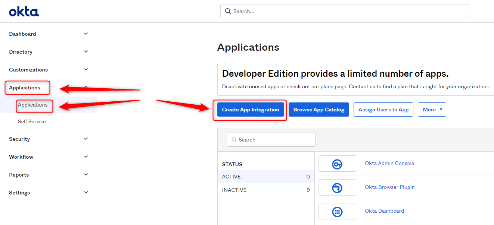

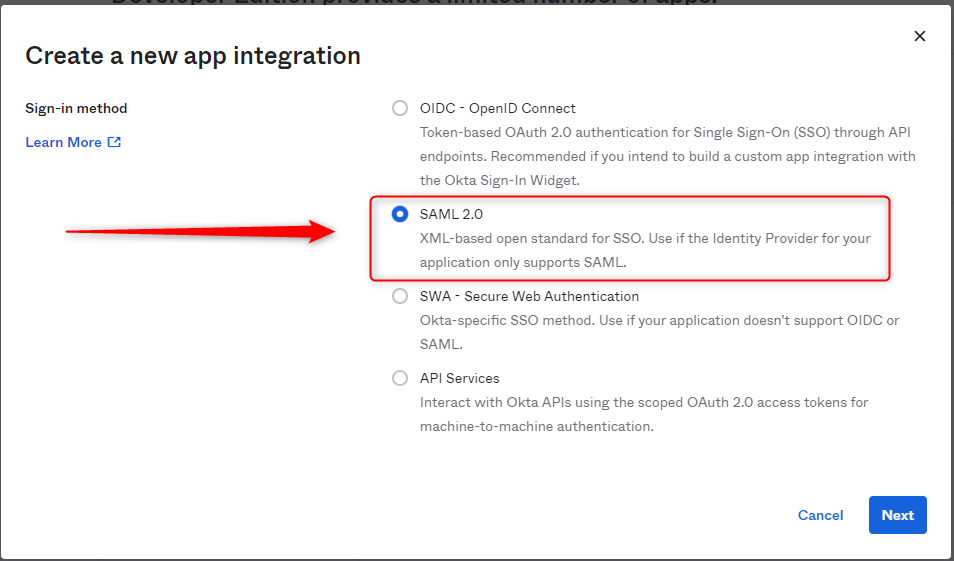

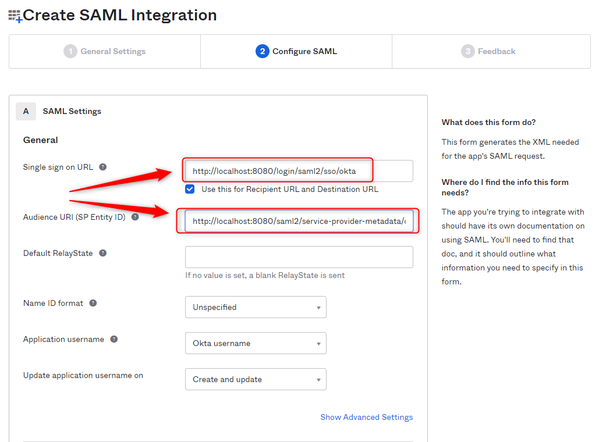

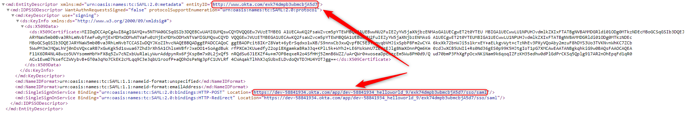

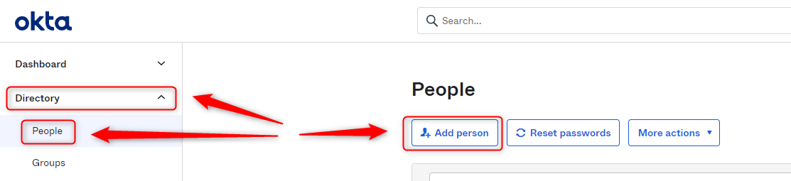

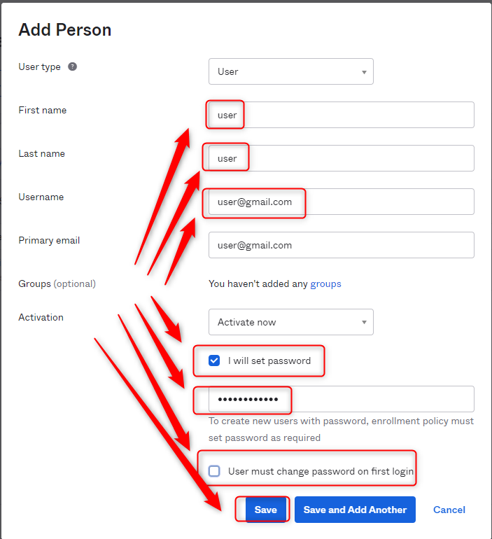

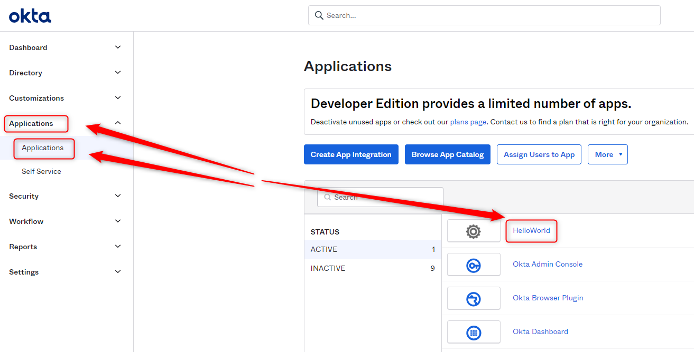

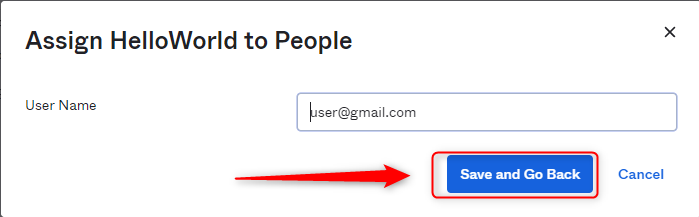

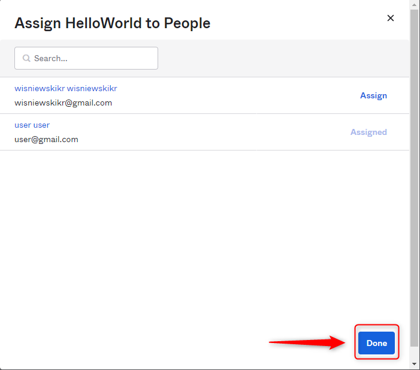

USAGE - PRINTSCREENS
--------------------

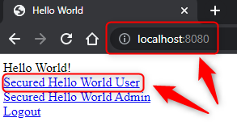

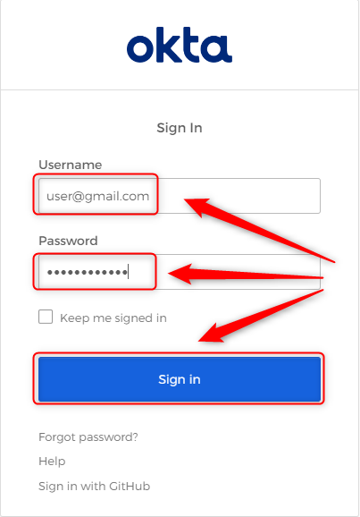

